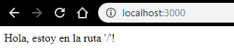

# Lo esencial de Node.js

## Requisitos

Los conocimientos que se van a requerir para que este artículo les sea de provecho son los siguientes: 

* Dominio de JavaScript y ECMAScipt.
* Nociones generales de patrones de desarrollo.
* Manejo básico de sistemas Unix.
* Git Develoment Workflow.
* Bases de Datos no relacionales, en este caso usaremos MongoDB.

### Expectativa

Al finalizar el artículo se espera que el lector obtenga: 

* Conocimientos exactos y puntuales de aspectos específicos de node.js además de facilidad de aplicar en las áreas necesarias de su proyecto actual y de una gestión envidiable. 
* Capacidad para la complementación inmediata de lo aprendido a sus proyectos actuales basadas en las dependencias Express y MongoDB.

Con todo esto, se espera que el estudiante disfrute el artículo y que pueda sacarle el mayor provecho posible. 

## **Herramientas y Repositorios**

Las herramientas y repositorios que vamos a utilizar en este artículo serán los siguientes:

### **Herramientas:**

* Repositorio de [Platzi](https://github.com/platzi/nodejsesenciales) \(Será lo principal\). Allí tendremos algunas ramas en las cuales trabajaremos según vayamos avanzando e iremos instalando dependencias que necesitaremos a lo largo del artículo.
* Bases de Datos MongoDB.
* Cliente para hacer pruebas con API, en este caso usaremos PostMan.

Para que las herramientas sean útiles, debemos actualizarnos siempre con el repositorio esencial o base del artículo, hacer copia local en nuestro computador y en cada parte del artículo mostraré la rama en la que estamos trabajando y mostrando los ejercicios que iremos realizando.

## Historia de Node 

Vamos a ver algunos de los elementos que lo hacen interesante de aprender, desde sus aspectos conceptuales, por su supuesto. 

### **¿Qué es Node?**

Quizá ya sepas qué es Node, o al menos conozcas para qué funciona, sin embargo quisiera presentarte algo diferente. Son tres conceptos que definen perfectamente a Node.

* Ambiente de ejecución de código: Cuando pensamos en Node, hemos escuchado que es un FrameWork o IDE \(Ambiente Integrado de Desarrollo\) pero estos términos son incorrectos y no aplican para definirlo. Node simplemente es un **ambiente de ejecución de código,** es un utilitario dentro de un sistema operativo que ejecuta el JavaScript línea a línea, de modo que no entra en esas caracterizaciones. 
* Proyecto Comunitario: Es un proyecto que está mantenido por una gran comunidad de desarrolladores, así que es un aspecto que nos inspira confianza ya que siempre tendrá soporte y respaldo.
* Cambio Paradigma: Ha cambiado la forma en la que trabajamos a JavaScript, desde el momento que surgió, tomó popularidad y en la actualidad donde JavaScript es uno de los lenguajes más populares que existen permitiendo habilidades de uso que antes no se podían imaginar. 

### **Antecedentes**

Previo a Node.js, JavaScript era un lenguaje estrictamente enlazado al navegador, era su única zona de ejecución que existía entonces. Desde **1995** con **NetScape** hasta el **2009** donde se produjo un cambio verdadero**. JavaScript** en esos momentos solo servía para **Web Clients**, demostrando así poca madurez.

### **Origen**

[**Ryan Dahl**](https://en.wikipedia.org/wiki/Ryan_Dahl) fue el Creador de Node.js. Su primera versión la lanzó en el 2009, surgiendo de una inspiración dada por Google, ya que bajo un modelo de código libre había hecho público el código del motor de JavaScript de Chrome “V8”. A partir de allí, Ryan presentó la propuesta como un utilitario de ejecución de JavaScript fuera del navegador, como ambientes de servidor.

### **Características**

* **Libre**: Es OpenSource absolutamente.
* **Real Time**: Por su naturaleza, Node capas de crear aplicaciones que funcionen a tiempo real, sin necesidad de agregar tantos módulos.
* **Orientado a Eventos**: De forma que mucha de su estructura nativa, utilizan elementos o patrones de desarrollo orientados a eventos.
* **Asíncrono**: Si realiza una ejecución secuencial de instrucciones, el es capaz de delegar tareas que sean de alto costo de recursos de computo y seguir con la ejecución sin parar el programa.
* **Multiplataforma**: Es capaz de ejecutarse en diferentes ambientes como en sistemas operativos de Microsoft, Apple y Todas las distribuciones de Linux. También sirve para ejecutarse del lado del servidor.
* **Robusto**
* **Escalable**: Puede expandirse mediante **clustering** \( Un algoritmo de agrupamiento \(en inglés, **clustering**\) es un procedimiento de agrupación de una serie de vectores de acuerdo con un criterio. Esos criterios son por lo general distancia o similitud\)
* **Expandible**: Es capaz de agregar módulos para tener muchas más funciones.
* **No Bloqueante**: Delega recursos a otros hilos de procesos en la arquitectura interna, todo para mantener la optimización al máximo en las ejecuciones de código.

### **Actualidad**

Desde sus comienzos ha cambiado demasiado y ha obtenido gran popularidad. Es mantenido por **Node Fundation.** Desde el 2009 hasta Hoy en día, node ha pasado por muchas revisiones, algunos cambios han sido tan grandes que la retro-compatibilidad es casi imposible. Las versiones más estables llevan el acrónimo **LTS \(** **LTS** es una acrónimo de la expresión inglesa “long-term support” que traducido viene a significar “con mantenimiento a largo plazo”**\)**

### **Evolución**

Realmente Node no ha dejado de evolucionar, se ha mantenido en constante mejoramiento desde su lanzamiento, ha sido objeto de mucha crítica pero se ha mantenido como uno de los mejores utilitarios como ambiente de desarrollo de JavaScript en otros sistemas operativos.

En las siguientes versiones se están añadiendo nuevos módulos que van a ser fundamento de otras tecnologías que van a ser muy próximamente los estándares de moda. Ejemplo:

* **Soporte para `HTTP/2`**: Ya en la versión 10 en adelante están incluidos de maneras estable.
* **Mejor manejo de Módulos**: dado que en algunas versiones `EcmaScript` ha ido implementando algunas mejoras y variantes, poco a poco van a estar ingresando de manera nativa en las próximas versiones de Node.js.

## Configuración Asistida de Rutas en Express.js

Vamos a ver cómo configurar rutas en Express.js de una manera especial y sencilla. Así podremos trabajar con rutas a largo plazo y proyectos que sean de gran envergadura. 

### **Primer Contacto con el Repositorio**

Para empezar a trabajar con nuestro repositorio haremos lo siguiente en nuestra terminal, procederemos a hacer **`git clone`, `cd`**y a abrir nuestro editor favorito \(en este caso usaré Vscode\)

```bash
git clone https://github.com/platzi/nodejsesenciales.git
cd nodejsesenciales
code .
```

Ahora para tener todas nuestras dependencias Instaladas, procederemos a usar **`npm install`** para tener todas las dependencias en nuestro computador. 

### Dependencias

Las dependencias que usaremos serán las siguientes: 

```javascript
{
  "name": "nodejsesenciales",
  "version": "1.0.0",
  "description": "Repositorio para el curso de esenciales de Node.js de Platzi.",
  "main": "index.js",
  "scripts": {
    "test": "echo \"Error: no test specified\" && exit 1",
    "start": "nodemon index.js"
  },
  "repository": {
    "type": "git",
    "url": "git+https://github.com/platzi/nodejsesenciales.git"
  },
  "keywords": [
    "nodejs",
    "esenciales"
  ],
  "author": "Platzi",
  "license": "ISC",
  "bugs": {
    "url": "https://github.com/platzi/nodejsesenciales/issues"
  },
  "homepage": "https://github.com/platzi/nodejsesenciales#readme",
  "dependencies": {
    "express": "^4.16.3",
    "glob": "^7.1.3",
    "nodemon": "^1.18.9"
  }
}

```


Acá hay que actualizar nodemon a la versión `"nodemon": "^1.18.9"` ****sucede que hay un problema con una dependencia en la versión en que se hizo el curso, por lo tanto es necesario actualizar a la versión que les digo para que continúen sin problemas.


### **Explicación de las dependencias:** 

* **`Express`:** Que nos ayudará a crear las rutas.
* **`Glob`:** Para manejar la _recursividad_ eficientemente y leer los archivos de rutas.
* **`Nodemon`:** Que nos servirá para detectar cambios en nuestros archivos y reiniciar el servidor. 

Ahora que tenemos nuestras dependencias instaladas, procederemos a ejecutar el Script `start`

```javascript
"start": "nodemon index.js"
```

Lo ejecutaremos con el siguiente comando:

```bash
npm run start
```

Con esto iniciamos nuestra instancia de express. Ya express nos está escuchando en el puerto `3000`.

## Ahora vamos al código

En nuestro archivo `index.js` encontraremos el siguiente código.

```javascript
const express = require("express");
const app = express();

app.get("/", (req, res)=>{
    res.send("Hola, estoy en la ruta '/'!");
});

console.log("Iniciando Express.js");
app.listen(3000, ()=>{
    console.log("Express ha iniciado correctamente!");
});
```

Esta la manera tradicional de usar `express`, la forma más sencilla, donde agregamos una _ruta_ en nuestro _fichero_ donde se hace la primera llamada a `express`. 

Acá introducimos una ruta mediante `app.get()` donde el primer parámetro es nuestra ruta y finalmente nuestro _handler_ `res.send()` que nos dice el amistoso mensaje: `"Hola, estoy en la ruta '/'!"`

```javascript
app.get("/" /*Esta es nuestra ruta*/, (req, res)=>{
    /*Este es nuestro handler*/
    res.send("Hola, estoy en la ruta '/'!"); 
});
```

Esta forma de trabajar si sirve pero no es bueno a largo plazo, esto es así debido a que en proyectos grandes tendremos muchas rutas y tenerlas en nuestro `Index.js` es la peor idea de todas. Por eso procederemos a eliminar la siguientes líneas de código ya que están ubicadas de forma errónea.

```javascript
const express = require("express");
const app = express();

/*app.get("/", (req, res)=>{
    res.send("Hola, estoy en la ruta '/'!");
});*/ /*Estas sonlas líneas que vamos a eliminar*/

console.log("Iniciando Express.js");
app.listen(3000, ()=>{
    console.log("Express ha iniciado correctamente!");
});
```

 Ahora que tenemos nuestro fichero sin rutas nos vamos a nuestro directorio y nos dirigiremos al siguiente documento siguiendo la ruta:


Estando en este archivo veremos el siguiente código con la función que estudiaremos.

```javascript
const glob = require("glob");
const path = require("path");

module.exports = function(app){ /* <- Hablo de esta función */
  glob.sync("./routes/**/*.js").forEach((file)=>{
    if (!file.includes("index.js")) {
      require(path.resolve(file))(app);
    }
  })
}
```

Acá usamos la dependencia que agregamos, `glob` que nos sirve para cargar archivos. En este caso usa su propiedad `glob.sync` que es importante tenerla cuando nuestra aplicación no está ejecutando, por lo tanto no necesitamos que sea asíncrono, la asincronía se usa cuando la aplicación ejecuta código y le toca algo muy pesado.

Acá estamos cargando con `glob` recursivamente las rutas que cumplan con el siguiente esquema `"./routes/**/*.js"`, de modo que busca dentro del directorio `routes` todo lo que se encuentre dentro del mismo que tenga extensión `file.js`,  luego va a iterar por cada archivo que encuentre y usará la condición de que el archivo no se llame `index.js`, ese será el único archivo que no trabajará la condicional. Para todos los demás casos haremos uso de `require` con el `path.resolve` para construir la ruta dentro del mismo, finalmente le pasamos nuestra instancia de aplicación `app` para tener una única carga de rutas de manera dinámica, fácil de entender y asistida. 



```javascript
const glob = require("glob");
const path = require("path");

module.exports = function(app){ /* <- Acá la función resibe el argumento 
de nuestra aplicación */
  glob.sync("./routes/**/*.js"/* <- Acá buscaremos todos los archivos 
  que contengan la extensión .js */).forEach((file)=>{
    if (!file.includes("index.js")/* <- No tomaremos en cuenta el archivo
    principal */) {
      require(path.resolve(file))(app); /* <- Finalmente usamos nuestra instancia 
      require y construimos la ruta usando path.resolve para el arhivo encontrado,
      también pasamos nuestro argumento pricipal que recibe la función completa */
    }
  })
}
```



### Otras rutas que tenemos en nuestros archivos


Ahora miraremos las otras rutas que tenemos, los otros archivos que no tomamos en cuenta para la explicación anterior. Los archivos a los que me refiero son los siguientes:




```javascript
module.exports = function (app) {
    app.get("*", (req, res)=>{
        res.send("Route not defined!");
    });
} /* Esta ruta representa a cualquier ruta que no 
     contenga nuestra apliación, mostrará el mensaje 
     "Route not defined!" */
```





```javascript
module.exports = function (app) {
    app.get("/", (req, res)=>{
        res.send("Hola, estoy en la ruta '/'!");
    });
} /* Nos dice que estamos en la ruta madre */
```





```javascript
module.exports = function (app) {
    app.get("/profile/:user", (req, res)=>{
        res.send(`Hola, estoy en el perfil de ${req.params.user}!`);
    });
} /* Un badge divertido que nos dirá el nombre del perfil que busquemos */
```



Ahora incluiremos todos estos códigos de express en nuestro `index.js` que es nuestro archivo principal. Ahora tenemos la libertad de requerir solo la carpeta donde está nuestro `index.js` \(donde contiene `glob`\) ya que `glob` se encargará de incluir los otros archivos. 



```javascript
const express = require("express");
const app = express();

require('./routes/views')(app); /* en views está un arhivo index que por
default de llama, allí tenemos a glob que llama al resto de los archivos
que se encuentran allí */
require('./routes/special')(app) /* Acá llamamos al otro index que se 
encuentra allí en special por que glob de views no lo tomó en cuenta */

console.log("Iniciando Express.js");
app.listen(3000, ()=>{
    console.log("Express ha iniciado correctamente!");
});
```



Ahora procederemos a probar nuestra pequeña app en nuestro navegador, recordemos que se escucha en el puerto `3000`.




Con esto concluimos esta sección.

