# Ortografía básica

## La importancia de escribir bien

Escribir bien es fácil y nos da mucho reconocimiento. Con esto nos evitaríamos hacer el ridículo en las redes sociales, pero no solo eso, en nuestro perfil profesional es necesario que tengamos nuestra ortografía impecable. Es necesario escribir bien para tener una excelente presentación laboral.

###    Estadísticas importantes

En primer lugar nuestra hoja de vida. Un estudio de la comisión **Recruitment & Employment Confederation** encontró que el **50%** o más de las hojas de vida tienen errores de ortografía, y si comparan nuestra hoja de vida con otra para ver la ortografía significa que dependemos absolutamente de ella para conseguir trabajo. Nuestra página, nuestro perfil, nuestra hoja de vida necesitan ortografía, es nuestro deber tener una buena presentación a la hora de conseguir empleo. 

También podemos hablar de **e-comerce,** quizá tengamos nuestra propia tienda **Online** en donde patrocinemos nuestros productos. La revista **BBC** calculó que un pequeño error ortográfico en nuestra tienda **Online** puede significar el **80%** menos en ingreso de nuestros productos. 

Ahora hablemos de nuestra marca profesional. El **59%** de las personas encuestadas por **Global Lingo** perdería la confianza o dejaría de comprar a una marca que se exprese mal  en sus redes sociales.

En **Match** entrevistaron a muchos de sus usuarios y arrojó como resultado que el **39%** de las personas toman en cuenta la ortografía como un punto a favor a la hora de elegir pareja. La forma en que nos presentamos a los demás es la forma en que ellos nos ven y nos valora. 

## ¿Qué es la Ortografía?

Seguramente, lo primero que se nos viene a la mente es la **Real Academia Española,** pero un dato interesante es que hay **23** academias de la lengua española, hay una por cada país de habla hispana. 

### ¿Qué es? 

_**Es una serie de reglas que le da uniformidad al lenguaje escrito**_, ¿Por qué necesitamos estas reglas? Somos muchísimos los que hablamos español, necesitamos mantener cierta uniformidad y ciertas reglas para poder entendernos entre todos nosotros. Por eso existe la RAE y las otras instituciones académicas que están en constante comunicación definiendo cuales van a ser las reglas para manejar nuestro idioma.

### ¿Qué no es la Ortografía?

No es una serie de reglas que se dictaron en una tabla de piedra, la lengua se encuentra todo el tiempo en evolución con lo que creamos, con lo que decimos y con cualquier cosa que le inyectemos a nuestro lenguaje.

**Tres ejemplos**:

1. **Toballa**: Es una palabra que está en desuso, era como un sinónimo para la palabra **toalla**. 
2. **Bluyín**: Esta es la forma de escribir en español la palabra en inglés que es _**Blue Jean**_.
3. **Posverdad**: Es una palabra nueva que se incluyó en diciembre 2017.

**¿Qué quiere decir todo esto?** Los nuevos conceptos e ideas que nos creamos están enfrentando nuestro idioma, se incluyen en el y en las reglas que manejan las instituciones de la lengua española.

### Resumen

* La ortografía es un conjunto de convenciones y reglas que ayudan a mantener la uniformidad del lenguaje escrito. 
* Son necesarias para comunicarnos todos en el mismo idioma y entendernos.

_**Ahora hablemos de ti, de cómo aprendiste ortografía.**_

## ¿Cómo aprender a escribir mejor?

Remontémonos a la época en que aprendimos a escribir y a saber de la ortografía. Muchos de nosotros tenemos **flashback** negativos cuando vemos nuestros libros con que aprendimos a escribir, también le tenemos un pavor a las **caligrafías** \(las hojas donde practicamos la escritura\), se basaban en la repetición. La pregunta es **¿Esto realmente funciono?** Obvio, aprendimos a escribir, y también desarrollamos la motorización de nuestros movimientos al escribir, pero en cuento a ortografía **¿Te quedó la enseñanza? ¿Te quedó la forma correcta de la escritura de las palabras?** Quizá la respuesta sea que **no**, y esto es muy probable.

### ¿Cómo haremos para aprender a escribir mejor?

Aprenderemos las reglas de la ortografía, pero **no** con la repetición, si no con ejercicios prácticos, enfocados en tus gustos y en tu vida profesional. Ya no necesitamos practicar con oraciones tan básicas, lo haremos con ejercicios aplicados a nuestro trabajo, a nuestra vida profesional. También tendremos ejercicios y ejemplos en cuanto a los temas que más nos llama la atención, por ejemplo la programación. Por ultimo aprenderemos reglas, pero tal como sucedió en nuestra infancia necesitamos repetición. Es buenísimo leer en libros, **twitter**, **publicaciones**, **documentación**, todo lo que podamos leer nos dejará palabras nuevas e ideas que necesitaremos en nuestra ortografía. También es recomendable escribir mucho, no necesariamente tiene que ser para publicar en algún medio, no tiene por qué ver nunca la luz pública pero a la medida que escribes irás recordando las reglas.

### ¿Cual es nuestro trabajo ideal?

Podemos imaginar un aviso **online** donde buscan a una persona con tu perfil para ese trabajo de tus sueños, lo queremos, así que o basta con enviar nada más la hoja de vida. Para poder destacarnos en los miles de candidatos que también quieren este trabajo, tenemos que escribir un correo donde nos presentemos, demos una breve descripción de nuestra experiencia y por que somos los indicados par este trabajo. _**Este será nuestro proyecto, escribir esta carta para postular a un trabajo**_.

## Hablemos de las letras

Las cosas se aprenden mejor cuando las relacionamos con las cosas que nos gusta, en este caso lo haremos con la química, llegando a la siguiente analogía: La letra es la unidad fundamental del lenguaje escrito así como el átomo es la unidad fundamental de la materia, con esto se construye todo o que está a nuestro alrededor, tal como lo hacen las letras que constituyen todas las palabras y descripciones que nos rodea.

### Tipos de letras

Solo hay dos tipos, y son las siguientes:

* **Vocales**: Son 5 y se distingues por que cuando la pronunciamos el aire sale de nuestra boca sin ningún obstáculo.
* **Consonantes**: En español son 22, el aire sale con algún obstáculo, que puede ser el labio, la lengua... por ejemplo la letra **c**, que se encuentra con la lengua. Para complementar su sonido tiene que estar junto a una vocal.


_Una vocal puede ser sílaba en sí misma pero una consonante **no**._


## Mayúsculas y minúsculas

Otra clasificación sería **"minúsculas y Mayúsculas"**. **¿Qué es una Mayúscula?** es una forma de escribir la misma letra, que tiene una forma ligeramente diferente y en la mayoría de los casos su tamaño es mayor que las minúsculas. Se una la letra Mayúscula solo como la letra inicial de una palabra. Es un recurso muy importante y vamos a ver las reglas de uso. No debemos abusar de ella, una fraseo un párrafo sostenida en Mayúsculas, sobre todo si es una escritura online, te hace ver como si estuvieras gritando. Existe personas que a cada palabra le pone una letra Mayúscula, pero no es un buen uso de las Mayúsculas.

### Reglas

1. _**Se usa Mayúscula al inicio de una oración y después de un punto, interrogación o exclamación**_: Esta regla tiene una pequeña excepción, la veremos más adelante cuando hablemos de puntuación. Por ahora tenemos que tomar en cuenta los signos que usan puntos y que la primera palabra de nuestra oración va en Mayúscula. 
2. _**Nombres Propios**_: Siempre deben llevar Mayúscula inicial, sin importar donde se ubique el nombre. **¿Qué es un nombre propio?** Es el que se refiere a una persona o entidad en particular a diferencia de una categoría más general, por ejemplo la categoría _persona_, esa palabra no lleva Mayúscula inicial, pero si es una persona específica como _**César Augusto**_, es un nombre propio y debe llevar Mayúscula inicial. **Los apodos deben llevar Mayúscula inicial**, esto sucede por que se refiere a una persona en especial. **Los nombres de las mascotas**, nuestra mascota es única, por ende va en Mayúscula. **Los nombres de los objetos**, cuando le colocamos un nombre lo convertimos en una entidad particular. **Los nombres de los lugares, sean países o continentes**. **Los nombres de las empresas o de las marcas**, aunque hay marcas que deciden colocar sus nombres con minúscula inicial, por ejemplo el **ipod**. Las obras de arte.
3. _**Siglas y acrónimos**_: **Una sigla** es cuando tomas un nombre u oración larga, tomas las primeras letras de cada palabra y lo comprimes para decir este nombre u oración de una forma más concisa. **Un acrónimo** es lo mismo pero con la diferencia de que estas siglas tienen una pronunciación natural y se puede decir como una sola palabra, por ejemplo **UNICEF**. Sea sigla o acrónimo, debe llevar Mayúscula en cada una de las letras  y no utilizar puntos entre ellos. 


### Consejo

_Los días de la semana, los meses, los nombres de los idiomas y las nacionalidades no llevan mayúsculas, no se consideran nombres propios. Solo llevan mayúsculas cuando están después de un punto o a comienzo de una oración. Solo en el inglés si están en Mayúsculas estas palabras._


### Práctica

La mejor forma de aprender es practicar. Vamos a usar un artículo que escribió Tífis del team de Platzi.

**Artículo**:

**juana&lt;-\(a\) la alpaca&lt;-\(b\), nueva líder de producto**

> _por tífis_&lt;-\(c\)
>
> **imperios&lt;-\(d\) como el inca descubrieron el verdadero liderazgo en las alpacas. ellas&lt;-\(e\) pesan hasta 77 kg&lt;-\(f\), un poco más que yohan graterol&lt;-\(g\), nuestro anterior líder de producto en platzi&lt;-\(h\). la&lt;-\(i\) alpaca defiende su territorio como un pm&lt;-\(j\) defiende cambios al código. por&lt;-\(k\) estas razones a partir de hoy "juana la alpaca" toma el liderazgo del equipo de producto de platzi.**

### **Correcciones**:

* **juana -&gt; Juana \(a\)**: es la primera palabra del párrafo, por ende va en Mayúsculas, además es un nombre propio. 
* **alpaca -&gt; Alpaca \(b\)**: esto pasa por que la especie alpaca aunque es un sustantivo, Juana la Alpaca lo usa como nombre propio, por tanto va en Mayúsculas.
* **tífis -&gt; Tífis \(c\)**: Tífis es un seudónimo, osea un apodo, por tanto va en Mayúsculas. 
* **imperios -&gt; Imperios \(d\)**: es la primera palabra del párrafo, va en Mayúsculas.  
* **inca -&gt; Inca \(d\)**: no habla de cualquier imperio sino de este en particular. Es un nombre propio. 
* **ellas -&gt; Ellas \(e\)**: después del punto va en Mayúscula.
* **kg \(f\)**: de conserva en minúscula por que es una abreviatura, es así cuando una sola palabra se contrae, kilogramo es una sola palabra por tanto va en minúscula. 
* **yohan graterol -&gt; Yohan Graterol \(g\)**: nombres propios. 
* **platzi -&gt; Platzi \(h\)**: es nombre propio. 
* **la -&gt; La \(i\)**: empieza el párrafo, va en Mayúscula.
* **pm -&gt; PM \(j\)**: es un Product Manager, se toma  las primeras letras de cada palabra, son siglas por tanto va en Mayúscula. 
* **por -&gt; Por \(k\)**: después del punto siempre va en Mayúscula.

### **Segundo ejemplo**

> **primeras impresiones de juana la alpaca**
>
> **¿cómo fue su primer día? en su primera reunión con freddy vega, el ceo de platzi, juana tomó fuertes medidas para mejorar la ui de la plataforma: ahora todo es comic sans.**
>
> **a pesar de la negativa de freddy, juana argumentó que esta tipografía tendría mucha más conversión en el mercado potencial de los millennials.**
>
> **es un día emocionante para juana en su nuevo cargo. en su primer día ya ha terminado 50 de los más de 100 cursos de platzi y apunta a más. sus ambiciones son fuertes y espera ser la ceo muy pronto, pero para llegar allá afirma que “falta mucha lana”.**

### **Corrección:**

> **Primeras** impresiones de **Juana la Alpaca**
>
> ¿**Cómo** fue su primer día? **En** su primera reunión con **Freddy Vega**, el **CEO** de Platzi, Juana tomó fuertes medidas para mejorar la **UI** de la plataforma: ahora todo es **Comic Sans**.
>
> **A** pesar de la negativa de **Freddy**, **Juana** argumentó que esta tipografía tendría mucha más conversión en el mercado potencial de los millennials.
>
> **Es** un día emocionante para **Juana** en su nuevo cargo. **En** su primer día ya ha terminado 50 de los más de 100 cursos de **Platzi** y apunta a más. **Sus** ambiciones son fuertes y espera ser la **CEO** muy pronto, pero para llegar allá afirma que “falta mucha lana”.

## ¿Cómo aprender las reglas de ortografía?

Esta es la parte más difícil de aprender ortografía. me refiero a las letras que suenan igual pero se escriben distinto en nuestro idioma, ejemplo la **v** y **b**, la **y** y la **ll**, la **h**. la **c**, **s** y **z**. Esto es complicado de aprender debido a la complejidad de reglas existente actualmente para el uso de estas letras. Ahora surge esta pregunta, **¿Cómo aprender todas estas reglas?** La respuesta es que no tienes que hacerlo, todo lo tenemos a nuestra mano en nuestros dispositivos. A continuación adjuntaré los archivos que usaremos para solventar nuestras dudas a la hora de usar estas letras y saber qué hacer con ellas. Son imágenes verticales donde las miraremos en formato telefónico. 











## B y V

Acabamos de ver las reglas de uso de estas letras, las infografías compartidas no contienen todas las reglas de uso de estas letras, es un resumen de lo más importante. La única forma de aprender todo esto es practicando, leyendo, escribiendo y usando correctores.

Vamos a usar el siguiente artículo para practicar, tendrás espacios en blanco donde decidiremos si va la **b** o **v**:

**¿Cómo superar el miedo a hablar en público?** 

Es ine\_ita\_le sentir miedo e incertidum\_re cuando ha\_las en pú\_lico. De\_es sa\_er que el día que no sientas miedo, puede que simplemente estés sintiendo a\_urrimiento y que tu tra\_ajo ya no te conmue\_e. Hace poco recorda\_a un fenómeno muy conocido llamado el efecto Dunning-Kruger. Es un sesgo cogniti\_o según el cual los indi\_iduos con escasa ha\_ilidad sufren de un sentimiento de superioridad, como si tu\_ieran todas las respuestas. Por el contrario, los indi\_iduos altamente calificados tienden a su\_estimar su competencia relati\_a. En lugar de en\_idiar a quienes lo han conseguido, tú \_as a usar este efecto para tu \_eneficio.

**Correción:** Es ine**v**\(viene del verbo evitar, por tanto va con v\)ita**b**\(antes de consonante va B\)le sentir miedo e incertidum**b**re cuando ha**b**las en pú**b**lico. De**b**\(por el verbo **deber** se escribe con b\)es sa**b**er que el día que no sientas miedo, puede que simplemente estés sintiendo a**b**\(antes de **u** se usa b\)urrimiento y que tu tra**b**\(acá no hay reglas\)ajo ya no te conmue**v**\(lo verbos terminados en mover y sus conjugaciones se escriben con v\)e. Hace poco recorda**b**\(pretérito imperfecto de un verbo terminado en a\)a un fenómeno muy conocido llamado el efecto Dunning-Kruger. Es un sesgo cogniti**v**\(ivo se escribe con v\)o según el cual los indi**v**\(después de las sílabas di va v\)iduos con escasa ha**b**\(palabras terminadas en bilidad\)ilidad sufren de un sentimiento de superioridad, como si tu**v**\(pretérito imperfecto\)ieran todas las respuestas. Por el contrario, los indi**v**iduos altamente calificados tienden a su**b**\(prefijo que significa por debajo de va con b\)estimar su competencia relati**v**\(ivo\)a. En lugar de en**v**\(después de la n siempre va v\)idiar a quienes lo han conseguido, tú **v**\(conjugación del verbo ir\)as a usar este efecto para tu **b**\(bene que significa bien y se escribe con b\)eneficio.

### Reto: B y V

**Vamos a visualizar otro texto donde agregaremos las letras correspondientes.**

_Nunca ol\_ides que la audiencia no sa\_e lo que no sa\_e y eso es positi\_o. Una \_ez que hayas a\_sor\_ido el contenido, \_as a entrar a un estado mara\_illoso que en el uni\_erso de ha\_lar en pú\_lico se llama “the flow”. Si has dado más de una conferencia en pú\_lico, si has e\_olucionado esa ha\_ilidad para desen\_ol\_erte frente a una audiencia, sa\_rás qué es sentirse en esa zona y \_uscarás llegar a ella tan pronto como sea posi\_le._

### Corrección

_Nunca olvides que la audiencia no sabe lo que no sabe y eso es positivo. Una vez que hayas absorbido el contenido, vas a entrar a un estado maravilloso que en el universo de hablar en público se llama “the flow”. Si has dado más de una conferencia en público, si has evolucionado esa habilidad para desenvolverte frente a una audiencia, sabrás qué es sentirse en esa zona y buscarás llegar a ella tan pronto como sea posible._

## S, C y Z

Vamos con un ejemplo para practicar el el uso de estas letras, no se trata de aprenderlas de memoria, solo echarle un vistazo para tener una idea de las reglas en general.

Ahora presentaré las palabras que se van a corregir de la imagen con la explicación de cada corrección.

**Palabras**: 

1. Conoces: Lleva **c** por que es una conjugación de la palabra conocer, todas las que terminan en **cer** llevan **c**.
2. **Usada**: Se escribe con **s** por que viene del verbo usar que se escribe con **s**, además su etimología en latino está escrita con **s** y todas sus derivadas. 
3. **Sistema**: la raíz latina de sistema está escrita con **sys**, todos sus derivados llevan s. 
4. **Diseño**: las palabras que empiezan con la sílaba **dis** se escriben con **s**.
5. **Consistentes**: este es un caso curiosos, su raíz latina lleva **s**. Este ejemplo no sale en la infografía compartida en este curso, por eso te invito a que investigues más por tu cuenta y practiques mucho. 
6. **Básicas**: viene de la palabra base que se escribe con s. 
7. **Combinaciones**: la terminación **cion** se puede escribir tanto con **s** como con **c**, todo depende de la palabra en que se derive. Esta palabra viene de combinador, y vimos que las conjugaciones de estas palabras terminadas en **dor** can con **c**.
8. **Reutilizar**: viene de la palabra utiliza, vimos que las que terminan en **iza** siempre se escriben con **z**. 
9. **Instancias**: la combinación de letras **nz** nunca se escriben antes de consonantes, por lo tanto va **s**. Esta palabra es un derivado de **instanciar** y los verbos terminados en **ciar** se escriben con **c**.
10. **Organismo**: la palabra terminada en **ismo** se escribe con **s**.
11. **Sección**: el sonido de **cción** se escribe con doble **c**, excepto **conexión**.
12. **Interfaz**: perteneciente a la familia terminada en **az**, esta terminación se escribe con **z** pero cuando lo pasas a plural que terminan en **aces** va con **c**.
13. **Ser**: un verbo que se usa mucho en español, su raíz latina se escribe con **s**. Sus conjugaciones se escriben con **s**. 
14. **Efectividad**: los sonidos fuertes antes de una consonante siempre va con **c**. 

Así quedaría nuestra imagen terminada después de aplicar la información propuesta en la infografía. 

### Ejercicio

A continuación te mostraré una transcripción donde faltan algunas **s**, **c** y **z**, tu trabajo es colocar las letras correspondientes a los espacios vacíos.

**Transcripción**:

_¿Cómo tener un plan de aprendi\_aje para toda la vida?  
Recono\_e los objetivos que de\_eas cumplir.  
¿Qué ne\_e\_itas para aprender?  
Bu\_ca op\_iones de aprendi\_aje._  
_Aplica lo que aprende\_\_  
\_Evalúa_ _\_i estás cumpliendo tus objetivos.  
¡Fabulo\_o! Nunca pares de aprender._

**Corrección**: _¿Cómo tener un plan de aprendizaje para toda la vida?  
Reconoce los objetivos que deseas cumplir.  
¿Qué necesitas para aprender?  
Busca opciones de aprendizaje._  
_Aplica lo que aprendes_  
_Evalúa_ _si estás cumpliendo tus objetivos.  
¡Fabuloso! Nunca pares de aprender._

## G y J

Ejercicios audibles escrito seguido de haberlos captado oralmente:

### Ejercicios

1. Se **produjo** una explosión de **gran** **magnitud**. 
2. **Dijo** que mi **mensaje** **original** está **protegido** por una contraseña. 
3. **Tradujo** un **fragmento** de un texto de **geografía**. 

### Explicaciones

Explicación de 1: acá tenemos la palabra **produjo**: es la conjugación de un verbo que no tiene ni **g** ni **j** en su infinitivo, es decir el verbo producir. Estos verbos al conjugarlos deben llevar **j**. Lo mismo pasa con **dijo** y **tradujo**. En el caso de la palabra **gran** y **magnitud** se trata de una combinación de dos consonantes y vimos que la **j** no se debe combinar con ninguna otra consonante después de ella.

* Explicación de 2: tenemos la palabra **mensaje**, como vimos anteriormente esa palabra se escribe con **j**. **Original**, es una palabra que se origina de la palabra **origen**, la sílaba **gen** se escribe con **g**. **Protegido**, es una conjugación del verbo **proteger**, al terminar con **ger** se escribe con **g**. 
* Explicación de 3: **fragmento** y la segunda **g** de **geografía** se trata de una combinación de dos consonantes y por lo tanto va con **g**. La primera **g** de **geografía** viene de **geo** que se escribe con **g**.

Ahora que vimos como se escriben todas estas palabras vamos a trabajar con otro más.

### Segundo ejercicio

1. Es ilógico que el ejecutivo haya tenido ventaja. 
2. El lenguaje del ingeniero debe tener un significado claro. 
3. Se requiere agilidad para escoger la jerga adecuada para el jefe. 

## LL y Y

Ahora hagamos un pequeño ejercicio para practicar el uso de estas dos letras. Va a funcionar como el último ejercicio, se escribirán y se explicarán.

### Ejercicio

1. Desde chiquillo su proyecto fue apoyar a la villa. 
2. Hay un relleno en el bordillo, voy para allá. 
3. Las yerbas se zambullían en la lluvia. 

   Ahora vamos a revisar cada una de ellas.

### Explicación

* Explicación de 1: la palabra **chiquillo** tiene la terminación **illo**, eso quiere decir que se va a escribir con **ll**. En **proyecto** tenemos la sílaba **yec** que siempre lleva **y**. **Apoyar** y esta es un poquito friki por que es la excepción de una regla, la que dice que las palabras terminadas con **llar** van con **ll**. **Villa**, la terminación **illa** va con **ll**. 
* Explicación de 2: **hay** es una conjugación del verbo **haber**, se escribe con **y**. **Relleno** es un derivado de la palabra **llenar**, que se escribe con **ll** y sus derivado también. **Bordillo** termina en **illo** y se escribe con **ll**. **Voy** es la conjugación del verbo **ir**, se escribe con **y**. **Allá** es adverbio de lugar, se debe escribir con **ll**. 
* Explicación de 3: **yerbas**, esta escritura es totalmente válida y empieza con **y**. **Zambullían** es una conjugación del verbo **zambullir** que se escribe con **ll** por que termina en **llir**. **Lluvia** es una excepción a una regla, las sílabas **yu** van con y pero acá no. 

### Actividad

1. Puede que hayas rayado el tornillo cuando estabas cayendo. 
2. Ellos huyeron de las fallas subyacentes.
3. Es muy sencillo evitar el follaje en tu trayecto. 

## H

Vamos a usar un artículo del blog de Platzi. El artículo es el siguiente:

> **Programación para no ingenieros** 
>
> Basta con urgar por aí para enterarnos de que ay automóviles autómatas y que ¡o sorpresa! nuestra información ya a sido almacenada en algún servidor. Un día, un umilde estudiante se psicología empezó a acer pruebas de una idea que para otros sería ueca y, después de unas oras, la materializó con código. Así nació Facebook. Las abilidades de programación ya no son exclusivas de personas que tengan una formación en ingeniería, de echo, as de saber que no es exclusiva de la creación de software.

Claramente este artículo tiene muchos errores, le faltan muchas **h**. Nuestro trabajo es corregirlo. ¡Vamos a hacerlo!

### Corrección

**Programación para no ingenieros** 

Basta con **h**urgar por a**h**í para enterarnos de que **h**ay automóviles autómatas y que ¡o**h** sorpresa! nuestra información ya **h**a sido almacenada en algún servidor. Un día, un **h**umilde estudiante se psicología empezó a **h**acer pruebas de una idea que para otros sería **h**ueca y, después de unas **h**oras, la materializó con código. Así nació Facebook. Las **h**abilidades de programación ya no son exclusivas de personas que tengan una formación en ingeniería, de **h**echo, **h**as de saber que no es exclusiva de la creación de software.

### Notas de esta corrección:

La mejor forma de aprender el uso correcto de los verbos que empiezan con **h** es aprenderlos de memoria, así como sus excepciones.

* El adverbio de lugar  **ahí**  lleva  **h**  intercalada, a diferencia de la interjección  **¡ay!**  o la conjugación “hay” del verbo  **haber**.
* Las interjecciones en general se escriben con  **h**, como:  **¡oh!**,  **¡huy!**,  **¡hurra!**.
* La palabra  **hora**  y todos sus derivadas llevan  **h**  porque conservan su forma original en latín.
* La palabra  **hecho**, derivada del verbo  **hacer**, lleva  **h**, a diferencia de  **echo**  del verbo  **echar**  que es sinónimo de  _expulsar_.
* La palabra  **as**  se escribe sin  **h**  sólo cuando se refiere al carta de una baraja que tiene una sola figura, o al  _calificativo_  de una persona que es  _sobresaliente_  o  _muy destacada_, ha diferencia de  **haz**  y  **has**  que son conjugaciones de los verbos  **hacer**  y  **haber**, respectivamente.

### Tarea

Es tu turno de practicar las reglas del uso de la H. Recuerda hacer estos retos a conciencia. No importa que te equivoques, la idea es practicar para familiarizarte con cada una de estas reglas.

**Agrega las H faltantes en el siguiente texto. Comparte tu texto corregido en la sección de discusiones.**

_La ciencia y la tecnología siempre an ido de la mano. Los científicos de nuestro emisferio an sabido sacar partido de esta erencia, pues gracias a la programación an podido modelar simulaciones que les an permitido aorrar tiempo y dinero para avanzar sus predicciones._

_A medida que la cultura de internet se ace más eterogénea y nuestros ábitos de acceso a la información cambian, las necesidades de interacción también. Los éroes de esta istoria son los comunicadores, quienes están usando erramientas digitales para crear mejores experiencias._

### Corrección

La ciencia y la tecnología siempre **han** ido de la mano. Los científicos de nuestro **hemisferio** **han** sabido sacar partido de esta **herencia**, pues gracias a la programación **han** podido modelar simulaciones que les **han** permitido **ahorrar** tiempo y dinero para avanzar sus predicciones.

A medida que la cultura de Internet se hace más **heterogénea** y nuestros **hábitos** de acceso a la información cambian, las necesidades de interacción también. Los **héroes** de esta **historia** son los comunicadores, quienes están usando **herramientas** digitales para crear mejores experiencias.

## Reglas de división de las palabras en sílabas

Siguiendo la analogía de la química, donde el **átomo** era la representación de la **letra**. Cuando unimos varios **átomos** tenemos **moléculas** y cuando la molécula es más grande, tenemos un compuesto.

_En este caso mi sílaba sería una molécula y mi palabra sería el compuesto_.

### ¿Qué es una sílaba?

**Es un conjunto de letras que se pronuncia juntas en una sola emisión de voz**. Una sílaba puede ser tan corta como una letra, por ejemplo la letra **a** que es una sílaba en sí sola o puede ser tan larga como varias letras juntos, por ejemplo la sílaba **trans**. Todas estas letras se pronuncian juntas en una sola emisión de voz. Seguramente cuando vas a separar una palabra en sílabas se te complica un poco, aveces tenemos muchas dudas. Veamos algunas reglas que nos ayudan a hacer esta separación.

### Reglas de división de sílabas

La mayorías de las dudas se relaciona con la posición de las consonantes ya que ellas no pueden ser una sílaba en sí sola, necesitan siempre de una vocal para completar el sonido. Es una duda que nos surge a casi todos cuando aprendemos ortografía. ¡Ahora sí, veamos estas reglas!

Comencemos con este ejemplo, la palabra **pasar**. Tiene una consonante inicial que es la **p** y tiene una final que es la **r**. Con esto nos ruge la siguiente regla:

> La consonante inicial de la palabra debe unirse a la primera vocal. La consonante final de la palabra debe unirse a la ultima vocal.
>
> Así que nuestra palabra se divide en dos sílaba:

### _**Consonante entre dos vocales**_

Acá tenemos la palabra **rápido**, acá tenemos dos consonantes con el mismo caso. La regla dice:

> Toda consonantes que esté en medio de dos vocales, debe unirse a la vocal que le sigue

En esta palabra todas las consonantes se pueden unir a la vocal que le sigue

### _**Grupos consonánticos indivisibles**_

Cuando tenemos dos consonantes juntas en medio de dos vocales hay dos opciones. La primera opción sería: **grupos consonánticos indivisibles**, esto quiere decir que hay consonantes que tienen sonidos fuertes, por ejemplo la **p**, **b** y la **d** que al acompañarlos con una **r** o **l** modifican un poco el sonido. Por ejemplo la siguiente palabra:

Acá se pronuncia **do-ble,** no **dob-le,** cuando tenemos esas dos consonantes juntas, por lo tanto, estos grupos consonánticos nunca se deben separar y deben quedarse dentro de la misma sílaba.

**Cuando no es un grupo consonántico indivisible** lo que hacemos es separar la pronunciación de las consonantes aunque estén juntas. Por ejemplo:

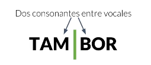

Nosotros pronunciamos **tam-bor**, por eso cuando tenemos dos consonantes juntos entre dos vocales y no formen parte del grupo consonántico indivisible, se deben separar cada una en una sílaba.

### _**Tres consonantes ente vocales**_

Un ejemplo claro sería:

Aquí aplica la regla de los **grupos consonánticos indivisibles**, tenemos que las consonante **t** tiene un sonido fuerte y que cuando le agregamos la **r** se modifica el sonido. La primera consonante que conseguimos en este grupo de tres la agregamos a la vocal anterior y las otras dos que son indivisibles por su sonido alterado se agregan a la vocal que sigue. Por esto queda en-tre-ga. _**También podemos tener las tres consonantes juntas pero que no correspondan al grupo de las consonantes indivisibles**_, en este caso lo que haremos es dejar las dos primeras consonantes a la sílaba anterior y la tercera a la sílaba siguiente:

### _**Cuatro consonantes entre vocales**_

Estos casos son especiales, siempre vas a tener en segundo lugar un grupo de consonantes indivisibles, por esto las dos primeras consonantes se quedan con la vocal anterior y las otras dos con la vocal siguiente.

## Diptongo, triptongo e hiato

Ya vimos qué hacer con las consonantes, ahora veamos las vocales. Con estas sucede algo muy diferente, hay tres posibilidades: **diptongo, triptongo e hiato**. Vamos a reconocer cuando dos vocales estén juntas si forman una sílaba o dos.

### Vocales abiertas y cerradas

Veamos un esquema:

Quizá nos enseñaron que la determinación de una vocal en cuanto a si es cerrada o abierta depende de nuestra boca. Existe un truco adicional para determinar esas vocales, cuando pronunciamos una vocal abierta como **a**, **e** u **o**, la posición de nuestra lengua está abajo, pero cuando pronunciamos una vocal cerrada como **i** o **u** la lengua se queda a la mitad. **¿Por qué es importante saber cuando una vocal es cerrada o abierta?** Esta clasificación nos guiará para identificar si estamos hablando de un **hiato** o un **diptongo**.

### Diptongo

Hablamos de diptongo cuando tenemos una vocal abierta y una cerrada juntas. Es decir: una **a**, **e**, **o** antes de una **i** o **u**. Ejemplo:

También cuando tenemos una **vocal cerrada** seguida de una **abierta**. Estos dos casos son diptongo cuando no llevan tilde. Ejemplo:

Cuando tenemos dos vocales cerradas juntas, siempre es un diptongo. Ejemplo:

### Triptongo

Esta clasificación se da muy pocas veces en nuestro idioma pero es un caso real. Sólo sucede cuando tenemos tres vocales juntas, se pronuncian dentro de la misma sílaba y están en el siguiente orden: **cerrada-abierta-cerrada**. Ejemplo, que es una onomatopeya:

### Hiato

Sucede cunado tenemos dos vocales juntas pero no revuelta. Son dos sílabas, eso quiere decir que en realidad están separadas ya que las pronuncias con dos emisiones de voz diferentes. **¿Cuando se presenta?** En primer lugar cuando tenemos dos vocales abiertas juntas. Ejemplo:

Cuando tenemos una vocal cerrada con tilde y luego una abierta. Ejemplo:

También cuando tenemos una vocal abierta y una cerrada con tilde. Ejemplo:

Esto es un poco complicado pero no debemos preocuparnos. Hagamos algunos ejercicios.

### Ejercicios

Tenemos una serie de vocales con y sin tildes, haremos combinaciones y concluiremos si tenemos una **diptongo, triptongo o hiato**. Primer ejercicio:

Estas dos combinaciones nos forman un diptongo, podemos pensar en la palabra **Aura**, está escrito en el siguiente orden: **abierta-cerrada**. ¿Pero que pasa si a la **u** le ponemos una tilde?.

Lo que sucede es que la tilde nos rompe el diptongo para convertirse en un hiato. Ejemplo: Raúl. También sucede con la palabra **maíz** o **país**. Ahora veamos un diptongo que se usa muy poco:

Este solo se usa en palabras que son herencia de otros idiomas como la palabra **gourmet**. **¿Qué pasa si hacemos la combinación cerrada-abierta?**

Acá también estamos hablando de un diptongo, por ejemplo en la palabra **cielo**. También tenemos que dos palabras cerradas siempre es un diptongo como en la palabra **ciudad**.

**Ahora intentemos con el triptongo**:

Son tres vocales juntas que se pronuncian en la misma sílaba. Un ejemplo sería: **limpiauñas** o **semiautomático**.

## La sílaba tónica, el acento y la tilde

Vamos a aprender cual de las sílabas lleva acento, una cosa curiosa es que acento y tilde no son lo mismo.

### Sílaba  tónica

Es dentro de una palabra, la sílaba que yo estoy imprimiendo con mayor fuerza al pronunciarlas, el resto se les conoce como átonas. También se conoce como acento léxico. _**Todas las palabras llevan acento pero no todas las palabras llevan tilde**_. Es importante identificarla para saber cuando va a llevar tilde o no.

### ¿Cómo encontrarla?

Un truco para conseguir la sílaba tónica cuando no estamos seguro de su ubicación es el siguiente: primero dividimos la palabra en silabas con las reglas que sabemos, ahora pronunciaremos la misma cantidad de sílabas de que tiene cambiando cada vez la posición donde le imprimimos más fuerza al pronunciarlas.

Si le damos más fuerza a la sílaba **jem**, vemos que suena muy natural. El resto de las sílabas no suenan bien. Con esto podrás conseguir la silaba tónica.

### Tilde

Si la sílaba tónica es el acento de cada palabra, entonces, **¿Qué es la tilde?** Es un símbolo gráfico que usamos con una letra para modificar su pronunciación:

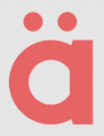

En otros idiomas como el **portugués** o el **francés** existen mucho otros tipos de tilde. Existe la tilde aguda, grave, circunflejo, diéresis, entre otras. Tenemos la suerte que en el español solo tenemos esta tilde:

Solo se usa la tilde aguda, se usa para marcar la silaba tónica en una palabra.

### Dato importante

Las mayúsculas llevan tilde, existe la creencia de que no llevan, esto viene de la época de las imprentas donde usaban tipos móviles para imprimir los libros y cuando usaban la letra mayúsculas con tilde se rompían.

## Palabras agudas

Ahora aprendamos a usar las tildes. Todo se reduce a saber distinguir la sílaba tónica, exactamente saber donde está ubicada. Empecemos con las palabras agudas.

### ¿Qué es una palabra aguda?

* **Son las que llevan acento en la última sílaba**: cuando hablamos de esta clasificación de palabras aguda, graves o esdrújulas, no vamos a pensar en las posiciones: primera sílaba, segunda y tercera. Vamos a pensar de atrás para adelante, es decir: última, penúltima, antepenúltima. - **Son las que llevan la sílaba tónica en la última posición**. - _Llevan tilde cuando terminan en **vocal**, **n** o **s**_: excepto que sea monosílaba, esos no se acentúan.

Ejemplo:

Esta palabra es aguda, no lleva acento porque no termina en **vocal**, **n** o **s**.

### Ejemplos

* La primera palabra es **navegador**: si usamos la técnica de ir acentuando cada sílaba para encontrar la sílaba tónica, nos daremos cuenta de que es **dor**, es la última y por ende es aguda. No lleva acento por la reglas antes vistas. 
* **Programación**: la última sílaba es tónica, así que es aguda, además termina en **n** y por eso **lleva acento**. Como es una **diptongo**, lleva su acento en la vocal **o**. 
* **Virtual**: su sílaba tónica es **tual** pero no lleva tilde. 
* **Compiló**: es **aguda** y lleva tilde  porque  termina en **vocal**.

## Palabras llanas o graves

Se les puede llamar de las dos formas. **Son las que llevan el acento en la penúltima sílaba**, es decir: la sílaba antes de la última. Por ejemplo:

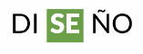

Si tomamos este ejemplo, la palabra **diseño**, podemos ver en donde está la sílaba tónica, es la segunda.

### ¿Cuando se usan tilde en estas palabras?

La regla es lo contrario a las que tienen las palabras agudas. Esto quiere decir que las reglas son las siguientes, no llevan tilde cuando:

* Terminen en **vocal**. 
* Terminen en **s**. 
* Terminen en **n**. 

La tilde siempre va en la **sílaba tónica**, nunca en otra posición. Veamos otros ejemplos:

* **Di-se-ño**: no lleva tilde por que termina en vocal. 
* **E-ner-gí-a**: si nos guiamos por la regla de las tildes en las palabras graves, podríamos concluir que no lleva. La regla de los hiatos son más importantes, cuando tenemos una vocal **cerrada con otra abierta** lleva tilde. Las palabras graves que terminan en hiato, llevan tilde aunque terminen en vocal. 
* **Ar-gu-men-to**: estamos hablando de un sustantivo, termina en vocal así que no lleva tilde. 
* **Di-fí-cil**: termina en **l**, por ende lleva tilde. 

## Palabras esdrújulas

Son las que llevan el acento en la **antepenúltima sílaba**, la que está antes del penúltimo. Siempre llevan acento en la sílaba tónica. Ejemplo:

Si usamos la técnica para descubrir la sílaba tónica, nos daremos cuenta de que **ná** es la correcta. **¿Cuando llevan tilde?** Siempre. Dato curioso: _**la palabra esdrújula es una palabra esdrújula**_.

### Ejemplos

* **Pa-rá-me-tro**: su sílaba tónica es **rá**.
* **A-ná-li-sis**: su sílaba tónica es **ná**.
* **Á-re-a**: es un hiato y lleva acento en la primera **a**.
* **Bue-ní-si-mo**: es una palabra esdrújula y siempre lleva tilde. 

La terminación **ísimo** o **ísima**, se usa para hablar de cantidades grandes. Estas terminaciones siempre son esdrújulas y llevan tilde.

## Palabras sobreesdrújulas

_Si has seguido la dinámica_, sabrás que la **sílaba tónica** de este tipo de palabras está en la **tras-antepenúltima** sílaba, es anterior a la **antepenúltima**. **Siempre lleva tilde**. Todas las palabras que tengan la sílaba tónica en esta posición o anterior a esta son **sobreesdrújulas**. Hay pocas palabras **sobreesdrújulas** en nuestro idioma o son derivados de otras palabras. Ejemplo:

Viene de la palabra rápido, esta es **esdrújula** por eso lleva **tilde**. Agregando el sufijo **mente** la convertimos en un adverbio, nos indica velocidad. Tiene 5 sílabas y tiene su sílaba tónica en la **tras-antepenúltima** sílaba, lleva acento.

### Ejemplo

* **Ex-plí-ca-me-lo**: siempre son derivados de otras palabras. Lleva acento en **plí**, su **tras-antepenúltima** sílaba. 

## Tildes diacríticas

Las reglas del uso de las tildes que acabamos de ver, es decir las tildes en: los hiatos, las palabras **agudas**, **graves**, **esdrújulas** y **sobreesdrújulas**, cubren el el 90% de todos los casos de tildes que te puedes encontrar, el otro 10% te los vas a encontrar en el tema de ahora: **tildes diacríticas**.

### ¿Qué son?

Son tildes que se usan para distinguir entre dos palabras que se escriben igual, se pronuncian igual pero tienen un significado diferente.

### Ejemplos

* **El**, **él**: la palabra "**el**" se escribe sin tilde cuando es un artículo, una palabra que acompaña a un sustantivo. La palabra "**él**" se escribe con tilde cuando es un pronombre, una palabra que reemplaza a un nombre. Ejemplos: 
  * _¿Sabes **el** número de la casa?_: Acá usamos la palabra **el** para acompañar el sustantivo **número**.  
  * _No, pregúntaselo a **él**_: él es un pronombre, para este caso si podemos cambiar la palabra él por un nombre, es por que es un pronombre. 
* **Tu**, **tú**: cuando usamos "**tu**", es un posesivo, se refiere a la propiedad de algo: tu carro, tu casa, tu forma de ser. La palabra "**tú**" es también un pronombre. Ejemplos: 
  * _Por favor, préstame **tu** llave_: se refiere a la llave que le pertenece a la otra persona. 
  * _Pensé que **tú** la tenías_: se refiere a una persona y por eso es un pronombre. 
* **Mi**, **mí**: la palabra "**mi**" se refiere a un posesivo, algo que le pertenece a alguien. "**Mí**" es un pronombre y se refiere a una persona. Ejemplos: 
  * _¿Vendrás a **mi** fiesta?_: pertenencia. 
  * _Claro, es muy importante para **mí**_: pronombre personal.
* **Si**, **sí**: "**si**" se refiere a una condición o la nota musical **si**. La palabra "**sí**" es para afirmar o como el pronombre **sí** para decir: **en sí, soy mejor**. Ejemplos:
  * _Si establezco una fecha lejana, el programa me falla ¿Esto es un **bug?**_: condición.   
  * **Sí**, lo es. El programador so resaltó como un pendiente para **sí** mismo: afirmación y pronombre. 
* **De**, **dé**: "**de**" es una preposición, se refiere a la pertenencia de algo. "**Dé**" solo se usa cuando es la conjugación del verbo **dar**. Ejemplos: 
  * _Toma este curso **de** ortografía_: de pertenencia.
  * _¿Crees que me dé todas las respuestas?_: conjugación de **dar**.
* **Te**, **té**: **te** es un pronombre, **té** es un sustantivo. Ejemplos: 
  * _¿Qué **te** gustaría tomar?_: pronombre. 
  * _**Té** o café están bien_: se usa como sustantivo, es el único caso en el que la palabra té lleva tilde.
* **Se**, **sé**: "**se**" se usa como pronombre para articular frases. "**Sé**" se usa para conjugar dos verbos: **ser** o **saber**. Ejemplo: 
  * _Quiero que **se** vea el logo en la página_: pronombre como articulador. 
  * _**Sé** paciente, Creo que ya **sé** cómo agregarlo_: conjugación de ser y saber. 
* **Mas**, **más**: "**mas**" es **adversativo**, es decir, sinónimo de la palabra **pero**. "**Más**" es comparativo o que expresa suma. Ejemplos: 
  * _Intenté resolverlo, **mas** no lo logré_: claramente es sinónimo de **pero**.
  * _Entonces debes estudiar **más**_: significa **suma**, referente a cantidad. 
* **Aun**, **aún**: "**aun**" se puede cambiar por **incluso**. "**Aún**" se puede cambiar por la palabra **todavía**.
  * _Llegó muy lejos, aun cuando no se lo propuso_: se puede cambiar por la palabra **incluso**.  
  * _**Aún** no es tarde para seguir su ejemplo: acá se puede cambiar por la palabra **todavía**_.

### Sentido más amplio

En este caso veremos las siguientes palabras: _**qué, quién, cómo, cuál, cuándo, cuánto, dónde, por qué**_. Todo esto lo veremos en sentido **interrogativo** o **exclamativo**. Una manera de recordar esto es no pensar que necesariamente una oración que tenga signo de exclamación o interrogación quiera decir que la palabra tenga sentido interrogativo o exclamativo, más bien se trata de dónde se encuentre la palabra a ver si lleva a formular una pregunta. Miremos algunos ejemplos:

* **¿**_**Dónde**_ **será la reunión?**: acá claramente es una pregunta. 
* **Será** _**donde**_ **la hicimos la última vez**: acá no es una pregunta. 
* **¡**_**Qué**_ **maravilla! Me aprobaron la idea**: es una exclamación.
* **Qué suerte la** _**que**_ **tuviste**: empieza como exclamación, pero el segundo "**que**" no es exclamativo.
* **A que no sabes** _**quién**_ **me escribió**: aunque no tiene signos de interrogación tiene un sentido interrogativo, representa una pregunta. 
* **Sabía que tú serías** _**quien**_ **lo dijera**: acá no es ni una pregunta, duda o exclamación. Acá estamos dando información. 

Este tema de las tildes diacríticas es un poco compleja, la única forma de dominar esta área de la ortografía es practicando mucho, sea leyendo o escribiendo.

### En desuso

Estas alguna vez estuvieron vigentes y correctas. Actualmente están en desuso.

* **ó**: se usaba entre números. 
* **sólo**: esta palabra no debe llevar tilde, aunque se usa mucho la RAE dictó que no se usara.
* **éste, ésta, ésto, ése, ésa, éso, aquél, aquélla**: no es aconsejable usar ninguna de ellas. 

### Actividad con tildes

A continuación mostraré un párrafo al cual le faltan muchas tildes, nuestro trabajo será colocar las tildes en los lugares correspondientes.

### Párrafo sin tildes

A veces no entiendo por que organizamos conferencias. Es caro, requiere coordinacion grandisima y una inversion emocional increible. En resumen, no es nada facil.

Mas cuando ves como nacen nuevos amigos y nuevas empresas, ese nivel de conexion hace que valga la pena.

Cuando organice mi primer evento yo tenia 19 años y no sabia que estaba haciendo. Todo salio mal, fue un autentico milagro que no me mataran.

### Párrafo corregido

A veces no entiendo por **qué** organizamos conferencias. Es caro, requiere **coordinación** **grandísima** y una **inversión** emocional **increíble**. En resumen, no es nada **fácil**.

Mas cuando ves **cómo** nacen nuevos amigos y nuevas empresas, ese nivel de **conexión** hace que valga la pena.

Cuando **organicé** mi primer evento yo **tenía** 19 años y no **sabía** **qué** estaba haciendo. Todo **salió** mal, fue un **auténtico** milagro que no me mataran.

## Reto: el uso de la tilde

A continuación encuentras un texto libre de tildes. Tu reto consiste en corregirlo agregando todas las tildes faltantes. Comparte tu texto corregido en la sección de discusiones.

### Texto sin corrección

_PlatziConf es mas que solo conferencias de tecnologia en tu pais, es el dia clave para impulsar tu carrera profesional. En esta ocasion tendremos mentorias para ayudarte a mejorar tu marca personal de forma facil y rapida._

_¿Como seran? Un experto del mismisimo Team Platzi te dara guia sobre cualquier tema en una sesion uno a uno. Habra un numero limitado de lugares y seguramente se agotaran en tiempo record._

_Ademas, encontraras la PlatziStore, donde podras adquirir productos unicos de Platzi para ti._

### Texto corregido

_PlatziConf es **más** que solo conferencias de **tecnología** en tu **país**, es el **día** clave para impulsar tu carrera profesional. En esta **ocasión** tendremos **mentorías** para ayudarte a mejorar tu marca personal de forma **fácil** y **rápida**._

_¿Como **serán**? Un experto del **mismísimo** Team Platzi te **dará** **guía** sobre cualquier tema en una **sesión** uno a uno. **Habrá** un numero limitado de lugares y seguramente se agotaran en tiempo record._

_Ademas, **encontrarás** la PlatziStore, donde **podrás** adquirir productos **únicos** de Platzi para ti._

\_\_

## Actividad

Ahora vamos a crear una lista de 20 palabras que tengan que ver con tu perfil, imaginando un documento que escribiremos para presentar en el trabajo ideal. Cuando tengamos esas 20 palabras tendremos que identificar la sílaba tónica, clasificarla como palabra grave, aguda, esdrújula o sobreesdrújula. Debemos identificar si llevan tilde o no.

### Palabras

1. _Constancia_: cons-**tan**-cia, palabra grave, lleva tilde porque termina en **vocal**. 
2. _Determinación_: de-ter-mi-na-ción, palabra aguda, lleva tilde porque termina con **n**. 
3. _Paciencia_: pa-**cien**-cia, palabra grave, lleva acento porque termina en **vocal**. 
4. _Disciplina_: dis-ci-**pli**-na, palabra grave, no lleva acento porque termina en **vocal**.
5. _Perseverancia_; per-se-ve-**ran**-cia, palabra grave, no lleva acento porque termina en **vocal**.
6. _Comprensión_: com-pren-**sión**, palabra aguda, lleva tilde porque termina con **n**. 
7. _Ortografía_: or-to-gra-**fía**, palabra aguda, lleva tilde porque termina con **n**. 
8. _Activo_: ac-**ti**-vo, palabra grave, no lleva acento porque termina en **vocal**.
9. _Sagaz_: sa-**gaz**, palabra aguda, no lleva tilde porque no termina con las vocales compatibles. 
10. _Diseñador_: di-se-ña-**dor**, no lleva tilde porque no termina con las vocales compatibles. 
11. _Pensador_: pen-sa-**dor**, no lleva tilde porque no termina con las vocales compatibles. 
12. _Equitativo_: e-qui-ta-**ti**-vo, palabra grave, no lleva acento porque termina en **vocal**.
13. _Matemática_: ma-te-**má**-ti-ca, palabra esdrújula, siempre lleva acento. 
14. _Álgebra_: **ál**-ge-bra, palabra esdrújula, siempre lleva acento. 
15. _Sociable_: so-**cia**-ble, palabra grave, no lleva acento porque termina en **vocal**.
16. _Publicador_: pu-bli-ca-**dor**, palabra aguda, no lleva tilde porque no termina con las vocales compatibles. 
17. _Asistente_: a-sis-**ten**-te, palabra grave, no lleva acento porque termina en **vocal**.
18. _Consejero_: con-se-**je**-ro, palabra grave, no lleva acento porque termina en **vocal**.
19. _Compañero_: com-pa-**ñe**-ro, palabra grave, no lleva acento porque termina en **vocal**.
20. _Humorista_: hu-mo-**ris**-ta, palabra grave, no lleva acento porque termina en **vocal**.

## Estructuración de la oración y tipos de oraciones

Si seguimos el ejemplo de la química donde las letras eran átomos, las sílabas moléculas y las palabras compuestos, podemos llegar a la conclusión de que las oraciones son compuestos.

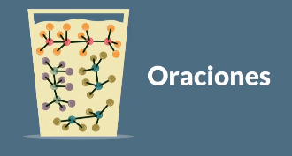

Esta es una solución donde están flotando algunos tipos de moléculas, algunos compuestos más largos que otros. La oración es algo similar, es un conjunto de palabras que se unen para expresar una idea. Las oraciones tienen una estructura, la más simple es la siguiente:

Podemos explicar esta estructura de la siguiente manera:

1. **Sujeto**: es el elemento que realiza la acción. 
2. **Predicado**: ofrece información acerca del sujeto. 
3. **Núcleo**: es un verbo, en este caso es el verbo **ser** conjugado como: **es**.

Este es el ejemplo más sencillo, pero si te das cuenta, las oraciones que vemos y hacemos día a día no siempre están formadas con esta estructura, existen formas más complejas. Quizá el sujeto no esté en la posición que explicamos, puede ser tácito, por ejemplo: vimos una película, quizá pareciera que no tiene sujeto pero la realidad es que sí, el sujeto somos nosotros en esta oración. Ahora veamos más ejemplos para aprender sobre esta estructura:

### Declarativas o enunciativas

Son oraciones que informan de un acontecimiento de manera objetiva, pueden darse de forma afirmativa o negativa. En este tipo de oraciones es mucho más fácil detectar el sujeto.

_En el segundo ejemplo el sujeto sería: nunca, el predicado: es demasiado tarde para aprender._

### Interrogativas

Son las que formulan una pregunta, pueden ser directas e indirectas.

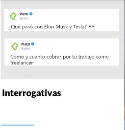

El primero ejemplo es una pregunta directa y el segundo ejemplo no está marcado con signos de interrogación pero sigue siendo una pregunta.

### Exclamativa

Expresan emoción y siempre vienen encerradas dentro de los signos de admiración o exclamación.

### Imperativa

Es una oración que da una orden o petición a la persona que lo está leyendo.

### Dubitativas

Son las que expresan una duda de parte de la persona que dice la oración.

### Optativas o desiderativas

Expresan un deseo, por lo general vienen con las palabras: **ojalá**, **espero que**.

## Tipos de palabras

Existen muchísimas formas de clasificar distintas palabras en nuestro idioma. En este caso nos enfocaremos en la función que hace cada palabra en una oración, sucede que hay palabras que puede tener varias funciones según cómo se organice en la oración.

### Sustantivo

Es un nombre, se usa para designar a un ser vivo, algo material o inmaterial. Por eso hablamos de sustantivos concretos como un perro, abstractos como un sentimiento y los nombres propios que también son sustantivos.

### Adjetivo

Es una palabra que describe al sustantivo, lo modifica o lo complementa de alguna forma. Toda palabra que acompañe al sustantivo y ayude a describirlo va a ser un adjetivo.

### Verbo

Es una acción que es realizada por el sujeto. Un verbo, en este caso, es la acción que está realizando nuestro perro:

Los verbos son todas las palabras que terminan en **ar**, **er** o **ir**. Se conjuga de acuerdo a la oración y se puede modificar en función a la persona, número o tiempo.

### Adverbio

Es una palabra que modifica al verbo, incluso hasta al adjetivo.

Nos da un detalle adicional sobre en qué modo está ladrando el perro. También podríamos decir: el perro rojo **oscuro**, acá oscuro acompaña al sustantivo y al adjetivo. El adverbio modifica al verbo y al adjetivo.

### Artículo

Es una palabra que delimita al sustantivo.

### Pronombre

El pronombre es una palabra que hace las veces de sustantivo.

Cuando en una oración de pueda cambiar un nombre por la palabra: él, ella, entre otros, entonces sería un pronombre.

### Conjunciones

Enlazan dos palabras o dos frases. Se puede usar **y** u **o**, dependiendo del sentido de la oración. 

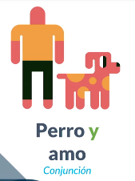

### Preposición

Subordina una palabra a la otra. Se usa para denotar posición, movimiento, tiempo, sucesión o finalidad. 

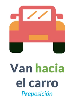

### Interjección

Es una expresión de asombro, molestia o dolor. Forman oraciones en sí misma y puede formar parte de otra oración. 

### Caso importante

Veamos la diferencia entre: ¡ay!, hay y ahí. Si aplicamos las reglas que vimos de la clasificación de las palabras podemos llegar a la siguiente conclusión:

### Reto: tu idea principal

Esta entrega de tu proyecto consiste en escribir la idea principal de tu correo. Debe ser una sola oración que resuma quién eres y por qué eres el candidato perfecto para ese trabajo de tus sueños. Identifica con cursivas el sujeto de tu oración. Para cada palabra de tu oración, identifica a qué clase de palabra corresponde.

### **Ejemplo**

_Yo_ soy una ingeniera apasionada por la escritura.

* Yo: pronombre.
* Soy: verbo.
* Una, la: artículos.
* Ingeniera, escritura: sustantivos.
* Apasionada: adjetivo.
* Por: preposición.

### **Reto**

"Yo soy un programador que nunca para de aprender".

* Yo: pronombre. 
* soy: verbo. 
* un: artículo,.
* programador: sustantivo. 
* que: conjunción. 
* nunca: adverbio.
* para: verbo.
* de: preposición.
* aprender: verbo.

## La importancia de la puntuación

En nuestra analogía de la química, nuestro **párrafo** sería una conjunto de soluciones creadas por la cadena química que ya pusimos de ejemplo.

De esta manera le daremos riqueza y sentido a lo que estamos escribiendo, esto quiere decir que nuestro párrafo está compuesta por varias oraciones, así que tenemos que usar bien los signos de puntuación para que el sentido de nuestro párrafo no sea incorrecto.

Es importante para no desviar el sentido y permitirle al lector tomar aire.

## Los signos de puntuación

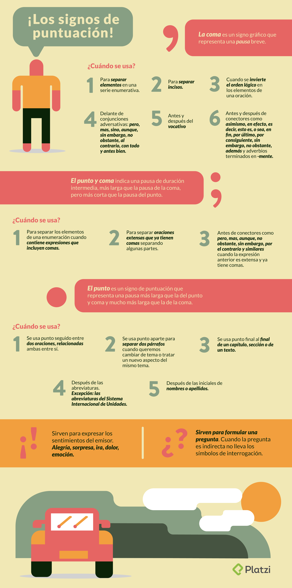

## Signos principales

Los principales signos de puntuación son el punto, la coma, el punto y coma, las comillas, los paréntesis, los signos de interrogación, los signos de exclamación, los puntos suspensivos y el guion.

### Punto «.»

El punto \(**`.`**\) es el signo de puntuación que se coloca al final de los [enunciados](https://es.wikipedia.org/wiki/Enunciados) y las \[oraciones\]\([https://es.wikipedia.org/wiki/Oraci%C3%B3n\_\(gram%C3%A1tica](https://es.wikipedia.org/wiki/Oraci%C3%B3n_%28gram%C3%A1tica)\) "Oración \(gramática\)"\) gramaticales en español, además en la mayoría de los [lenguajes](https://es.wikipedia.org/wiki/Lenguaje) escritos con el [alfabeto latino](https://es.wikipedia.org/wiki/Alfabeto_latino), se escriben sin dejar espacio de separación con el carácter que precede, pero dejando un espacio con el carácter que sigue a continuación, a no ser que dicho carácter sea de cierre. Existen tres clases de punto: el punto y seguido, el punto y aparte y el punto final. Generalmente, indica una entonación descendente.

Punto y seguido

Separa enunciados dentro de un párrafo. Quiere decir que se continúa escribiendo a continuación del punto; la primera letra escrita en este caso irá en mayúscula. Por ejemplo: «Historia de España. El descubrimiento de América». Se denomina _punto y seguido_, nombre más lógico y recomendable que el también usual de _punto seguido_.

Punto y aparte

Separa dos párrafos de contenido diferente dentro del texto. A continuación hay que comenzar a escribir en línea distinta. Para seguir las normas se debe colocar sangría a la primera línea de texto del nuevo párrafo y comenzar en mayúscula. Se denomina _punto y aparte_, aunque en algunas zonas de América se dice _punto aparte_.

Punto final

Siempre se coloca al final, cerrando un texto o enunciado. No es correcta la denominación _punto y final_, creada por analogía de las correctas _punto y seguido_ y _punto y aparte_.[1](https://es.wikipedia.org/wiki/Signo_de_puntuaci%C3%B3n#cite_note-1)​

También se usa el punto para indicar que la palabra anterior es una abreviatura. En este caso se escribe la abreviatura seguida del punto y se continúa escribiendo de forma usual. Esta última clase de punto no se aplica en determinadas abreviaturas como [puntos cardinales](https://es.wikipedia.org/wiki/Punto_cardinal), [acrónimos](https://es.wikipedia.org/wiki/Acr%C3%B3nimos) o medidas, que se consideran [símbolos](https://es.wikipedia.org/wiki/S%C3%ADmbolos).

### Coma «,»

Artículo principal: _\[Coma \(puntuación\)\]\(_[https://es.wikipedia.org/wiki/Coma](https://es.wikipedia.org/wiki/Coma)\(puntuaci%C3%B3n\) "Coma \(puntuación\)"\)\_

La coma \(**`,`**\) es un signo de puntuación que señala una breve pausa dentro del enunciado. Se escribe sin dejar espacio de separación con el carácter que precede, pero dejando un espacio con el carácter que sigue a continuación. Se emplea para separar los miembros de una [enumeración](https://es.wikipedia.org/wiki/Enumeraci%C3%B3n) o sucesión, ya sean palabras o frases, salvo los que vengan precedidos por alguna de las \[conjunciones\]\([https://es.wikipedia.org/wiki/Conjunci%C3%B3n\_\(gram%C3%A1tica](https://es.wikipedia.org/wiki/Conjunci%C3%B3n_%28gram%C3%A1tica)\) "Conjunción \(gramática\)"\) _y_, _e_, _o_, _u_ o _ni_. Por ejemplo:

> María volvió a casa, hizo los deberes, cenó y se fue a la cama.  
>   
> Mi casa tiene muebles, mesas y cuatro camas.

Hay tendencias que admiten su uso para separar dos miembros independientes de una oración, haya o no conjunción entre ellos, siempre y cuando sean realmente independientes; pues, si no, estaríamos en el caso anterior:

> Los soldados saludaban, la gente aplaudía y los niños no paraban de cantar.

También se utiliza para delimitar o aislar una aclaración o inciso \(palabras u oraciones incidentales\):

> Nacho, mi primo, acaba de conseguir su primer \[empleo\]\([https://es.wikipedia.org/wiki/Trabajo\_\(sociolog%C3%ADa](https://es.wikipedia.org/wiki/Trabajo_%28sociolog%C3%ADa)\) "Trabajo \(sociología\)"\).

Las locuciones conjuntivas o adverbiales, sea cual sea su posición, van precedidas y seguidas de coma, tales como: _en efecto, es decir, en fin, por consiguiente._

Indicar que una o varias palabras han sido suprimidas por razones gramaticales o de estilo.[2](https://es.wikipedia.org/wiki/Signo_de_puntuaci%C3%B3n#cite_note-2)​

### Punto y coma «;»

Artículo principal: [_Punto y coma_](https://es.wikipedia.org/wiki/Punto_y_coma)

El punto y coma \(**`;`**\) es un signo de puntuación; gramaticalmente, se utiliza para unir dos oraciones relacionadas en una sola frase:

—_María estaba apenada por el examen._ + _María tendrá que estudiar más._ = _María estaba apenada por el examen; tendrá que estudiar más._ —_Está lloviendo mucho._ + _No podemos ir caminando._ = _Está lloviendo mucho; no podemos ir caminando._

Generalmente se puede sustituir por construcciones del tipo:

—_María estaba apenada por el examen y tendrá que estudiar más._ —_No podremos ir caminando porque está lloviendo mucho._

También sirve para separar los elementos de una enumeración cuando se trata de expresiones que incluyen comas:

—_Había que estar en contacto con la naturaleza; dejar entrar el cielo, el mar y el viento; dormir sobre tablones, sobre el suelo; sentarse en sillas medio rotas._

Además, se usa delante de las conjunciones o locuciones como _pero, más, aunque, sin embargo, por tanto_ y _por consiguiente_ cuando los períodos tienen cierta longitud:

—_Creemos en la creatividad y la ruptura de los opresores cánones antiguos como medio de vida; no obstante, somos conscientes de que es necesario mantener un mínimo de tradición en nuestros trabajos._

### Dos puntos «:»

Artículo principal: [_Dos puntos_](https://es.wikipedia.org/wiki/Dos_puntos)

Este signo de puntuación \(**`:`**\) representa una pausa mayor que la de la coma y menor que la del punto. Detiene el discurso para llamar la atención sobre lo que sigue, que siempre está en estrecha relación con el texto precedente.[3](https://es.wikipedia.org/wiki/Signo_de_puntuaci%C3%B3n#cite_note-3)​ Un uso importante y frecuente de este signo es introducir citas textuales \(uso que a veces se le atribuye incorrectamente a la coma\).

### Comillas: simples «'» y dobles «"»

Artículo principal: [_Comillas_](https://es.wikipedia.org/wiki/Comillas)

Las comillas \(`‘` `’`, `“` `”`, `«` `»`\) son signos de puntuación que se colocan al principio y al final de las frases, palabras escritas como citas, ejemplos, de aquellas que se quiere destacar, ya sea por importancia que le dé el autor o por su carácter irónico, vulgar o extranjero e impropio de la lengua que se está usando. A pesar de que está verdaderamente extendido el uso de las comillas inglesas \(“ ”\) es preferible emplear antes las angulares o españolas \(« »\) y reservar aquellas, y finalmente las simples \(‘ ’\), para cuando deban entrecomillarse partes de un texto ya entrecomillado. Se utilizan, por ejemplo:

1. Para citar textualmente algo: p. ej., «Me dijo que “supuestamente llegaría hoy”».
2. Para señalar palabras usadas en un sentido distinto del normal, con el fin de indicar que se han seleccionado intencionalmente y no por error.
3. Para indicar la intención irónica o sarcástica del empleo de una palabra.
4. Para indicar algo sobre una palabra o expresión.
5. Para presentar el  [significado](https://es.wikipedia.org/wiki/Significado)  de una palabra o expresión.
6. Para destacar que una palabra o expresión es extranjera, se trata de un apodo o de un  [seudónimo](https://es.wikipedia.org/wiki/Seud%C3%B3nimo).

En español se utilizan tres tipos de comillas:

1. Comillas castellanas, latinas, españolas, angulares dobles o  _guillemet_  \(« »\).
2. Comillas dobles o inglesas \(“ ”\).
3. Comillas simples \(‘ ’\).

Asimismo, se distingue entre comillas de apertura \(«, “, ‘\) y comillas de cierre \(», ”, ’\).

Cada uno de estos signos tiene su propio uso. Como norma general, como primera opción se utilizan las comillas angulares. Si dentro de lo ya entrecomillado apareciera una segunda cita, se utilizarían otras comillas, siendo preferibles las inglesas, para dejar como recurso final las simples. Lo más frecuente es entrecomillar, desde fuera hacia dentro, en el orden siguiente: «...“...‘...’...”...»

Las comillas simples se utilizan para marcar ejemplos en casos en que no resulta apropiado el uso de la [cursiva](https://es.wikipedia.org/wiki/Cursiva). También se prefiere su uso para presentar el significado de una palabra:

«—El autor dijo: “Las comillas \('signos de puntuación utilizados para demarcar niveles distintos en una oración'\) se usan profusamente en mi obra”.»

Dice la norma que los signos de puntuación de una oración que contiene un texto entrecomillado deben colocarse después de las comillas de cierre, excepto cuando ese texto no pertenezca a ninguna otra oración, es decir, cuando la frase u oración entrecomillada sea individual.

En español no se deja espacio alguno entre las comillas y su contenido. Cada idioma tiene sus propias normas de aplicación de las comillas.

### Paréntesis «\( \)», corchetes «\[ \]» y llaves «{ }»

Artículo principal: [_Paréntesis_](https://es.wikipedia.org/wiki/Par%C3%A9ntesis)

Los paréntesis \(en singular _paréntesis_\) son signos de puntuación. Se usan en pares para separar o intercalar un texto dentro de otro o para hacer una aclaración. Los distintos tipos son:

* los paréntesis propiamente dichos:  `(` `)`
* los corchetes:  `[` `]`
* las llaves:  `{` `}`

Para distinguir ambos paréntesis se usa decir:

* Paréntesis que abre o paréntesis izquierdo al símbolo \(.
* Paréntesis que cierra o paréntesis derecho al símbolo \).

Igual que las comillas, cuando se han de emplear varias veces en un mismo fragmento se utilizan de la siguiente manera: \(…\[…{…}…\]…\)

### Signos de interrogación «¿» y «?»

Artículo principal: [_Signos de interrogación_](https://es.wikipedia.org/wiki/Signos_de_interrogaci%C3%B3n)

El signo de interrogación \(`¿` `?`\) es usado para hacer una [pregunta](https://es.wikipedia.org/wiki/Pregunta). Su origen se encuentra en el [latín](https://es.wikipedia.org/wiki/Lat%C3%ADn). La [palabra](https://es.wikipedia.org/wiki/Palabra) «cuestión» viene del latín _questio_, o 'pregunta', abreviado como «Qo». Esta abreviación se transformó en el signo de interrogación.

En la mayoría de los [idiomas](https://es.wikipedia.org/wiki/Idioma) se utiliza un único signo de interrogación al final de la frase interrogativa: _How old are you?_ \(inglés; en español «¿Cuántos años tienes?»\). Este fue el uso habitual también en español, hasta mucho después de que la segunda edición de la _Ortografía de la Real Academia_, en 1754, declarase preceptivo iniciar las preguntas con el signo de apertura de interrogación invertido \(¿\), y terminarlas con el signo de interrogación ya existente \(?\) \(«**¿**Cuántos años tienes?»\) al tiempo que se ordenaba lo mismo para los signos de exclamación \(¡\) y \(!\). La adopción fue lenta, y se encuentran [libros](https://es.wikipedia.org/wiki/Libro), incluso del siglo XIX, que no utilizan tales signos de apertura. Finalmente se generalizó, seguramente debido a que la sintaxis del español no ayuda en muchos casos a deducir en qué momento se inicia la frase interrogativa, como pasa en otros idiomas.

Una variante que no llegó a generalizarse fue la de utilizar la apertura únicamente cuando el [enunciado](https://es.wikipedia.org/wiki/Enunciado) fuera largo, o con riesgo de ambigüedad, pero no para las frases breves y claramente interrogativas, como «Quién vive?». La influencia del inglés está haciendo retornar este viejo criterio. Incluso es común que en las salas de _chat_ o conversaciones en línea en español se use solamente el signo \(?\) para preguntar, ya que ahorra [tiempo](https://es.wikipedia.org/wiki/Tiempo) al momento de presionar las teclas. Esto podría no tener gran importancia debido a que se está utilizando en conversaciones informales.

### Signos de exclamación «¡» y «!»

Artículo principal: [_Signo de exclamación_](https://es.wikipedia.org/wiki/Signo_de_exclamaci%C3%B3n)

Los signos `¡` `!` se utilizan para señalar el carácter exclamativo o representar una forma de actuar en una oración. Se escriben para empezar y finalizar una oración exclamativa, exhortativa o imperativa. También van entre signos de exclamación las interjecciones:

* _—¡Ayuda!_
* _—¡Cuidado con el perro!_
* _—¡Pero qué buena idea!_
* _—¡Genial!_

### Puntos suspensivos «...»\[[editar](https://es.wikipedia.org/w/index.php?title=Signo_de_puntuaci%C3%B3n&action=edit&section=10)\]

Artículo principal: [_Puntos suspensivos_](https://es.wikipedia.org/wiki/Puntos_suspensivos)

Los puntos suspensivos \(`…`\) son tres puntos sin espacios entre ellos, son un único signo de puntuación que se utiliza al final de una palabra, frase u oración en lugar del punto u otro signo. Se utilizan para dejar en duda, continuación o en suspenso una acción y son alineados horizontalmente al nivel de la línea base de [escritura](https://es.wikipedia.org/wiki/Escritura).

### Guion «

Artículo principal: [_Guion ortográfico_](https://es.wikipedia.org/wiki/Guion_ortogr%C3%A1fico)

El guion \(`-`\), de menor longitud que la raya, tiene tres usos principales. Se utiliza como signo para unir palabras, muestra la división de palabras al final de una línea, y se usa en obras como [diccionarios](https://es.wikipedia.org/wiki/Diccionarios) para marcar la separación entre las [sílabas](https://es.wikipedia.org/wiki/S%C3%ADlabas) que componen las palabras.[4](https://es.wikipedia.org/wiki/Signo_de_puntuaci%C3%B3n#cite_note-4)​

### Raya «—»

Artículo principal: _\[Raya \(puntuación\)\]\(_[https://es.wikipedia.org/wiki/Raya](https://es.wikipedia.org/wiki/Raya)\(puntuaci%C3%B3n\) "Raya \(puntuación\)"\)\_

La raya \(`—`\), que no debe confundirse con el [guion bajo](https://es.wikipedia.org/wiki/Guion_bajo) \(\_\) —especialmente en contextos informáticos— ni con el guion \(-\) —el cual es más corto— ya que tienen usos y significados muy diferentes, se usa para introducir un inciso dentro de un período más extenso y para señalar en los diálogos la intervención de cada locutor y los comentarios e incisos del narrador. Se escriben dos, una para abrir y otra para cerrar, excepto cuando el diálogo no prosigue, que es recomendable suprimir la última y sustituirla por el obligatorio punto; además, se escriben separadas del resto de la frase con un espacio, y pegadas al propio inciso. En el caso de los incisos puede sustituir a la coma para mayor aislamiento de los mismos y también a los paréntesis, pero para expresar uno menor.[5](https://es.wikipedia.org/wiki/Signo_de_puntuaci%C3%B3n#cite_note-5)​

Usos de la raya:

1. Para encerrar los elementos intercalados, en lugar de comas:
   * _Las prendas del espíritu joven —el entusiasmo y la esperanza— corresponden, en las armonías de la historia y la naturaleza, al movimiento y a la luz._
   * _Para lograr una buena imagen —que impacte— cuida tus modales._
   * _No iré sino mañana —dijo el niño._
2. En los diálogos de estilo directo, para separar el discurso de cada personaje:

_—Luis, la primera impresión en una entrevista es definitiva._

_—Lo sé y me estoy preparando._

_—Te deseo mucho éxito._

Para escribir la raya con el teclado informático español, en [Microsoft Windows](https://es.wikipedia.org/wiki/Microsoft_Windows) se mantiene presionada la tecla «Alt» mientras se pulsa «0151» en el teclado numérico. En sistemas operativos de [Apple](https://es.wikipedia.org/wiki/Apple) se puede conseguir el mismo efecto con «Alt» y la tecla guion \(-\) en ordenadores Mac.

## La coma criminal

¿Cómo podemos evitar en los texto que escribimos? Primero que nada vamos a ver qué es. La coma criminal se le dice a la coma que ponemos entre el sujeto y el verbo, o bien entre el verbo y el sujeto. Este es un error muy común, porque viene de la forma en que hablamos naturalmente. Vamos a ver varios ejemplos:

En el siguiente caso pasa algo interesante, cuando decimos la siguiente frase en voz alta pareciera que debería llevar coma.

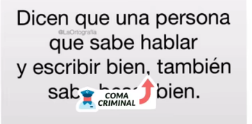

Cuando encontramos el sujeto y el verbo sabemos que entre ellos no va coma. 

### Coma vocativa

Se usa para llamar a alguien o saludar. Esta coma nos suena raro, pero es totalmente inocente.

### Coma que separa el inciso

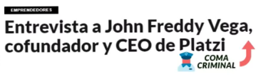

Cuando agregamos una información adicional podemos poner una coma para separarla de la declaración principal, esta coma es totalmente inocente y debe dejarse. ¿Cómo sabemos qué es un inciso? Fácil, podemos eliminar la parte que agregamos a nuestra información principal y si sigue funcionando como oración, entonces es un inciso.

## Reto: los signos de puntuación

Sigamos practicando el uso de la coma, el punto, el punto y coma, los signos de exclamación y los signos de interrogación. A continuación te comparto un texto al que le hemos borrado todos los signos de puntuación. Tu reto consiste en corregir el texto agregando los signos de acuerdo a las reglas que acabamos de ver. Comparte tu respuesta en la sección de discusiones.

### Oración sin signos

_Aprender algo útil nos da las herramientas para adaptarnos a diversas situaciones nuestros trabajos hoy en día requieren que nos adaptemos a problemas que nunca pensaríamos enfrentar te has puesto a pensar por qué admiramos a los presidentes ellos además de tener una gran responsabilidad deben estar en la capacidad de adaptarse a situaciones inesperadas frente a toda una nación la capacidad de reaccionar de un presidente construye o limita a una nación los mejores presidentes son aquellos que aprenden del potencial de su país y lo adaptan para hacerlo competitivo a nivel interno y externo la adaptabilidad es la clave para triunfar en los empleos de hoy en día adaptarse no sólo significa tener un buen entorno de trabajo y ser feliz en él sino llevar al máximo nuestra contribución como individuos si aprendemos los procesos si ejecutamos y planeamos estamos en la capacidad de dar un alto valor y una visión poderosa a una empresa construir y dirigir procesos es uno de los caminos más seguros hacia el crecimiento profesional_

### Oración corregida

_Aprender algo útil nos da las herramientas para adaptarnos a diversas situaciones, nuestros trabajos hoy en día requieren que nos adaptemos a problemas que nunca pensaríamos enfrentar. ¿Te has puesto a pensar por qué admiramos a los presidentes? Ellos, además de tener una gran responsabilidad, deben estar en la capacidad de adaptarse a situaciones inesperadas frente a toda una nación. La capacidad de reaccionar de un presidente, construye o limita a una nación. Los mejores presidentes son aquellos que aprenden del potencial de su país y lo adaptan para hacerlo competitivo a nivel interno y externo, la adaptabilidad es la clave para triunfar en los empleos de hoy en día_.

_Adaptarse no sólo significa tener un buen entorno de trabajo y ser feliz en él, sino llevar al máximo nuestra contribución como individuos. Si aprendemos los procesos, si ejecutamos y planeamos, estamos en la capacidad de dar un alto valor y una visión poderosa a una empresa. Construir y dirigir procesos es uno de los caminos más seguros hacia el crecimiento profesional_.

## Construyendo un texto

Ya estamos llegando a la parte final de este curso. Empezamos con algo muy pequeño, un átono, lo convertimos en moléculas; compuesto; soluciones cada vez más grandes. Estamos llegando a lo último de este curso, nuestro producto terminado es el texto.

¿Qué es el texto? Es un conjunto de de párrafos que forman una idea. Tiene un principio y un final definido. Existen diferentes tipos de textos: narrativos, descriptivos, argumentativos. Dependerá de ti qué tipo de texto vas a crear.

### ¿Cómo se construye un texto?

Vamos a ver varios pasos que debemos seguir para construir un texto. A continuación te voy a mostrar una lista de pasos que debes seguir:

* **Elige un tema y un tipo de texto**: muchas veces no elegimos el tema, pero si estamos haciendo algo libre podemos elegir el tema que queramos y la forma en que lo vamos a desarrollar. 
* **Documéntate**: lee mucho sobre el tema que escogiste tratar. Existen muchas fuentes de conocimientos, el Internet lo es. Puedes inspirarte de otros autores para lograr el tema que tanto deseas culminar y compartir. 
* **Organiza tu información**: tenemos que aprovechar todo el tiempo que invertimos en la investigación, si no organizamos nuestro texto puede que mucha información se nos pierda. 
* **Escribe un primer borrador**: este no tiene que ser perfecto, la escritura fluye mejor cuando lo la interrumpimos con nada. Esta es la forma más libre de expresar en una hoja ─ puede ser online o una hoja física ─ nuestra idea.
* **Haz las correcciones necesarias**: este es el mejor momento para poner en práctica todo lo que hemos aprendido en este curso, también de poner las puntuaciones indicadas. Tenemos que releer lo que escribimos, aveces nos acostumbramos a nuestros errores y quizá tengamos que salir a despejarnos para poder detectarlos. 
* **Reescribe**: debemos hacerlo un par de veces para poder llegar al punto de tenerlo completado. 

## Estructura del texto

Hablando muy generalmente se puede decir que consta de tres partes. A continuación las enumero y explico:

1. **Introducción**: un párrafo con el que abrimos y presentamos la idea, de qué vamos a hablar. Si es un texto argumentativo podemos hablar un poco de nuestra posición frente al argumento. Tenemos que presentar la idea principal.
2. **Desarrollo**: este puede ser de una longitud de tres o cuatro párrafos, también depende el tipo de texto que estemos desarrollando. Si es un texto argumentativo tenemos que presentar a detalle el tema, podemos presentar los puntos de vista diferente que tienen muchos grupos sociales, también tenemos que explicar el nuestro a detalle. 
3. **Conclusión**: es muy importante, tenemos que llegar siempre a una enseñanza y un fin lógico de nuestro documento. Tenemos que concluir todo el desarrollo, es en este último donde presentamos la conclusión que tenemos que sacar del texto. 

### ¿Y el título?

el título es la carnada de tu texto, es lo que hará que las personas se detengan a leerlo. Muchas veces lo recomendable es escribir el título al final. El título puede ser una oración en sí mismo, un sujeto y un predicado, no necesariamente tiene que ser así, pero tenemos que lograr que describa muy bien lo que van a leer los usuarios.

## Errores comunes al escribir un texto

Vamos a ver una serie de errores comunes que las personas tienen cuando se sientan a escribir un texto.

### Discordancia entre el sujeto y predicado

El sujeto y el verbo que se encuentran en el predicado deben concordar.

### El infinitivo introductor y "adicional" como adverbio

No podemos empezar un texto en infinitivo, tenemos que conjugarlo. No debemos usar la palabra "**adicional**" como adverbio, recordemos que un adverbio es una palabra que modifica el verbo. Para convertir "**adicional**" en adverbio tenemos que agregarle "**mente**".

### El gerundio que expresa posterioridad

Suena un poco complicado, pero ya lo vamos a entender. Es la conjugación de un verbo que expresa una acción que está sucediendo, con las conjugaciones que terminan en: **ando**, **endo**, entre otros. En el caso de este ejemplo no debieron haber escrito la las palabras marcadas en gerundio, esas cosas no podían estar sucediendo al mismo tiempo, es imposible.

### "Haber" como verbo personal

El verbo "haber" es un verbo impersonal, esto quiere decir que solo se debe conjugar en tercera persona.

### Cacofonía

Es cuando cuando leemos un texto y por la repetición varias palabras similares se vuelve pesado de leer. Para encontrar estas palabras que riman y hacen el texto pesado de leer, debemos leer nuestro texto en voz alta y escucharnos detenidamente.

### Adverbio de lugar y pronombre posesivo

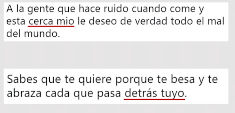

El **adverbio de lugar** es el que denota la relación de algo con respecto a otro objeto. El **pronombre posesivo** es el que denota posesión. El adverbio de lugar no se puede poseer y no puede usar la posesión como referente de lugar.

### Dequeísmo y antidequeismo

Son casos muy curiosos, el **dequeismo** es la costumbre de colocar "de que" en lugares donde no debería ir, el **antidequeismo** es justamente lo contrario. Es difícil saber cuando debemos usar el "**de que**" o no, el truco es pasar la oración a pregunta y detenernos a pensar en cómo suena. Otro truco es cambiar la palabra "que" por "algo", así nos daremos cuenta si suena extraña la oración.

### Falta de puntuación

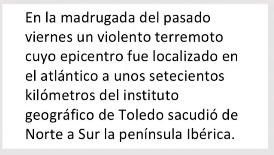

### Exceso de puntuación

No debemos agregar coma entre el sujeto y el predicado, a esto se le llama coma criminal.

