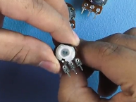
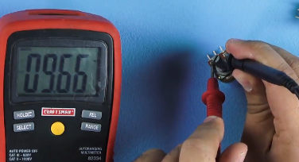

# Electricidad y electrónica

 Veremos los fundamentos de electricidad y electrónica. ¿Cómo va a funcionar este curso? Va a ser el curso que te permitirá obtener todos los conocimientos necesarios para entender la electricidad y electrónica. No será tan complejo pero vamos a enfocarnos en los conceptos principales. **Objetivos**:

* Prototipar nuestros propios circuitos. 
* Diseñar dichos circuitos.
* Pensar para qué nos sirve los componentes. 

Mediante practica entenderemos todo lo necesarios alrededor de esto, como por ejemplo las herramientas, cómo usar un **multímetro**, cómo medir cada componente, qué es una **protoboard**, los componentes **esenciales**, cómo evitar que se nos quemen los elementos. Si ya conocemos la teoría probablemente ya conoces todo lo que veremos pero _**¡tómalo y ayuda al resto de los estudiantes!**_

## Componentes que necesitaremos

Habrán cientos de estudiantes que estarán tomando estas clases contigo, así que si en tu país sabes donde comprar cada uno de los componentes, por favor, comparte ese dato. En cada capital hay una zona donde se centraliza la venta de componentes electrónicos. También puedes adquirirlos por Mercadolibre.

### Componentes

* Multímetro
* Tarjeta de prototipado o Protoboard
* 5 resistencias de: 1k, 5k, 10k, 220, 330, 470 ohms
* Variable o Potenciómetro de 1k, 5k, 10k
* Fotorresistor de 5 mm o de 10 mm
* Leds, los que tu quieras, nunca sobran
* Botón normalmente abierto, el que encuentres.

## ¿Qué es la electricidad?

Este es un concepto bastante abstracto pero que está en todos lados, así que lo vas a entender fácilmente. **La electricidad es un conjunto de fenómenos producidos por el movimiento e interacción entre las cargas eléctricas positivas y negativas de los cuerpos físicos.** ¿Qué quiere decir esto? Esta en todos lados, en tu casa no es la excepción. Cuando presionas el botón de encender la luz permites que haya un flujo de electrones, una carga moviéndose en el circuito de tu casa, lo que hace que encienda la luz. Otro ejemplo son los vehículos eléctricos, ellos tienen una batería y un motor, la batería le proporciona energía al motor y el se encarga de convertirla en fuera física mecánica que se transfiere a las llantas y hace que se impulse. En tu dispositivo también hay un flujo de carga eléctrica que hace que funciona. Este fenómenos invisible que sucede en la interacción de las cargas positivas y negativas está en todos lados.

### Cargas eléctricas

Acá está la imagen de un átomo: El átomo se divide en tres partículas subatómicas elementales. Estas son:

1. **Electrón**: con una carga negativa. 
2. **Protón**: con una carga positiva. 
3. **Neutrón**: con una carga neutra.

Nuestras carga serán:

* **Negativa**: si tienen más electrones que protones.
* **Positiva**: si tienes más protones que electrones.
* **Neutra**: si tienes una equivalencia en cantidad entre protones y electrones. 

### Carga eléctrica

Es una **propiedad física intrínseca** de algunas partículas subatómicas que se manifiestan mediante fuerzas de **atracción y repulsión** entre ellas a través de campos electromagnéticos. Una fuerza de atracción conocida es la gravedad, la que permite el funcionamiento de los grandes cuerpos como los planetas, permitiendo que nos mantengamos en el suelo y que existan las órbitas. La electricidad también tiene esta propiedad, pero además tiene la de repulsión. La siguiente imagen lo explica: 

* Cargas negativas de repelen. 
* Cargas negativas y positivas se atraen. 
* Cargas positivas se repelen.

### Materiales

Ahora hablemos del flujo de los electrones a través de los materiales. Tenemos los elementos cargados en nuestro electrón, el electrón se encuentra en los anillos externos del átomo, es lo que nos permite crear lo que llamamos electricidad. La electricidad fluye de negativo a positivo.

* **Los materiales conductores** como el cobre se encuentra en todas las instalaciones de electricidad, esto es por que es uno de los materiales conductores más abundantes. Es de los mejores que hay ya que tiene los electrones muy poco unidos al núcleo, o sea que están listo para hacer el flujo eléctrico. Cuando se junta con el átomo de al lado es capaz de recibir toda esta energía. 
* **Los materiales aislantes** tienen los electrones muy unidos al núcleo, por lo tanto va a ser muy difícil que los electrones fluyan. 
* **Los materiales semiconductores** tienen la particularidad de que podemos hacerlos cambiar para que los electrones se encuentren más cerca o lejos del núcleo. 

Los materiales como el plástico pueden tener electrones, ¿Por qué no ceden? por que tienen los electrones muy unidos, pero si reciben una gran cantidad de energía si van a ceder, por esto fallan algunos aislantes, si se hace una instalación eléctrica muy grande usan materiales preparados para este tipo de energías.

## Voltaje y corriente

Ahora hablemos de estas dos propiedades de la electricidad. Son dos conceptos importantes que nos permitirá saber de la potencia eléctrica.

* **¿Qué es la corriente?** Es la cantidad de carga que está fluyendo en un instante dado, la cantidad de electrones que fluye en un circuito eléctrico. 
* **¿Qué es el voltaje?** Es la potencia con la que esta carga fluye, se analiza como si fuera un río, el ancho del río es la cantidad de corriente de agua, pero sin importar la cantidad de agua que esté en el río, si no hay corriente este no será un río, será un lago, algo como las baterías que almacenan carga que no se mueve. Si le hacemos una salida a ese lago va a empezar a caer, y si está en una pendiente lo va a hacer con mucha más rapidez, esto es el voltaje. 

En la siguiente imagen se analiza cómo funciona: 

Veamos otra analogía:

**Acá tenemos dos represas para explicar el funcionamiento de estas propiedades de la corriente**: la turbina de encarga de generar energía basándose en la cantidad de agua que pase por allí. **¿De qué depende que está turbina gire más o menos rápido?** De ni más ni menos que de la fuerza con la que el agua la mueva, nota que tenemos el mismo estrecho en las dos imágenes, o sea que la cantidad de agua que puede pasar en un instante dado va a ser la misma, la tubería es de un tamaño definido, siempre va a pasar la misma cantidad pero en _**un tiempo dado**_. **¿Por qué podemos hacer que el agua fluya más rápido?** Por la fuerza. Podemos hacer que ese instante donde pasa la misma cantidad de agua lo haga muchas veces más rápido, esto si le ponemos más potencia o fuerza al flujo. Por ejemplo, cuando la regadera de tu casa echa poca agua va a ser la misma cantidad de agua pasada en un instante que si tuvieras toda la llave abierta, lo que cambia es la cantidad de veces que pasa esa agua en el instante tomado. **El voltaje** representaría el llenado de la represa, es decir, si la represa tiene mucha más agua, tendrá más fuerza para hacer pasar mucha más agua por la tubería. **La corriente** sería el estrecho limitado por donde sale tal agua. En un circuito eléctrico la imagen **A** y **B** tendrían la misma corriente, pasará la misma cantidad de electrones en un tiempo dado por el ancho del material conductor. **El voltaje** por la intensidad nos da la potencia. La potencia es, que tanta fuerza pasa a través de un circuito eléctrico en un momento dado. **El voltaje** es la diferencia de potencial que existe en un circuito eléctrico. En este caso es la fuerza con la que vamos a empujar a los electrones en nuestro circuito.

## Potencia eléctrica

Ya que tenemos claro qué es la corriente y el **voltaje**, podemos definir la potencia eléctrica. Básicamente es la cantidad de **corriente** que multiplicamos por el **voltaje** para obtener una nueva **magnitud**, nos sirve para definir la fuerza eléctrica que tiene nuestro circuito, lo llamamos potencia representado por **W** que es el **Wat**, nos sirve para medir en una unidad de tiempo, cuanta energía estamos consumiendo. La analogía más fácil de entender esto es la bombilla. Los focos incandescentes, "_los ahorradores_" consumían **70 wats/hora**. Hoy en día puedes adquirir un foco **led** que consume **10 wats/hora**. Esto no es más que una pequeña ecuación que nos indica que durante una hora a **110 volts** vamos a consumir la cantidad de corriente eléctrica, carga eléctrica para iluminarte que necesitas al multiplicar: **110 \* x = 10 wats/hora**. Aquí tenemos que hacer una división, despejando **x**, tendríamos que... para saber cual es el consumo que tendría mi foco **led** a **10 wats/hora** sería dividir **10** entre **100**, nos daría a **0.1 ampere**. ¡No te preocupes! Más adelante veremos estas formulas a detalles para entenderlas mejor.  
Dato: _**un foco led consume mucho menos, ¡úsalos!**_

_\*\*\*\*_

## ¿Donde se aplica la electricidad?

Hablemos de los campos donde se aplica el estudio de la electricidad. Hay tres grandes campos: 

 Vamos a analizar estos campos.

1. **Eléctrica**: por ejemplo la ingeniería eléctrica, que se encarga de estudiar todo lo que ocurre desde el enchufe de tu casa para atrás. En lugares como las represas, las granjas de celdas solares, las plantas de energía eléctrica basadas en la quema del carbón y las plantas nucleares. Una vez creada la energía hay que llevarlas a donde sea necesaria, hay que llevarlas a las ciudades, los pueblos, a donde se necesite. Hay que buscar la manera de transportar esta energía eficientemente, se hace mediante cableados desde los generadores hasta las grandes ciudades. Luego cada ciudad tienen sus plantas de distribución de energía, reciben voltajes super altos así que los transforman a voltajes mucho más inferiores para el consumo en los hogares. Cada una de las colonias tienen el transformador, que agarra los voltajes altos y se encarga de transformarlo en un voltaje usable en los enchufes de tu pared. Estos son los flujos generales de la ingeniería eléctrica. Obviamente tiene otras ramas pero esta es la visión general. 
2. **Electrónica**: este campo es uno de los más importantes, sobre todo para los estudiantes de programación. Es el campo que usaremos en la carrera de **IoT** de **Platzi**. Acá es donde se trabaja con voltajes pequeños, de corrientes directas, que nos van a servir para darle un uso lógico a la corriente. No solo la hacemos llegar de un punto **A** a un punto **B**, si no que en todo su camino van ejecutando diferentes acciones, por ejemplo el circuito eléctrico de nuestros dispositivos.  De todo esto se encargan los electrónicos. Se usa en muchas industrias, una de estas es la música. Se usa en las guitarras, los teclados eléctricos y los sintetizadores. 
3. **Computación**: aquí es donde la humanidad encontró la mejor forma de analizar y ejecutar matemáticas complejas con solo electricidad. Problemas repetitivos, pero la lógica que se ejecutan en los circuitos sirve para solucionar esto. Las computadoras de hoy en día nos sirven para absolutamente todo. Se basa en el principio del transistor, el 0 y el 1, solo dos estados, esto es electrónica pura. Con estos dos estados se pueden hacer cosas extremadamente increíbles. 

## Resistencia y la ley de Ohm

**La resistencia** no es otra cosa más que la oposición al flujo de la corriente eléctrica en un circuito. **Un material aislante** está hecho molecularmente para resistir al flujo de la corriente, en cambio un **material conductor** está hecho para permitir que el flujo de la corriente sea el más eficiente de todos. **Los superconductores** tienden a tener la resistencia en 0. **A continuación mostraremos dos elementos gráficos**: 

 Acá ilustramos el concepto de resistencia, sabemos que a mayor cantidad de agua en un contenedor vamos a tener mayor flujo. Aquí, en el ejemplo 1, tenemos una cubeta en donde hay una equis cantidad de agua y una salida donde va a haber cuatro gotas saliendo por cada momento. Luego tenemos el ejemplo 2 donde ilustramos ahora sí a la resistencia. Imagina que tomamos algún tipo de material que permita tapar el hueco, lo que pasa es que tiene el doble de agua pero con el material puesto en el hueco de la cubeta va a salir cuatro gotas igual que en la otra cubeta, el flujo debería de ser más pero estamos poniendo una resistencia para limitar la corriente que fluye. _**La resistencia nos va a servir para limitar la cantidad de corriente que estamos pasando en un circuito**_.

La unidad de medida que usamos para medir la resistividad en un circuito eléctrico es el Ohm, que se obtiene usando la ley del señor Ohm. Nos sirve para calcular la resistencia en un circuito, la corriente que vamos a tener o hasta el voltaje. 

**Es una simple, ecuación que dice que el voltaje\(V\) va a ser igual a la intensidad\(I\) de un circuito por la resistencia\(R\)**. Obviamente debemos de tener uan intensidad fija, para esto se usa una fuente de poder fija. Imagina que tiene un tubo fijo, una cantidad de corriente fija y la definiremos como 1 Ampere, a este le puede poner una resistencia que puedes variar la cantidad de Ohm que quieras para obtener un voltaje final. Sencillamente debemos grabarnos esta ecuación.

## Multímetro

Vamos a ver qué es un multímetro, cómo usarlo y también muchos tips de cómo adquirir uno.

### Rangos

Los **multímetros** vienen en diferentes costos. Los más baratos pueden salir hasta en 4 dólares, comprar este tipo de **multímetros** compromete la precisión al medir los **circuitos**, medir **capacitancia** o **funcionalidades extras** que se usarán, puede que no las tenga. Tenemos el rango intermedio que te permitirán medir las siguientes unidades:

1. **Voltaje**.
2. **Continuidad**.
3. **Auntorango**: hace que se ajuste y te dé la lectura correcta. 
4. **Hold**: te permite guardar un valor. 
5. **Backlighting**: te permite trabajar en lugares donde carezca la luz. 
6. **Iodos**.
7. **Resistencia**.
8. **Capacitancia**. 
9. **Frecuencia**.
10. **Temperatura**. 
11. **Amperaje**.

Los multímetros además tienen que decirte que tan seguro son de usar con altos voltajes. Uno de calidad media soporta hasta 1.000 Volts en mediciones de voltajes. En la parte inferior del multímetro muestra donde conectar los cables de mediciones para captar lo que deseemos y obtener el resultado que queremos.

### Recomendación

Si deseas dedicarte a esto seriamente, a la electricidad y a la electrónica, es mejor que adquieras un multímetro industrial o profesional para tener mediciones más amplias y precisas. Pueden salir muy costosos pero son inversiones a muy largo plazo. Esto solo si de verdad quieres dedicarte únicamente a esto.

### Tipos de multímetros

**Gama baja**

**Gama media**

**Gama alta**

## Conceptos de circuito eléctrico

Ahora veamos cómo hacer que la corriente nos sirva para algo. Los circuitos eléctricos no es otra cosa que darle sentido al uso del voltaje. **Acá tenemos un circuito eléctrico básico**:

_Sabemos que la electricidad se mueve de negativo a positivo, eso sería lo correcto_:

Pero por tradición y por confusión de hace años, el concepto se quedó mostrando que la electricidad se mueve de positivo a negativo. _**Esto es algo confuso pero es así como se quedó, por convenio**_.

Quizá esto no tenga sentido pero así se definió y así se hace.

### Diodo

Este elemento que se muestra en la gráfica se llama **diodo emisor se luz**. Esta sería su **simbología**.

En este circuito estamos trabajando con corriente directa \(**D.C\)** es el tipo de voltaje que se usa en todo circuito electrónico. Su comportamiento es lineal.

Suponiendo que en nuestro circuito tenemos una batería o fuente de poder de **2.7v** y que tenemos un **swicth** que interrumpe el flujo o que evita que se cierre, se vería de la siguiente forma con su **simbología**.

Su función es hacer que el flujo de electrones llegue a su destino. Cuando el circuito está interrumpido se le llama _**circuito abierto**_, esto lo que provoca es que el circuito no tenga ninguna utilidad. Para que un circuito funcione, necesitamos hacerlo del tipo _**cerrado**_.

Al hacer que nuestro flujo de electrones llegue a su destino haría que nuestro **led** se encienda. Simple y sencillamente nos indicaría que hay un flujo de energía. Solo existen dos tipos de circuito:

1. **Abierto**: cuando el flujo está interrumpido.
2. **Cerrado**: cuando el flujo de electrones llega a su destino. 

### Circuito en serie y paralelo

La siguiente imagen nos ayudará a ilustrar que son estos dos tipos de circuitos.

En este caso tenemos nuestra batería de **9v** y **1A**. Los **v** serían la tensión y el **A** la corriente. Presta atención a la primera imagen.

### En serie

Allí tenemos dos focos conectadas en series, es decir, una está conectada después de la otra. Las lamparas serían **L1** y **L2**. ¿Qué sucede cuando hacemos este tipo de circuito? El voltaje será la suma de el voltaje individual de cada componente, es decir, que la suma de cada componente se irá restando al voltaje de la fuente de poder: **9v-\(5v+4v...\)**

Esto daría como resultado que cada lampara añadida al circuito en serie tendría disponible menos voltaje y por ende iluminaría menos.

### En paralelo

Ahora veamos como funciona este circuito. Se le llama **paralelo** por que sus componente están colocados paralelamente y no en serie.

Cada terminal va a ir conectada primeramente del lado **positivo** y luego el **negativo**. En un circuito de esta clase lo que cambia es el **amperaje**. El voltaje se mantendrá igual ya que esa tensión llega de la misma manera a cada **bombilla**. Esto quiere decir que cada componente le irá restando a la corriente \(**amperios**\) de nuestra fuente de poder.

## Fuentes de alimentación

Todos nuestros circuitos necesitan energía eléctrica para funcionar, sabemos por sentido común que podemos utilizar baterías **AA**, **AAA**, **D**; y baterías recargables como las de nuestros celulares, controles de videojuegos y demás dispositivos. También tenemos cargadores \(algunas veces llamados adaptadores de corriente\), que se enchufan a la pared y cargan nuestras baterías y fuentes de poder, como la de tu **Xbox 360** o la de tu **laptop** de **escritorio**.

El mundo de las fuentes de poder es enorme, desde pequeñas baterías que podemos ver en relojes digitales de pulso, en circuitos de bajo consumo y sistemas de **IoT** entre otros; hasta fuentes de alimentación basadas en energía nuclear, como la fuente del **Curiosity Rover** que recorrió Marte entre 2011 al 2019 con una fuente que contenía plutonio y que generaba electricidad suficiente para recargar una y otra vez sus baterías.

### Entonces, ¿Qué es una fuente de poder?

¡Simple!; es cualquier dispositivo que utilicemos para proveer a nuestro circuito de la cantidad de **voltaje** y **amperaje** que necesitamos.

Si utilizamos por ejemplo una fuente de poder con un voltaje muy bajo, nuestros circuitos no van a funcionar \(prueba en los circuitos del curso una batería AA ,que nos da entre 1.2 a 1.5 volts; y verás cómo su voltaje no alcanza para alimentar nuestro **led** después de las resistencias\)

Si utilizamos una fuente con poco **amperaje** en un circuito con un motor y varios **leds**, verás como el motor no puede ir a toda velocidad y los **leds** bajan de intensidad; esto, lo puedes observar en una casa cuando hay un alto consumo de corriente eléctrica y la instalación no es muy segura, por ejemplo, al encender una **motobomba** eléctrica para mover agua a un segundo o tercer piso podrás observar cómo las luces bajan su intensidad, tal como en una película de terror.

Si te interesa aprender más sobre el mundo de las fuentes de poder y la electrónica de potencia, cuéntame en un comentario, este es un mundo aparte que vale la pena explorar sólo si de verdad te quieres dedicar de fondo al diseño de circuitos.

En este curso usaremos algo mucho más normal, una batería de 9 voltios como fuente de poder. Si quieres, también puedes trabajar con un cargador que tengas en casa, siempre y cuando tenga una salida de 7 a 12 volts; pero de verdad, te recomiendo más la batería, una será más que suficiente para todo el curso gracias a la eficiencia de los **leds**.

## Tierra eléctrica

Cuando trabajamos en **circuitos**, seguramente veremos un **símbolo** de tierra. Más adelante veremos a profundidad esto. _Las conexiones de nuestros hogares casi siempre tienen un polo a tierra_. Esto genera demasiada confusión cuando somos principiantes en esta carrera.

### ¿Qué es un polo a tierra?

Se parece a algo como esto:

Es una varilla se cobre entierra para disipar la electricidad sobrante en el circuito de nuestros hogares. Si nuestra casa es lo bastante moderna, tendrá tres conectores. ¿Para que sirven estos **tres** conectores? _**Los dos primeros**_, generalmente los de la parte superior que están en paralelo, contienen la corriente alterna y permiten su flujo, van a poseer tensión. _**El tercero**_ va conectado al cable que se va a tierra, recuerden: esto sirve para disipar excesos que pueden llegar a existir en la energía de nuestros hogares.

### Ejemplo

Cuando no aterrizamos nuestro equipo de música o planta de sonido, puede emitir ruido que no debería. Esto pasa por que no es capaz de disipar o eliminar esa energía sobrante que fluye en nuestro circuito, como cargas electrostática y cosas parecidas que afectan a nuestro sistema. **Otro ejemplo** sería cuando se va y viene la luz de golpe \(_**en Venezuela esto pasa a cada rato equisde**_\) los reguladores por lo general van a encargarse de reparar esa energía excedente. _**Si no hay un regulador pero tenemos un polo a tierra, va a regular la energía excedente**_.

## Matando a un led

_**¿Qué pasaría si conectáramos un led a una fuente de poder que supere su voltaje?**_ Es muy probable que sepas que va a pasar. Algo a tomar en cuenta antes de empezar el experimento:

* **Una batería de nueve voltios es demasiado para alimentar a un led**. 
* **Todos los led funcionan de 3volt para abajo**. 
* **Su rango de corriente va de entre 20 a 60 miliamperios**.

Cuando le pasamos una cantidad de voltaje superior a un componente se quemará. _**Usando una resistencia de podría impedir tal atrocidad**_.

Acá tenemos la batería y el **led**:

Los **led** tienen dos terminales, una corta y otra lagar. _**La patica corta es la terminal negativo y la larga la positiva**_. Al conectar el **led** va a encender:

Pero inmediatamente se muere:

## Protoboard

La tarjeta de **prototipados** es increíblemente útil para crear nuestros **primeros experimentos**.

**No es recomendable** que alguien que quiera dedicarse a esto de la electricidad se enfoque en usar este tipo de soluciones. Sucede que con el tiempo el contacto en las placas metálicas inferiores de la **protoboard** dejan de funcionar bien. Es bueno usar placas **fenolicas** pero eso ya es otro tema. Los beneficios serían: 1. **Facilidad de uso**. 2. **Nos ayudará a subir de nivel en nuestra experiencia**.

### Explicación

La **protoboard** está segmentada en dos partes, como pudiste ver en la imagen inferior. El espacio del medio indica que la continuidad del circuito se interrumpe en esa zona, exactamente en la zona entre **e** y **f**. Funciona con coordenadas sencillas de los dos ejes principales del plano cartesiano **enumeradas en la parte izquierda** y **en la parte superior por letras**.

En este caso el eje **y** llega hasta el número **30** y el eje **x** hasta la letra **i**.

### Conexión de la fuente de poder

La **protoboard** cuenta con un puerto que se extiende de la parte superior hasta abajo donde te permite conectar tu **fuente de poder**.

_Recuerda siempre tomar en cuenta los signos **+** y **-** a la hora de conectar tu fuente de poder por que podrías dañar todos los componentes_.

### Consejo

_Sucede que las **protoboard** están hechas de plástico y en su parte interior lo que crea el circuito son líneas de cobre. Si alguna vez te llegara a pasar que conectas todo bien pero sin embargo algo dejó de funcionar misteriosamente, puede ser por que las líneas de cobre no están haciendo el contacto correcto con los terminales de los componentes._

## Creando un circuito básico

Lo vamos a hacer con los siguientes componentes:

1. **Led**.
2. **Botón**.
3. **Batería de 9v**.
4. **Resistencia**. 

### Imágenes de cada componente

_Batería de 9v_. 

_Push buttom_. 

_Led_. 

_Resistencia de 480 Ohms_. 

Ahora que tenemos todos los componentes, vamos a proceder a crear el circuito. _**Hay que recordar que debemos conectar los componente con los terminales correctos para la protoboard. Queremos que la conexión sea correcta y no dañar nada**_ .

### Conexiones

Primero conectaremos nuestra batería a las líneas que corresponden. _**Quizá te parezca que esta protoboard es muy diferente a las demás pero sigue funcionando igual**_.

Procederemos a conectar nuestro botón usando dos línas diferentes para así poder interferir con el circuito.

Vamos con el led. Necesitamos conectar una de las patitas al botón para así usarlo como encendedor. _**Recordemos que la patica más larga es positiva**_. Conectaremos el negativo a otra línea.

Cerramos el circuito conectando la línea **negativa** a la línea donde está conectada la fuente de poder.

Terminamos ahora si conectando el **cable positivo** para concluir con el circuito cerrado.

Haremos un cambio para incluir nuestra resistencia. Conectaremos mejor la resistencia a la patita negativa del led, que nos ayudará a reducir el exceso de voltaje. **¡Esto es muy importante!**

¡Ahora probemos!

## Resistencias

Este es uno de los componentes más importantes en un circuito eléctrico. Acá una representación típica de una resistencia:

Tiene diferentes bandas, son cuatro: **1ra, 2ra1, 3ra y 4ra** banda. Las nombraremos como **A, B, C y D**. En la vida real se vería así:

La primera banda es de color **verde**, le segunda **azul**, la tercera **negra** y luego la cuarta que está más separada de color **dorado**.

### ¿Para que sirven sus colores?

No importa en donde estés, la tabla de códigos de colores no fallará.

Nuestra resistencia tiene: **verde, azul, negro y dorado**.

### Lectura de los colores

En la tabla leeremos de izquierda a derecha, esto dará los siguientes resultados:

1. Verde: 5
2. Azul: 6
3. Negro: x10^0 = 1
4. Dorada: x5% de tolerancia

Resultado total: 56_10^0 = 56 Ohm \(\*Más o menos, el 5% de tolerancia indica que puede ser más o menos el resultado de las 4 franjas, por lo menos un 5% de diferencia. Te puede marcar 55 o 57 Ohms y estará bien_\)

### Medición

Primeramente colocaremos nuestro **multímetro** en el signo de **omega**. Puede que esté agrupado con otros signos, usa el botón **SELECT** para iterar en estas opciones hasta tener la opción de medir **Ohm**.

No importa como midamos la resistencia, ella no tiene polaridad.

Ahora medimos y nos da como resultado algo aproximado a **56** **Ohms**, eso está correcto, nos dio **55.4 Ohms**.

_**¡COOL! Ahora sabemos como medir resistencias**_.

## Potenciómetros

Sigamos hablando de las resistencias. No son otra cosa que una resistencia para variar el valor. Tenemos las resistencias típicas que ya vimos antes. Vamos a ver un potenciómetro.

Estos **potenciómetros** tienen una leyenda, en este caso dice: **B10K** y el otro **B50K**, estos son los valores máximos de resistividad que tienen. Tienen tres terminales, cada una tiene una función particular, la primera y ultima terminal te da **50k** de **resistividad** si el **potenciómetro** es de **50KiloOhms** o **10k** de **resistividad** si es de **10kiloOhms**. **La terminal** del medio te da el valor que estás cambiando en tu **resistividad**.

### ¿Cómo funcionan?

Si lo destapamos veremos una pequeña **punta** que hace contacto con la **tira** de resistencia que tiene abajo.

Si la tira de resistencia es de **10k**, en la mitad mide **5k** y el inicio daría **0k**.

### Medición

Seguimos con el **multímetro** puesto en **Ohm** para medir resistencia y procedemos a colocar los terminales del **tester**. Lo haremos en la primera terminal y en la tercera.

Si te das cuenta, el **multímetro** medirá **9.66**, casi **10k** por que ese es el rango que soporta este **potenciómetro**. Si giramos la perilla no habrá ningún cambio por que en las terminales 1 y 3 siempre va a mostrar la capacidad máxima que tiene el **potenciómetro**. _**La que varía su resistividad es la del medio**_. Para medir lo que queremos, que es la resistividad cambiante, lo debemos de hacer de la siguiente manera.

Giramos la perilla para observar como cambia el valor.

Conforme se va girando la perilla la resistividad va cambiando. Este es un aparato que tiene un sin fin de aplicaciones. **Por ejemplo se puede usar para regular la intensidad de iluminación de un bombillo**. Existen muchos tipos de **potenciómetros**:

Se pueden usar en **muchos lugares**. En mi equipo de música se encuentra uno que no tiene un final en la perilla, sirve para regular el volumen. Se ocupan en los joystick de los videojuegos, mide el punto o coordenada de la ubicación del joystick.

Según lo mueves en su eje el potenciómetro gira provocando que la resistividad cambie, pasando esos datos a un procesador que los interprete para saber su posición. _Por eso los controles para jugar te dan la capacidad de moverte en un videojuego caminando, trotando o hasta corriendo_.

**Otro ejemplo sería el siguiente potenciómetro**:

Sirve para regular alguna función de un aparato usando valores prefijados, se ocupaban antes cuando no había un microprocesador que leyera el potenciómetro, **simplemente el fabricante diseñaba un circuito para que trabajara con esos valores fijos**.

**Potenciómetro lineal**:

Mide el **movimiento transversal**. Se aplica en consolas de audio. Los **slider** se crean con este tipo de **potenciómetros**.

## Fotoresistencias

Sin resistencias que van a reaccionar a la luz que están recibiendo. A mayor luz una **fotoresistencia** va a tener un menor valor resistivo.

### ¿Por qué pasa esto?

Las **fotoresistencias** varían conforme la luz cambia por que el componente que tienen adentro es un semiconductor, se altera **si recibe luz** y se convierte en un material capaz de conducir la **energía eléctrica**. Funcionará de manera diferentes con muchos rango dependiente de cuanto material semiconductor tenga. Esta es una **fotoresistencia**:

**Vamos a analizar** los valores que nos arroja cuando la sometemos a luz y cuando no lo hacemos. Vamos a proceder a usar nuestro multímetro para medir los valores, no nos debemos preocupar por la **polaridad ya que no tiene**.

### Medición

Si lo medimos con luz nos arroja aproximadamente **0.734 KiloOhms**.

Ahora probemos con una linterna de teléfono.

Claramente podemos ver que bajó aún más su **resistividad** y por ende aumentar su **conductividad**. Ahora **¿Qué pasa si lo tapamos para evitar que la luz llegue a el?**

**Recibimos un valor alto de resistencia**. Tenemos que esta resistencia varió de de **0.700** a **47KiloOhms**, todo dependiendo de la luz que le llegara al **fotoresistor**. Cuando conectamos un componente de esto a un **arduino**, por ejemplo, podemos hacer cosas increíbles, como un sistema de luz automático que active las luces de la casa cuando anochezca o un sistema de emergencia para cuando se corte la electricidad de la casa y prendan unas automáticamente. **¿Y qué si te digo que esto se puede conectar a Internet?** Es maravilloso, podemos hasta lograr mandar un **tweet** cuando se prenda la luz de la casa, suena loco pero es posible. Todo esto con un componente básico como un **fotoresistor**.

### El uso de una fotoresistencia

Vamos a hacer una práctica básica para usar una fotoresistencia. Vamos a usar el circuito que usamos varias clases atrás.

**Puedes ver que la resistencia pequeña se quitó**, también quitaremos el botón y luego conectaremos la fotoresistencia, tendremos en cuenta que la **resistividad** mínima de este componente es suficiente para que nuestro **led** no muera. Quedará así.

Veremos que el **led** cambiará de brillo dependiendo de la luz que reciba. Si le colocamos la mano al resistor mira lo que sucede.

Baja el brillo considerablemente por que el resistor **aumenta su resistividad**. Ahora si lo soltamos sucede lo contrario.

Vimos como se refleja directamente en nuestro **led** la variabilidad de nuestro **fotoresistor** según le llegue la luz.

## Última demostración

Ahora presentaremos a la última presentación de este curso. Reutilizaremos el circuito que usamos en la clase anterior y usaremos un potenciómetro para experimentar acá. Vamos a eliminar el fotoresistor para empezar a usar el potenciómetro.

Ahora conectaremos nuestro potenciómetro a la protoboard.

Luego de que ya esté fijo y veamos que sus conexiones se hicieron bien procederemos con el experimento.

### Cosas a tomar en cuenta

Recordemos que la **primera terminal** del potenciómetro va a ser donde vamos a iniciar la resistividad, **en el medio** tendremos el valor cambiante y **por último tendremos la patita** que nos dará el máximo de resistividad.

### Armando el circuito

**Procederemos a conectar** el positivo a la primera terminal del potenciómetro. **Luego conectaremos** la salida que será la del medio, nos dará el valor cambiante y lo conectaremos a nuestra terminal positivo del **led**. **Por ultimo** conectaremos el negativo del circuito a la salida del **led**. Quedará así:

### Prueba

Tenemos el potenciómetro en su valor máximo de resistencia, el led se verá de esta forma:

Si lo giramos para que reduzca su resistividad pasará esto:

**Acá llegamos al máximo de conductividad**, no se muere el **led** por que la batería no es lo suficientemente potente para **quemarlo**. Para saber el rango de alimentación que un **led** tiene, tomemos en cuenta que el fabricando nos dará una hoja de datos que nos dirá todo sobre el componente. _**No ahondamos en este tema por que ya hay otros cursos que hablan sobre la investigación de cada componente**_.

