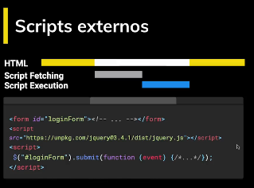
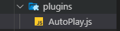
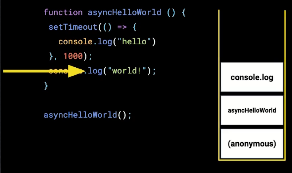

# Curso Profesional de JavaScript

## ¿Qué significa ser un profesional de JavaScript?

El camino para llegar a ser profesional es largo y duro, no es fácil. Todos necesitamos que nos guíen para saber qué hacer y qué no. Este camino es conocido como la ruta de pasar de **Junior** a **Senior**, _este es un duro camino lleno de experiencia_.

### ¿Qué forma a un profesional?

Te presento una lista de estas cosas que lo forman:

1. Conocimiento del lenguaje. 
2. Conocimiento de entornos de programación.
3. Mejores prácticas.
4. Versado en código.
5. Herramientas. 
6. Ética / Profesionalismo.
7. Experiencia.

### El lenguaje: JavaScript

Debemos tener muy claro cuales son los **fundamentos** de JavaScript antes de comenzar con esto. Existen _features_ muy raros y hay que estudiarlos. Tenemos que saber cómo **funcionan las cosas** en JavaScript.

### No fundamentos

Los **no fundamentos**" representan las siguientes características del lenguaje:

1. **Promesas \(nivel pro\)**.
2. **Getters, setters**: son formas de obtener valor de una variable sin tener que poner `this.name`.
3. **Proxies**: es un _feature_ muy raro, pero que más adelante veremos a profundidad. Sirve para interceptar a una función antes de que se ejecute. 
4. **Generadores**: esto es raro, pero vamos a ver que sí es eficiente. 

### ¿Cómo funciona?

Este lenguaje corre sobre un motor. JavaScript no contiene clases como otros lenguajes de programación, esto es algo que vuela mucho la cabeza, es muy difícil de entender. Otro _feature_ muy _cool_ que vamos a aprender es `event loop`, es lo que permite que pueda correr muchos procesos a la vez.

### Entornos de programación

Cuando estamos desarrollando lo hacemos para la **WEB**, para un celular, para seguidores. Existen diferentes entornos que nos ofrecen **APIS**, tenemos que conocer todo esto. V

### Versado en código

Esto quiere decir que tenemos que leer mucho código, un lugar hermoso para ponernos a leer código es **GitHub**. Debemos leer mucho y hacerlo de forma muy constante.

### Mejores prácticas

No vamos a reinventar la rueda, hay muchas personas que ya han solucionado los problemas más comunes, tenemos que usar estas soluciones, a estas soluciones se les llama: **patrones de diseño**.

### Ética

Esta es la parte más importante de ser un profesional. Un buen profesional cumple con los siguientes valores:

1. **Es responsable**. 
2. **Entrega a tiempo sus trabajos**.
3. **Sabe decir que no**. 
4. **No hace daño**. 

### Experiencia

La experiencia no es algo que se pueda enseñar, tenemos que encontrarla nosotros mismos en el camino a ser profesionales. Todo está en nosotros, tenemos que estudiar y practicar mucho.

## Inicio del proyecto

En este curso vamos a estar desarrollando una aplicación llamada: Platzi Video. En toda plataforma de video hay un componente especial en el desarrollo, tenemos que saber implementar el _**MediPlayer**_, en este curso vamos a estar desarrollando este _feature_ de forma modular, esto quiere decir que vamos a desarrollar _plugins_ que vamos a implementar a nuestro reproductor, extendiéndole sus funcionalidades. Vamos a comenzar con un poco de **CSS** y **HTML** ya escrito.

### Primer paso

Crearemos nuestros primeros archivos usando `npm init -y`, donde `-y` es una bandera que le dicta a **npm** que le diga sí a todas las preguntas que haga.

```text
npm init -y
```

Esto nos creará un archivo `package.json` que lo sustituiremos por el siguiente:

```javascript
{
"name": "platzi-media-player",
"version": "1.0.0",
"description": "Proyecto del Curso Profesional de JavaScript de la Escuela de JavaScript de Platzi.",
"license": "MIT",
"author": "César Augusto Barco <augustopayza@gmail.com>",
"keywords": [
                "platzi"
        ],
"scripts": {
                "start": "live-server"
        },
"devDependencies": {
        "live-server": "^1.2.1"
    }
}
```

Una vez tengamos todo esto listo vamos a proceder a instalar nuestro `live-server` para empezar a trabajar. Para instalar esto vamos a usar el siguiente comando `npm i -D live-server` donde `i` significa _install_ y la bandera `-D` _development_, esto quiere decir que no lo vamos a usar en producción.

Una vez instalado ya lo podremos usar con el `package.json` que dejé arriba. Lo usaremos con el comando `start` que llamará a su vez a `live-server`.

Antes de ejecutar este vamos a implementar varios archivos. Estos serán los siguientes:





También cualquier video que tengamos en nuestra PC. Nuestras carpetas tienen que quedar de la siguiente forma:


Ahora sí vamos a ejecutar nuestro pequeña aplicación.

```text
npm start
```

Nuestra pequeña aplicación andará en la **IP** que nos muestre la terminal.


### ¿Qué sigue?

Tenemos un botón que no funciona, lo vamos a poner a funcionar con un `media query`. Abrimos nuestras etiquetas de `script`.

Tenemos un vídeo que debemos manipular, lo vamos a hacer con `querySelector("")`, a este tenemos que pasarlo un elemento, en este caso será **video**, es el único elemento **video** en nuestro **HTML**. También debemos traer nuestro botón con \`querySelector\`\`.

```javascript
const  video = document.querySelector("video")
const  button = document.querySelector("button")
```

Cuando le demos **click** a nuestro botón queremos que el vídeo se reproduzca. Lo hacemos de la siguiente manera:

```javascript
button.onclick = ()=>  video.play()
```

El `video.play()` se saca de la API que trae el navegador, todos los elementos del DOM traen un API. Para saber cuales son las opciones de esta API podemos ir a [MDN](https://developer.mozilla.org/es/docs/Web/API/HTMLMediaElement) a ver toda la documentación. No podemos darle _play_ de una vez a penas se entre en la página, esto pasa por que los navegadores tienen una seguridad que no permite que esto pase, solo se puede dar _play_ si el usuario tiene la libertad de hacerlo.

Ahora nuestro código no es muy extensible, vamos a lograr esto usando **prototipado**. Para hacerlo extensible se pueden usar `clases`, pero en este caso usaremos `prototype`, usaremos el siguiente código para lograrlo.

```javascript
const  video = document.querySelector("video");
const  button = document.querySelector("button");

function  MediaPlayer(){}

MediaPlayer.prototype.play = function() {
    video.play()
}

const  player = new  MediaPlayer()
button.onclick = () =>  player.play();
```

Explicación:

1. Creamos una función llamada `mediaPlayer` que nos servirá como prototipo.
2. A `mediaPlayer` le asignamos una función llamada `play`  usando `prototype`. Esta función le dará inicio al video.
3. Luego con el botón se acciona una función llamada `player` que es una instancia del prototipo `mediaPlayer` que creamos. La instancia se crea usando la palabra `new`. 

### Hagámoslo más reutilizable

Para que nuestro código sea más reutilizable debemos hacerlo de esta manera:

```javascript
const  video = document.querySelector("video");
const  button = document.querySelector("button");

function  MediaPlayer(config) {
    this.media = config.el;
}

MediaPlayer.prototype.play = function() {
    this.media.play();
};

const  player = new  MediaPlayer({ el:  video });
button.onclick = () =>  player.play();
```

Explicación:

1. A nuestra función madre o prototipo le pasamos una configuración. Esta configuración lo que va a tener es el elemento `video` original. Le asignamos a `this.media` el elemento `video`. 
2. A la función extendida le asignamos `play()` a `this.media` para que se ejecute cuando presionemos el botón. 
3. En nuestra función especial `player` es una instancia del prototipo le asignaremos el valor de `video` para que lo reciba en configuración. Esto lo haremos con **desestructuración de objetos**.

Acá no podemos usar _**arrow function**_ por que el valor de `this` es global. Más adelante se verá con más detalle.

Para agregarle la funcionalidad de _pausa_ y _play_ con el mismo botón, debemos condicionar la función `play` de `MediaPlayer` de la siguiente manera:

```javascript
MediaPlayer.prototype.play = function() {
    if(this.media.paused){
        this.media.play();
    } else {
        this.media.pause()
    }
    // o podemos usar lo siguiente:
    // this.media.paused ? this.media.play() : this.media.pause()
};
```

## ¿Cómo llega un script al navegador?

Anteriormente lo usamos con la etiqueta `<script >`, pero hay muchas más formas de traer un script.

### DOM

Es una representación de un documento HTML, por ejemplo:


Cuando el navegador recibe este archivo lo tiene que convertir en una estructura parecida a un árbol.


Es una estructura fácil de procesar. Luego que el documento es leída y cargado ocurre el **DOMContentLoaded**.

### DOMContentLoaded

A partir de este punto tenemos la garantía de que todo nuestro documento se ha cargado.

### Scripts externos o embebido

Cuando abrimos etiquetas scripts lo hacemos como un elemento más del HTML, pero no todos son iguales. Veamos este ejemplo:


Primero tenemos un **script** que trae a **google analytics** con una fuente externa, luego tenemos un **script** embebido de cuatro líneas. Cuando tenemos un código embebido provoca que el navegador detenga el proceso de carga hasta que todo el código que esté dentro de ese **script** se ejecute por completo. Pasaría algo así:


Nuestro navegador estaría leyendo el **HTML** y luego se encuentra con el **script**. En este caso el **script** es muy corto, el navegador se detendrá allí pero se cumplirá muy rápido.

### ¿Donde colocar el script?

Es muy importante saber esto, por eso vamos a ver un ejemplo:


Tenemos primero el **script** con las funcionalidades que quisiéramos tener en un formulario. Luego tenemos el formulario.

¿Qué pasaría si ejecutamos este código? No dará el famoso error:


Cuando tenemos el **script** por arriba del formulario sucede que nuestro navegador detiene la lectura y creación de elemento cuando ve la etiqueta **script**. En nuestro navegador no existe la ID que usamos en el JavaScript, tampoco existen nuestro formulario. La solución es colocar elemento que vamos a tratar con el **script** en la parte de arriba para que se cargue primero. Por esto es que siempre nos han aconsejado colocarla antes de cerrar la etiqueta `</body>`, esto para que el navegador encuentre todos los elementos antes de ejecutar el script.

### Scripts externos

Con estos **scripts** sucede lo mismo, nuestro navegador detendrá el proceso hasta que la petición a la fuente y el **script** lleguen a manos de el.



Ahora existe un atributo que le podemos dar a los scripts externos.


Con este atributo logramos el la carga del **HTML** no se interrumpa cuando el **script fetching** está sucediendo, esto quiere decir que la petición va a ocurrir asíncronamente. Cuando ya tenemos el script y pasamos al **script execution** sí nos detenemos.

### ¿Qué sucede si tenemos dos script que son asíncronos?

Supongamos que tenemos un script que es de tamaño inmenso y el otro sí es un poco reducido.


Ambas peticiones salen pero no necesariamente se contestan en el mismo orden, en este caso primero responde el primer **script**, cuando se termina de cargar inmediatamente se ejecuta. Cuando llega el segundo **script** pasa lo mismo, se ejecuta inmediatamente interrumpiendo al HTML.

### Scripts externos con defer

Tenemos esta tercera forma de traer scripts externos. Esto lo que haces es posponer la ejecución del JavaScript hasta el final de la carga del HTML.


Es similar al async ya que funciona asíncronamente sin detener el HTML. La gráfica muestra que la petición ocurre y se responde muy temprano, pero no se ejecuta hasta el final.

### ¡Vamos al código!

Ahora en nuestro código lo que haremos es crear un archivo `index.js` en nuestra carpeta **assets**. Luego cortaremos el script que teníamos en nuestro HTML y lo pegamos en el archivo creado, no tenemos que pasar las etiquetas `</script>`. Quedará así:


Ahora a las etiquetas `<script>` que quedaron en nuestro HTML le agregaremos el atributo `src` con el **path** de nuestro nuevo archivo `index.js`.

```markup
<script  src="./assets/index.js"></script>
```

No usaremos `async` ni `defer` por que ya lo tenemos al final y no interrumpirá con el HTML.


## Scope

**Scope** o **ámbito de una variable** representa el tiempo de vida en el que esta existe, puede ser una variable que hayamos definido o el argumento a un función. Eso es muy importante por que evite que reescribamos el valor de una variable que ya habíamos definido. Por desgracia JavaScript no siempre tuve el mejor sistema de scope de variables, en el libro [JavaScript: The Good Parts](https://www.amazon.es/JavaScript-Good-Parts-ebook/dp/B0026OR2ZY) de [Douglas Crockford](https://www.amazon.es/Douglas-Crockford/e/B002N3VYB6?ref_=dbs_p_ebk_r00_abau_000000) se dice que el **scope** y variables globales son de las cosas más horrible que tiene el lenguaje. Por suerte esto a mejorado muchísimo, ahora tenemos a `let` y `const` que nos ayuda a evitar estos problemas.

### Scope global

Vamos a hacer algunas pruebas en el código para experimentar con estas variables.

Si declaramos un `var` de la siguiente forma lo estaríamos haciendo globalmente.

```javascript
var message = "¡Hello, Platzi!";
```

Si vamos a la consola y escribimos `windows.message` no da el mensaje que guardamos en la consola. `Windows` es nuestro ámbito global.

Si agregamos una **CDN** externo como **jQuery** podremos acceder a ese código **globalmente**. El peligro está en cambiar alguna característica del CDN global que trajimos.

```javascript
var message = "¡Hello, Platzi!";
var $ = function(message) {
    console.log("Say: " + message);
}
```

Si escribimos en la consola lo siguiente no dará el resultado...

```javascript
$('Hola')
    //  Say: Hola
```

Vimos que cambiamos por completo el acceso a elementos de jQuery, pero también nos dimos cuanta de que el message no era: `¡Hello, Platzi!` si no `Hola`, a esto se le llama: **Scope definition**.

Ahora hagamos otro ejemplo, una función que imprimirá números.

```javascript
function printNumbers(params) {
          for (var i = 0; i < 10; i++) {
              setTimeout(() => {
                  console.log(i)
              }, 100);
          }
      }

printNumbers()
```

Crea un siclo de **10** número del **0** al **9** y va a tener un retraso de **100ms**, pero si ejecutamos este código pasa algo extraño:

```javascript
// (10) 10 
```

Se imprime 10 veces 10 y eso no es lo que queremos.

Esto pasa por **function scope**, algo pasa con la variables `var`, pasa que el lenguaje lo declara como variable global y cuando llega el turno de imprimir el valor de **i** resulta que ya tiene 10. Se soluciona llamando a una función en el ciclo que ejecute el **setTimeOut**.

```javascript
function printNumbers(params) {
          for (var i = 0; i < 10; i++) {
              function eventuallyPrintNumbers(n) {
                  setTimeout(() => {
                  console.log(n)
              }, 100);
              }
              eventuallyPrintNumbers(i)
          }
      }

      printNumbers()
```

Haciéndolo así `var` conserva su valor real por cada ciclo. El valor `i` paso a un scope `n` totalmente nuevo.

### Block scope

Con las nuevas actualizaciones tenemos acceso a una variable que trabaja en el bloque de ejecución, siempre recordando su valor.

```javascript
function printNumbers(params) {
        for (let i = 0; i < 10; i++) {
          setTimeout(() => {
            console.log(i);
          }, 100);
        }
      }

      printNumbers();
```

### Module scope

Es probable que lo hayamos usado en `Node` o en `React` usando herramientas como `Babel`. Lo que hace es que el `scope` de esa variable se limite al archivo donde está definido.

```markup
<script  type="module"  src="./assets/index.js"></script>
```

El `type="module"` declara que el archivo es un módulo. Esto no está en todos los navegadores pero sí en los más modernos. Ya no podemos acceder a las variables globales de este archivo desde la **consola**.

### Importar y exportar

Podemos separar código que esté en un archivo js usando _export_ e _import_.

En nuestro archivo `./assets/index.js` separaremos el código que usar nuestro _media player_ en otro archivo llamado **MediaPlayer**.


Nuestro archivo `index.js` tendrá:

```javascript
import MediaPlayer from "./MediaPlayer.js";
const video = document.querySelector("video");
const button = document.querySelector("button");


const player = new MediaPlayer({ el: video });

button.onclick = () => player.play();
```

Y el archivo `MediaPlayer.js`:

```javascript
function MediaPlayer(config) {
  this.media = config.el;
}

MediaPlayer.prototype.play = function() {
  // if(this.media.paused){
  //   this.media.play();
  // } else {
  //   this.media.pause()
  // }
  // o podemos usar lo siguiente:
  this.media.paused ? this.media.play() : this.media.pause();
};

export default MediaPlayer;
```

Si exportamos una variable del archivo importado, ejemplo: `export const foo = "hi"`, entonces tendríamos que importarlo de la siguiente forma:

```javascript
import  MediaPlayer, { foo } from  "./MediaPlayer.js";
```

Entre llaves.

El **scope** es el lugar de vida de una variable y nos evita sobrescribir el valor de esta. En JavaScript tenemos cuatro:

1. **Global** scope.
2. **Function** scope.
3. **Block** scope.
4. **Module** scope. 

## Closures

Junto a `scope` cuando lo combinamos con `function` podemos crear algo que se llama `closure`. Para entenderlo veamos un ejemplo.

Agreguemos este archivo a la carpeta de ejercicios:

[Closure.html](https://firebasestorage.googleapis.com/v0/b/gitbook-28427.appspot.com/o/assets%2F-LlTyKe9xd6RJ6x5f2-z%2F-LnDU2j-5zEy68-1NOpV%2F-LnDwnbbAPdkWBBcChRw%2Fclosures.html?alt=media&token=6b93393d-8afc-46ce-b787-294e53cd9190)

Tenemos la variable `color` disponible globalmente. Para evitar que sea global vamos a crear una función que se va a llamar automáticamente. Esto se logra con **IIFE**\(_Immediately-invoked function expressions_\), es una función que se llama de la siguiente manera: `(function(){})()`.

```javascript
(function() {
        let color = "green";

        function printColor() {
          console.log(color);
        }

        printColor();
      })();
```

Al hacer esto ya la variable color no estará en un ámbito global sino funcional. Cuando combinamos un **scope** con una **función** sucede esto que ya hicimos, el famoso **closure**. La función que se encuentra en su interior puede acceder a la variable.

### Segundo ejemplo

Vamos a crear una maquina que imprima colores en la consola. Vamos a hacer una función que nos devuelva otra función.

```javascript
function makeColorPrinter(params) {
        let colorMessage = `The color is ${params}`;

        return function() {
          console.log(colorMessage);
        };
      }

      let greenColorPrinter = makeColorPrinter("green");
      console.log(greenColorPrinter());
```

Acá pasa algo interesante, la función que está dentro de `makeColorPrinter()` recuerda el valor de `colorMessage` aún cuando es llamado en la variable `greenColorPrinter`, está afuera de su **scope** pero aún lo recuerda. A esto se le llama closure, una funcionalidad que el lenguaje no trae por sí solo, logramos que se memorizara el `scope`. El **feature** que creamos se llama **variables privadas**.

### Variables privadas

Supongamos que tenemos el siguiente código que crea un contador.

```javascript
const counter = {
        count: 3
      }

      console.log(counter.count);
```

No queremos que `.log` pueda leer nuestra variable, **¿cómo la hacemos privada?** Para eso tenemos que crear una función.

```javascript
    return {
      increase: function() {},
      decrease: function() {},
      getCount: function() {}
    };
  }
  let counter = makeCounter(5)
```

**¿Qué sucede acá?** Ahora tenemos una variable privada por que si accedemos a `counter.count` no nos dará ningún valor, si usamos `console.log(counter.count)` no nos arrojará nada, pero sí tenemos las tres funciones declaradas disponibles; `increase`; `decrease`; `getCount`. Para acceder al valor de `count` lo tenemos que hacer usando la función `getCount` que sí tenemos disponible. Podemos hacer lo siguiente:

```javascript
getCount:  function()  {
	 return count;
}
```

Ahora si usamos `console.log(counter.getCount())` sí nos dará el valor de la **variable privada**. ¡Sorprendente!

Si no queremos que nuestra variable sea reescrita podemos usar la variable privada usando funciones.

### Sigamos implementando

Terminemos de acomodar nuestra función para agregarles las funcionalidad; `decrease`; `increase`.

```javascript
function makeCounter(n) {
        let count = n;

        return {
          increase: function() {
            count = count + 1;
          },
          decrease: function() {
            count = count - 1;
          },
          getCount: function() {
            return count;
          }
        };
      }
      let counter = makeCounter(5);
```

Ahora si podemos sumar y restar la variable usando nuestras nuevas funciones:

```javascript
console.log(counter.getCount()); // 5
      counter.increase()
      counter.increase()
      counter.increase()
console.log(counter.getCount()); // 8
      counter.decrease()
      counter.decrease()
      counter.decrease()
      counter.decrease()
console.log(counter.getCount()); // 4
```

Pero si queremos cambiar el valor con `counter.count = 10` no lo vamos a lograr.

`counter.count = 10 // No pasa nada`

El valor de la variable privada no se puede acceder directamente ni alterar directamente, se puede lograr mediante algunas funciones.

## Práctica: plugin

Antes de comenzar a diseñar nuestro **plugin** vamos a ver una estrategia para poder adjuntar muchos otros **plugins**.

### Vamos al código

Nos dirigiremos a la función que ya hicimos llamada `MediaPlayer`, en ella agregaremos los plugins por el objeto de configuración.

```javascript
function MediaPlayer(config) {
  this.media = config.el;
  this.plugins = config.plugins;
}
```

Debería poder funcionar este código incluso cuando no hay plugin, No está de más dar un valor inicial.

```javascript
this.plugins = config.plugins || [];
```

Para colocar las dos plecas verticales `||` usamos la combinación `Alt+124`.

Si ya añadimos los `plugins` en la configuración entones ya lo podemos usar en `index.js`. Ya podemos parle los **plugins** por la instancia a la función que creamos.

```javascript
const player = new MediaPlayer({
  el: video,
  plugins: []
});
```

El primer **plugin** que vamos a agregar va a ser el que nos va a solucionar el problema del autoplay. Este **plugin** no existe, pero lo vamos a crear.

```javascript
import AutoPlay from "./plugins/AutoPlay.js";

const player = new MediaPlayer({
  el: video,
  plugins: [new AutoPlay()]
});
```

No estamos seguros si nuestro plugins va a recibir parámetros pero luego vemos. Vamos a crear la carpeta y el archivo inexistente que instanciamos. Cuando usamos **script** con **type movil** tenemos que ser específicos y usar la extensión `.js`.



En el archivo nuevo escribiremos el siguiente código:

```javascript
function AutoPlay() { }

export default AutoPlay;
```

Con esto nuestro código no tiene errores, pero tampoco tiene funcionalidades nueva. Ya lo tenemos preparado para empezar a integrar un nuevo **plugin**.

En MediaPlayer vamos a necesito un tipo de inicialización.

```javascript
function MediaPlayer(config) {
  this.media = config.el;
  this.plugins = config.plugins || [];
  this._initPlugins();
}

MediaPlayer.prototype._initPlugins = function() {
  this.plugins.forEach(element => {
    element.run()
  });
}
```

De esta forma iteramos en cada **plugin** y lo **inicializamos** con una función llamada `run()`. Esta función tenemos que declararla en nuestro **plugin**.

```javascript
function AutoPlay() { }

AutoPlay.prototype.run = function() {

}

export default AutoPlay;
```

Necesitamos que esta función le de Play al video, pero tenemos que darle acceso. Para esto le pasamos una instancia del MediaPlayer, en el cual ejecutaremos las siguientes funciones.

```javascript
AutoPlay.prototype.run = function (player) {
    player.mute()
    player.play()
}
```

Para que la función **run** reciba **player** tenemos que pasársela en `MediaPlayer` usando `this` que representará **MediaPlayer**.

```javascript
MediaPlayer.prototype._initPlugins = function() {
  this.plugins.forEach(element => {
    element.run(this)
  });
}
```

No tenemos la función mute de `MediaPlayer`, por ende no funcionará. Vamos a crearla.

```javascript
MediaPlayer.prototype.mute = function () {
  this.media.muted = true;
}
```

Ahora crearemos un botón para que el usuario pueda mutear y desmutear cuando quiera. Para esto tenemos que crear un segundo botón en el cual llamemos por una ID ya que no será el único botón. El botón anterior también le pondremos una ID.

```markup
<button id="playPause">Play/Pause</button>
<button id="unmuteMute">Mute/Unmute</button>
```

Llamamos correctamente a estos dos botones.

```javascript
const button = document.querySelector("#playPause");
const muteUnmute = document.querySelector('#unmuteMute')
```

Cuando le demos **click** llamará a la nueva función que crearemos para que haga **mute** y unmute.

```javascript
muteUnmute.onclick = () => player.unmuteMute();
```

El objeto `player` es una instancia de `MediaPlayer`, allí crearemos la función `unmuteMute`.

```javascript
MediaPlayer.prototype.unmuteMute = function () { 
  this.media.muted ? this.media.muted = false : this.media.muted = true;
};
```

De esta forma ya tendremos la funcionalidad de **mutear** y **desmutear**.

## This

Para empezar con esta parte tenemos que comentar el plugins `AutoPlay` para que no nos moleste.

Vamos a crear un nuevo archivo en nuestra carpetas de ejercicios para aprender a usar this.

### ¿Qué es `this`?

Es un concepto que tienen muchos lenguajes de programación, sobre todo aquellos orientados a objetos. En Java, por ejemplo, `this` se refiere a la instancia de ese objeto , podemos escribir `this.name`. En JavaScript esto también es cierto pero existen contextos que cambian a esta propiedad del lenguaje. Veamos una de ellas, el `Global Scope`.

### This en Global Scope

Si usamos el siguiente código: `console.log(`this: ${this}`)` nos dirá que `this` es un objeto `Window`. Siempre que usemos `this` de forma global el _browser_ lo va a asignar a `Window`.

### Dentro de una función

Si usamos `this` dentro de una función con el siguiente código:

```javascript
function whoIsThis() {
            return this
        }
console.log(`whoIsThis: ${whoIsThis()}`)
```

Nos arrojará que `this` sigue siendo el objeto `window`. Esto sucede por que estamos ejecutando la función directamente, no está dentro de nada, simplemente cuando está sola el `this` será `window`. Esto pasa por defecto, excepto cuando usamos el `'use strict'`.

### Usando el modo estricto

Ahora lo probaremos usando el modo estricto de JavaScript.

```javascript
'use strict'
function whoIsThisStrict() {
    return this
}
console.log(`whoIsThisStrict: ${whoIsThisStrict()}`)
```

Si usamos el modo estricto nos arrojará que `this` es indefinido, _undefined_. También podemos limitar el uso estricto para que funcione nada más dentro de la función.

```javascript
function whoIsThisStrict() {
    'use strict'
    return this
}
console.log(`whoIsThisStrict: ${whoIsThisStrict()}`)
```

Acá sigue siendo _undefined_ pero limitado dentro de la función.

### This en un objeto

`This` se refiere a un objeto. Ese objeto es el que actualmente está ejecutando un pedazo de código.

Hasta ahora lo hemos llamado directamente, ¿pero qué pasa si esta función estuviera metida dentro de un objeto? Este objeto es el que va a ejecutar nuestra función, por ende será nuestro `this`.

```javascript
const person = {
        name: "César",
        saludar: function() {
          console.log(`Hola soy ${this.name}`);
        }
      };
person.saludar();
```

Cuando llamamos a `this` en la función saludar hace referencia al objeto `person` que cuenta con su propiedad `name`.

### This cuando sacamos una función de un objeto

Ahora, si sacamos la función saludar y la ejecutamos en una constante que se llame acción, el `this` representará otra cosa.

```javascript
const accion = person.saludar; 
accion();
```

Acá el navegador nos arrojará un error ya que no se puede leer a `this.name` por que no existen en el contesto `global`.

### This en el contexto de una clase

Las clases no existen en JavaScript. No son iguales a las clases de otros lenguajes de programación. Es una buena forma de entenderlo si le llamamos `clases` por la funcionalidad que tienen, pero más adelante se explicará mejor este tema de herencia prototipal.

```javascript
function human(name){
          this.name = name
      }
human.prototype.saludar = function() {
          console.log(`Hola me llamo ${this.name}`)
      }
const cesar = new human('César')
cesar.saludar()
```

Cuando llamamos a `this` se refiere a la instancia `cesar`, esto es importante saberlo ya que cuando asignamos `this.name = name` lo hacemos sobre la instancia `cesar` no en el _prototipo_ o **clase** `human`. Para poder usar `this` tenemos que hacer una instancia de la clase usando `new` y pasando los valores que queramos.

## Los métodos call, apply y bind

Es cierto que `this` no es un valor que podemos asignar directamente, pero sí existen unos métodos que son parte del prototipo de `function`, se llaman: `call`, `apply` y `bind`. Estos nos ayudarán a establecer `this` en el contexto de una llamada a una función.

Crearemos un nuevo archivo en la carpeta de ejercicios para aprender más sobre esto.

### Call

Para empezar crearemos una función.

```javascript
function saludar() {
        console.log(`Hola, me llamo ${this.name} ${this.apellido}`);
      }
```

En este caso no tenemos la función dentro de algún objeto o clase y sin embargo estamos utilizando `this`. Con la ayuda de `Call` vamos a establecer cual va a ser el `this`. Para esto crearemos un objeto.

```javascript
const augusto = {
          name: 'Augusto',
          apellido: 'Barco'
      }
```

Al tener el objeto vamos a llamar a `saludar` pero mediante `call`. Todas las funciones tienen los tres métodos antes mencionados, son tres funciones que ya vienen empaquetadas.

```javascript
saludar.call(augusto)
```

Con esto establecemos que `this` va a ser el objeto `augusto`. También podemos pasar parámetros aparte del contexto que ya le podemos dar con el `call`. Por ejemplo:

```javascript
function caminar(metros, direccion) {
        console.log(
          `${this.name} ${this.apellido} caminó ${metros} hacia el ${direccion}`
        );
      }

      caminar.call(augusto, 1000, "sur");
```

Esto nos dará como resultado: `//Augusto Barco caminó 1000 hacia el sur`. Aparte del contexto que le pasamos le mandamos dos argumentos.

### Apply

Esta hace la misma funcionalidad de `call`, pero sus argumentos los pasamos de una forma ligeramente diferente.

```javascript
caminar.apply(augusto, [800, "sureste"]);
```

Acá le pasamos los parámetros extras como si fueran un arreglo. Eso nos sirve cuando le tenemos que pasar una lista larga de parámetros a nuestra función, podremos manejar mejor esto usando `apply`. También le podemos pasar una instancia de un arreglo.

```javascript
const params = [800, "sureste"];
caminar.apply(augusto, params);
```

Igual nos dará el mismo resultado.

### Truco para distinguirlos

Podemos usar las iniciales de cada tipo de asignador de `this`. Ejemplo:

* **Call**: **c** de **comas**, esto por que le pasamos todos los valores separados por comas. 
* **Apply**: **a** de **arreglo**, acá le pasamos todos los parámetros por arreglos. 

### Bind

A diferencia de los dos anteriores que vimos, `bind` no va a llamar a la función automáticamente. Lo que va a hacer es construir una nueva función con el `this` integrado, cuando la llamemos va a funcionar.

```javascript
const daniel = {
        name: "Daniel",
        apellido: "Sánchez"
      };
      saludar.bind(daniel);
```

Si hacemos esto la función no se va a llamar, por esto tenemos que meterla en una constante y ejecutarla luego.

```javascript
const saludarConDaniel = saludar.bind(daniel); 
      saludarConDaniel();
```

Ahora vamos a ver cómo hacemos para pasar más parámetros a esta función, queremos usar la opción de caminar.

```javascript
const danielCamina = caminar.bind(daniel);
      danielCamina(200, "oeste");
```

Con esto ya tendremos nuestro: `//Daniel Sánchez caminó 200 hacia el oeste`.

También podemos pasar un parámetro cuando llamamos con `bind` y así establecer uno ya predefinido y el otro lo pasamos cuando ejecutamos.

```javascript
const danielCamina = caminar.bind(daniel, 200); 
      danielCamina("oeste"); 
```

Nos dará el mismo resultado pero guardando ya un parámetro que es la `distancia`. A esta técnica se le llama **Function currying**.

### Conclusión

Tenemos varias formas de establecer el valor de `this`, con los tres métodos que vimos. Cada uno tiene su forma de hacerlo. Con `call` y `apply` establecen el `this` y llaman de una vez a la función. Con `bind` se establece el contexto pero luego hay que ejecutarla como si fuera una nueva función que hay que guardar en una constante.

### Nodelist

Aveces tenemos objetos que se parecen a otros. Cuando llamamos a varios elemento usando el `getElementByClassName` nos trae un `Nodelist`, es muy parecido al `Array` pero no trae todos los métodos, como por ejemplo el `foreach`. Usemos el siguiente código:

```markup
<u>
        <li><button class="call-to-action">Aprender</button></li>
        <li><button class="call-to-action">Aprender más</button></li>
        <li><button class="call-to-action">¡Nunca pares de aprender!</button></li>
    </u>
```

Usaremos estos botones para probar el `foreach`. Vamos a darle funcionalidad. Traeremos estos botones con `getElementByClassName` y que cuando le demos **click** a cada uno de estos botones abra una ventana que diga _'Nunca pares de aprender'._

```javascript
const buttons = document.getElementsByClassName("call-to-action");
      buttons.forEach(element => {
          element.onclick = ()=> {
              alert('Nunca pares de aprender')  
          }
      });
```

Nos va a decir que `buttons` no es una función. Esto pasa porque `buttons` es un `Nodelist`. Se parecen a los arreglos pero no del todo, por lo menos tienen la propiedad `length` que nos puede servir para hacer el trabajo que queremos. Vamos a llamar el `foreach` a través del `Array` y le asignaremos el contexto de `buttons` con `call`.

```javascript
Array.prototype.forEach.call(buttons, element => {
        element.onclick = () => alert("Nunca pares de aprender");
      });
```

De esta forma el `foreach` entenderá a `buttons` como el contexto y lo usará como el elemento que iterará cada vez que se le dé `click`.

## Prototype

Este es uno de los temas más tedioso de JavaScript, se aleja totalmente a cómo se manejan las clases y objetos en otros lenguajes de programación. Las clases son como un plano, se crean y se llaman, si se quiere crear otra clase, se hace y luego se instancia, así funcionaría en otros lenguajes de programación, pero en JavaScript todo es un objeto.

### ¿Cómo logramos las clases si todo es un objeto?

Esta pregunta es interesante, se supone que para crear una clase e **instanciarla** tiene que ser por un objeto, pero **JavaScript** no cuenta con clases.

Para entender todo este tema lo vamos a hacer partiendo de un objeto pequeño hasta llegar a lo más tedioso de las herencias en JavaScript. Crearemos un archivo para empezar a testear en nuestra carpeta de ejercicios.

### Objeto común y corriente

Vamos a crear un objeto que será un super héroe.

```javascript
const heroe = {
        name: "Super-Man"
      };
      heroe.saludar = function() {
        console.log(`Hola a todos, soy ${this.name}`);
      };
      heroe.saludar();
```

Si queremos crear otro objeto similar como un `bat-man` tenemos que repetir el proceso.

```javascript
const bat = {
        name: "Bat-Man"
      };
      bat.saludar = function() {
        console.log(`Hola a todos, soy ${this.name}`); 
      };
      bat.saludar();  
```

Esto es muy tedioso, nadie quiere estar escribiendo lo mismo a cada rato, es ineficiente.

### Más eficiente

Podemos crear una función que nos construya estos objetos que llamamos dos veces, así ahorrar tiempo y código.

```javascript
function Hero(params) {
        const heroe = {
          name: params
        };
        heroe.saludar = function() {
          console.log(`Hola a todos, soy ${this.name}`);
        };
        return heroe;
      }
      const heroe = Hero("Super-Man");
      heroe.saludar();
      const bat = Hero("Bat-man");
      bat.saludar();
```

Ahora simplemente podemos ahorrarnos el estar creando una función por cada `heroe`, pero resulta que dentro de la función está otra que se llama `saludar()`, esta sí se llama por cada héroe que **instanciamos** de la función `Hero()`. Podemos crear un objeto aparte que tenga todas las funciones y que la función `Hero` haga referencia a ese nuevo objeto.

```javascript
Const heroMethods = {
        saludar: function() {
          console.log(`Hola a todos, soy ${this.name}`);
        }
      };
      function Hero(params) {
        const heroe = {
          name: params
        };
        heroe.saludar = heroMethods.saludar;
        return heroe;
      }
```

Esto nos trae mucha eficiencia de computo. No estaremos creando a cada rato la misma función sino que haremos referencia al mismo lugar de memoria.

Existe una mejor forma de hacer todo esto, por esto te presento a: `Object.create`.

### Object.create

Esta es una función que recibe un objeto como parámetro y devuelve uno nuevo.

```javascript
const newObject = Object.create(heroMethods);
```

Podemos usarlo para traer los métodos de `heroMethods` de forma más sencilla.

```javascript
function Hero(params) {
        const heroe = Object.create(heroMethods);
        return heroe;
      }
```

Y establecemos a `name` en la función `Hero` para recuperarlo, ya que no forma parte de `heroe`.

```javascript
function Hero(params) {
        const heroe = Object.create(heroMethods);
        heroe.name = params;
        return heroe;
      }
```

### Entendamos a object.create

Para entenderlo del todo vamos a la consola y usaremos las variables globales que tenemos definidas.

En la consola si ponemos `heroMethods` nos arrojará nuestra función `saludar`.

```bash
    > heroMethods    
    < {saludar: ƒ}
```

Ahora si creamos una constante y hacemos referencia a este objeto con `Object.create` pasa algo interesante.

```bash
    > const newHero = Object.create(heroMethods)
    < undefined
    > newHero
    < {}
```

Nos arroja un objeto vacío, pero si escribimos `newHero.saludar` la función sí existe.

```bash
    > newHero.saludar
    < ƒ () {
              console.log(`Hola a todos, soy ${this.name}`);
            }
```

**¿Entonces por qué nos da un objeto vacío?** Si abrimos este objeto veremos una propiedad que se llama `__proto__`.

```bash
    > newHer
    < {}
        __proto__: 
            saludar: ƒ ()
```

Podemos ver que cuenta con esta propiedad y en ella se encuentra nuestra función `saludar`. A esto se le llama herencia `prototipal`.

### Prototype

El mejor lugar para colocar nuestros métodos es dentro de la función `Hero`. Para esto pondremos nuestros métodos en el `proto` de `heroe`. Para lograr esto lo tenemos que hacer con `prototype`.

```javascript
Hero.prototype.saludar = function() {
        console.log(`Hola a todos, soy ${this.name}`);
      };
```

Y ahora llamaremos a este método que está en el proto con Object.create.

```javascript
function Hero(params) {
        const heroe = Object.create(Hero.prototype);
        heroe.name = params;
        return heroe;
      }

Hero.prototype.saludar = function() {
        console.log(`Hola a todos, soy ${this.name}`);
      };
```

### New

Esta palabra es azúcar sintáctico, ya no tendremos que usar `Object.create` ni retornar la función `Hero` para que nuestro mensaje aparezca en consola. Al usar `New` automáticamente nuestra función `Hero` usa el `prototype` como `this`, ya no tendremos que llamar a `Hero.prototype` con `Object.create` para contar con la función `saludar`. Las partes que no necesitaremos las comentaré.

```javascript
function Hero(params) {
        //const heroe = Object.create(Hero.prototype);
        //heroe.name = params;
        this.name = params;
        //return heroe;
      }

      Hero.prototype.saludar = function() {
        console.log(`Hola a todos, soy ${this.name}`);
      };

      const heroe = new Hero("Super-Man");
      heroe.saludar();
      const bat = new Hero("Bat-man");
      bat.saludar();
```

Al final podemos hacer lo mismo sin el `keyword new` pero usándolo nos facilitará muchas cosas. También existen otros `keywords` como `class` que nos ayudará mucho a ahorrar líneas de código.

## Herencia prototipal

Ya vimos como funciona la herencia, cuando asignamos métodos a `heroe` pudimos acceder a el a pesar de que cuando buscamos en la consola nos apareciera como un objeto vacío, sin embargo en `__proto__` estaba la referencia a los métodos. Esta es una de las mejores características que tiene JavaScript.

Vamos a inspeccionar a esto hasta a llegar a `Object`. ¡Vamos al código!

### Al código

Vamos a tener este código base.

```javascript
function Persona(name) {
        this.name = name
      }
      Persona.prototype.saludar = function() {
        console.log(`Hola, me llamo ${this.name}`);
      }
      const miPersona = new Persona('Augusto')
      miPersona.saludar()
```

Si llamamos a con el `console.log` `Persona.name` nos dará la propiedad `name` de la instancia. Si llamamos `Persona.saludar` nos dará la propiedad de la clase. Ahora, si llamamos a `Persona.toString` nos sale que es una función que hemos heredado, pero ¿de donde sale esta función?

### Usemos hasOwnProperty

Esto lo vamos a usar para saber si alguna propiedad pertenece a la clase. De esta forma lo sabremos:

```javascript
> miPersona.hasOwnProperty('name')
< true
```

```javascript
> miPersona.hasOwnProperty('saludar')
< false
```

Vemos que `name` sí forma parte de `miPersona` pero su método `saludar` no. Vamos a ver cómo es que entonces accedemos a `saludar`.

```javascript
> miPersona
< Persona {name: "Augusto"}
    name: "Augusto"
    __proto__:
        saludar: ƒ ()
        constructor: ƒ Persona(name)
        __proto__:
            constructor: ƒ Object()
            hasOwnProperty: ƒ hasOwnProperty()
            isPrototypeOf: ƒ isPrototypeOf()
            propertyIsEnumerable: ƒ propertyIsEnumerable()
            toLocaleString: ƒ toLocaleString()
            toString: ƒ toString()
            valueOf: ƒ valueOf()
            __defineGetter__: ƒ __defineGetter__()
            __defineSetter__: ƒ __defineSetter__()
            __lookupGetter__: ƒ __lookupGetter__()
            __lookupSetter__: ƒ __lookupSetter__()
            get __proto__: ƒ __proto__()
            set __proto__: ƒ __proto__()
```

Entonces vemos que usando esto en nuestra consola nos aparecerá que en el `__proto__` es donde está el método saludar, y en el `__proto__` del `__proto__` está la función `toString()`.

Podemos acceder al proto de la siguiente forma: `miPersona.__proto__`, pero esto puede variar dependiendo del navegador, no en todos aparece de esa forma, solo es una representación de la herencia. La forma correcta de acceder al proto es de la siguiente forma:

```javascript
> Object.getPrototypeOf(miPersona)
< {saludar: ƒ, constructor: ƒ}
```

Podemos comprobar que es el mismo objeto que `prototype` de la siguiente forma:

```javascript
> Object.getPrototypeOf(miPersona) === Persona.prototype 
< true
```

Hace referencia al mismo lugar de memoria. Ese objeto es idéntico al que está en `Persona.prototype`. Esto significa que no es una copia. Esto quiere decir que si le agregamos un método a `Persona` inmediatamente está disponible en `miPersona`, esto por que el lenguaje lo encadena y representa la misma cosa.

El lenguaje busca el método en el objeto, sino existe se va al **proto** y si no está en el **proto** se va al **proto** del **proto**, allí acaba. El ultimo **proto** es `Object`, es el punto de partida de todos los objetos de JavaScript. El **proto** de **Object** no existe, es aquí cuando la búsqueda se detiene, si ejecutamos una función que no existe en el **proto** nos saldrá un error. ¿Vale la pena entenderlo? Pos su puesto, nos ofrece un panorama completo de las herencias comprender esto.

## Parsers y el Abstract Syntax Tree

Para que el código llegue al navegador tiene que pasar muchas cosas, agarra el código, lo analiza, lo deconstruye, lo construye nuevamente, lo ejecuta y lo optimiza. Vamos a hablar de todo esto.

### La web

Ha cambiado mucho, cuando empezó a leer JavaScript lo hacía con `Netscape` que hacía cosas muy simples, se leía línea por línea, un paso a la vez. Hoy es igual, pero ahora de una forma diferente, ahora **Google** lo ha cambiado, ellos necesitaban a un navegador que ejecutara todo eficientemente. Por eso reinventó el funcionamiento del motor de `JavaScript`. En resumen esto es lo que hace:


Este es el proceso que realiza JavaScript para lograr ejecutar su código de la mejor forma posible. Ahora veamos un gráfico donde se explica mejor.


* **Bytecode**: es un código de más bajo nivel que permite que se ejecute mucho más rápido. 
* **Profiling data**: encuentra todos los puntos optimizables del código para luego dar paso al _optimizer compiler_ 
* **Optimized code**

Aveces este proceso falla y se quita la optimización.

### Parser

Este agarra tu código fuente y lo lee, pero tiene que descomponerlo primero, a estos pedazos se les llama _tokens_, identifica que significa cada palabra o símbolo. Una vez teniendo esta información se pasa al _**Abstract Syntax Tree**_.


Cuando sucede un error en esta lectura es donde sucede el `syntaxError`. No se puede leer tu código y no tiene sentido, los lenguajes de programación son muy formales, no se puede violar las reglas. Este proceso tiene que hacerse muy bien. Veamos que dice **Google** sobre este tema.


La mayoría del código no se ejecuta, por esto tenemos que empaquetar nuestro código de forma eficiente, a esto se le llama _bunding_ y _code splitting_, separaremos el código y lo cargaremos cuando sea necesario solamente. Esto se ve mucho en la **SPA**.

Existen forma de hacer, concretamente dos, veamos cómo lo hace el **V8**.


Cuando se hace el _Eager Parsing_ es donde se ve los errores y crea el **AS**T, el árbol se lectura de nuestro programa, también se construye los scopes para leer las variables globales o privadas.

Cuando hacemos _Lazy Parsing_ retrasamos alguna parte del código, logrando un **x2** de rápido en la lectura, no se crea el **AST** y los **scopes** se construyen parcialmente.

### Tokens

Te compartiré un **link** donde puedes experimentar con los _tokens_ para ver cómo funciona.

* [Tokens \| Demo](https://esprima.org/demo/parse.html)

Allí veremos como nos arroja los tokens de una declaración.

```javascript
> var answer = 6 * 7;
	< [
	    {
	        "type": "Keyword",
	        "value": "var"
	    },
	    {
	        "type": "Identifier",
	        "value": "answer"
	    },
	    {
	        "type": "Punctuator",
	        "value": "="
	    },
	    {
	        "type": "Numeric",
	        "value": "6"
	    },
	    {
	        "type": "Punctuator",
	        "value": "*"
	    },
	    {
	        "type": "Numeric",
	        "value": "7"
	    },
	    {
	        "type": "Punctuator",
	        "value": ";"
	    }
	]
```

Esto nos da el tipo y el valor que tiene cada palabra, símbolo o número. Tendremos cada uno de los caracteres clasificados para poder manipular y leer cada uno de ellos.

### AST

Esta es una estructura en forma de árbol, _**Abstract Syntax Tree**_. Este empieza desde una raíz y se desploma en partes.


Se puede usar en muchos lugares, para corregir el código, para compilar, entre otras funciones. Podemos experimentar en el siguiente enlace.

* [AST \| Example](https://astexplorer.net/)

Allí veremos como se va ramificando nuestro programa y va haciéndolo en forma de patrón anidado profundo, aparece valores que nuestro programa terminará ejecutando.

## Abstract Syntax Tree en Práctica

Vamos a usar el **AST** para crear una regla de **eslint**, este analizará estéticamente nuestro código a ver si hay que levantar un _warning_ por violar la sintaxis. Muchas de estas reglas ya viene con e _eslint_, pero podemos agregar nuestras propias reglas. Vamos a usar la herramienta [AST \| Explorer](https://astexplorer.net/#/gist/16fc27fc420f705455f2b42b6c804aa1/d9cc7988c2c743d7edfbb3c3b1abed866c975ee4) para experimentar. Usaremos la configuración por defecto, veremos en la parte superior izquierda el código que vamos a ingresar, a la derecha el _tree_ creado, en la parte inferior izquierda las funciones de las reglas y a la derecha de eso la salida de nuestro código.

### Test

En el **link** de **AST Explorer** ya tenemos un código escrito. Donde el la primera entrada tenemos las tareas que debe cumplir nuestro **fixer**.

```javascript
const pi = 3.1415;
const half_pi = 1.57075;
// variable constantes
// variables que guarden un numero

// El nombre de la variable tiene que estar en UPPERCASE
```

A la derecha tenemos el árbol completo de todas estas declaraciones y gracias a el podemos manipular, detectar errores o interpretar lo que escribamos. Luego implementamos una función que recibe la declaración de la variable y accedemos a los datos que nos ofrece el AST para lograr cumplir con los requerimientos de nuestro solucionador.

```javascript
export default function(context) {
  return {
    VariableDeclaration(node) {
        // tipo de variable const
          if (node.kind === "const") {
          const declaration = node.declarations[0];

          // asegurarnos que el valor es un numero
          if (typeof declaration.init.value === "number") {
            if (declaration.id.name !== declaration.id.name.toUpperCase()) {
              context.report({
                node: declaration.id,
                message: "El nombre de la constante debe estar en mayúsculas",
                fix: function(fixer) {
                  return fixer.replaceText(declaration.id, declaration.id.name.toUpperCase())
                }
              })
            }
          }
        }
    }
  };
};
```

Con `context.report()` podemos mandar un _warning_ y además podemos solucionar el problema que se haya presentado.

## Cómo funciona el JavaScript Engine

Justo después de que el **AST** se crea se pasa el código a _Bytecode_. **Bytecode**: es lo que va a estar ejecutando el motor de JavaScript y a su vez va a estar produciendo código optimizado.

Las observaciones que se hace al _Bytecode_ cuando se ejecuta hace posible optimizarlo.


_Bytecode_ es parecido a _assembly_ pero sobre un motor virtual. _Assembly_ es el código en binario.

Cuando el motor v8 produce este código lo crea en machine code.

El _profiling_ toma anotaciones de _bytecode_ y ve repeticiones en el código puede hacer optimizaciones. Ejemplo:


Cuando una función está hot significa que es hora de optimizar esa parte del código, eso sucede cuando se llama muchas veces. Allí es donde se pasa a **machine code**.

Cuando la función recibe un parámetro diferente se quita la optimización y se pasa a **bytecode**.

Veamos las capas de optimización:


Cada navegador tiene su propia forma de optimizar su código. Quizá nos parezca muy diferente pero al final hace su trabajo; ejecutar el código de la mejor forma.

## Event Loop

Es lo que hace que JavaScript parezca ser multi-hilo cuando en realidad es de un solo hilo. Esto permite hacer muchas cosas a la vez. JavaScript se organiza en dos estructuras de datos:


**Stack**: se encarga de llevar rastros de donde está el programa, lleva una lista de las funciones que se van llamando.

**Memory Heap**: es totalmente desorganizada, se guarda información sobre variable, scope... entre otras cosas.

Al _stack_ se le llena haciendo _**push**_, se le va agregando información se arriba hacia abajo, para para poder sacar información que esté en la parte inferior primero tenemos que sacar a los bloques de información que estén arriba, a esta acción se le llama _**pop**_.


Allí se guarda el registro de como funciona nuestro programa, guarda la información exacta de los **scope**, de los accesos de las variables, etc.

_Stack_ se ejecuta de la siguiente forma:

Guarda todas las funciones o declaraciones en **anonymous** y luego va añadiendo las instancias y ejecuciones, luego las va quitando según vayan saliendo de su ejecución.


Y así sucesivamente. Va agregando y quitando ejecuciones en el orden correspondiente.

Cuando se ejecuta una función asíncrona, como por ejemplo un `setTimeOut`, lo reconoce pero no lo ejecuta, sigue con su proceso normal y luego aparece otra vez para ejecutar la función que instanciaría el `setTimeOut`.





Para saber cómo funciona hay que conocer a _Queue_, esto es una estructura de datos en forma de fila, pero en esta estructura de datos saldrá primero lo que entró primero.

### Task Queue

Cuando encolamos una tarea queda en las tareas _schedule_, cuando el tiempo pase y se cumpla la condición o termine el proceso de espera pasa a _task queue_, luego se que llegue allí se topará con el _event loop_ que mirará siempre si hay tareas pendientes en _task queue_, al mismo tiempo mirará el _stack_ a ver si está vacío. Si el _stack_ no está vacío tiene que esperar entonces que sí lo esté.


Si entra más tareas agendadas al mismo tiempo bajará primero a _task queue_ la que se cumpla más rápido, el proceso restante se hace de la misma manera.

### Promesas

Las promesas es eso que va a pasar eventualmente, se puede rechazar o aceptar pero tardará en hacer eso.


Las promesas van en otra cola, la cola _**microtasks queue**_. El _event loop_ le da más importancia a esta fila que a la de tareas, así que primero va a ejecutar las que estén allí para luego pasar a las _task queue_.

## Funciones asíncronas

Cuando queremos tener una función que se ejecute eventualmente podemos usar las promesas, también se usan para esperar datos que van a tardar en llegar. Para esperar una información hay que usar el _keyword_ `await`, pero para usarlo hay que colocar `async` antes de la función.

```text
function resolveAfter2Seconds() {
  return new Promise(resolve => {
    setTimeout(() => {
      resolve('resolved');
    }, 2000);
  });
}

async function asyncCall() {
  console.log('calling');
  var result = await resolveAfter2Seconds();
  console.log(result);
  // expected output: 'resolved'
}

asyncCall();
```

Para esperar información de alguna API necesitamos usar este tipo de funciones para esperar la información en un tiempo indeterminado.

### Promesas

El objeto **`Promise`** \(Promesa\) es usado para computaciones asíncronas. Una promesa representa un valor que puede estar disponible ahora, en el futuro, o nunca.

```text
new Promise( /* ejecutor */ function(resolver, rechazar) { ... } );
```

Una **Promesa** es un proxy para un valor no necesariamente conocido en el momento que es creada la promesa. Permite asociar manejadores que actuarán asincrónicamente sobre un eventual valor en caso de éxito, o la razón de falla en caso de una falla. Esto permite que métodos asíncronos devuelvan valores como si fueran síncronos: en vez de inmediatamente retornar el valor final, el método asíncrono devuelve una _promesa_ de suministrar el valor en algún momento en el futuro.

Una `Promesa` se encuentra en uno de los siguientes estados:

* _pendiente \(pending\)_: estado inicial, no cumplida o rechazada.
* _cumplida \(fulfilled\)_: significa que la operación se completó satisfactoriamente.
* _rechazada \(rejected\)_: significa que la operación falló.

[`Promise.all(iterable)`](https://developer.mozilla.org/es/docs/Web/JavaScript/Referencia/Objetos_globales/Promise/all)

Devuelve una de dos promesas: una que se cumple cuando todas las promesas en el argumento iterable han sido cumplidas, o una que se rechaza tan pronto como una de las promesas del argumento iterable es rechazada. Si la promesa retornada es cumplida, lo hace con un arreglo de los valores de las promesas cumplidas en el mismo orden definido en el iterable. Si la promesa retornada es rechazada, es rechazada con la razón de la primera promesa rechazada en el iterable. Este método puede ser útil para agregar resultados de múltiples promesas

## Getters y setters

Son funciones que se usan dentro de objetos para tener propiedades virtuales, podemos establecer valores que no existían en las funciones.

### Getter

Enlaza la propiedad de un objeto con una función que será llamada cuando la propiedad es buscada.

A veces es deseable permitir acceso a una propiedad que retorna un valor dinámicamente calculado, o si desea mostrar el estado de alguna variable interna sin requerir el uso de llamadas a métodos explícitos. En JavaScript, esto se puede lograr con el uso de un _getter_ \(captador\). No es posible tener simultáneamente un _getter_ ligado a una propiedad y que dicha propiedad tenga actualmente un valor, aunque es posible usar un _getter_ junto con un _setter_ para crear un tipo de pseudo-propiedad.

```javascript
var o = {
  get latest () {
    if (this.log.length > 0) {
      return this.log[this.log.length - 1];
    }
    else {
      return null;
    }
  },
  log: []
}
```

### Setter

La sintaxis **`set`** enlaza la propiedad de un objeto con una función que será llamada cada vez que se le asigne un valor.

```javascript
var historial = {
  set actual(mensaje) {
    this.log.push(mensaje);
  },
  log: []
}
historial.actual='mensaje 1';
console.log(historial.log) //['mensaje 1']

historial.actual='mensaje 2';
console.log(historial.log)//['mensaje 1', 'mensaje 2']
```

En JavaScript, un _setter_ puede ser usado para ejecutar una función para una propiedad especifica que será ejecutada al cambiar el valor. Los _setters_ se suelen usar con _getters_ para crear un tipo de pseudo-propiedad. No es posible tener un _setter_ para una propiedad que tiene un valor real.[`Promise.race(iterable)`](https://developer.mozilla.org/es/docs/Web/JavaScript/Referencia/Objetos_globales/Promise/race)

Devuelve una promesa que se cumple o rechaza tan pronto como una de las promesas del iterable se cumple o rechaza, con el valor o razón de esa promesa.


## Proxy

El objeto **Proxy** se usa para definir un comportamiento personalizado para operaciones fundamentales \(por ejemplo, para observar propiedades, cuando se asignan, enumeración, invocación de funciones, etc\).

### Métodos del objeto handle

El objeto controlador es un objeto marcador de posición que contiene trampas para `Proxy`.

Todas las trampas son opcionales. Si no se ha definido una trampa, el comportamiento predeterminado es reenviar la operación al objetivo.

[`handler.get()`](https://developer.mozilla.org/en-US/docs/Web/JavaScript/Reference/Global_Objects/Proxy/handler/get)

Una trampa para obtener valores de propiedad.

### Sintaxis 

```javascript
var p = new Proxy(target, {
  get: function(target, property, receiver) {
  }
});
```

Los siguientes parámetros se pasan al `get`método. `this`está vinculado al controlador.

`target`

El objeto de destino.

`property`

El nombre o \[`Symbol`\]\([https://developer.mozilla.org/en-US/docs/Web/JavaScript/Reference/Global\_Objects/Symbol](https://developer.mozilla.org/en-US/docs/Web/JavaScript/Reference/Global_Objects/Symbol)"\) de la propiedad a obtener.

`receiver`

El proxy o un objeto que hereda del proxy.

El `get`método puede devolver cualquier valor.

### Ejemplo

```javascript
const monster1 = {
  secret: 'easily scared',
  eyeCount: 4
};

const handler1 = {
  get: function(target, prop, receiver) {
    if (prop === 'secret') {
      return `${target.secret.substr(0, 4)} ... shhhh!`;
    } else {
      return Reflect.get(...arguments);
    }
  }
};

const proxy1 = new Proxy(monster1, handler1);

console.log(proxy1.eyeCount);
// expected output: 4

console.log(proxy1.secret);
// expected output: "easi ... shhhh!"
```

## Object.keys\(\)

El método `Object.keys()` devuelve un array de las propiedades `names` de un objeto, en el mismo orden como se obtienen en un loop normal.

`Object.keys` devuelve un array cuyos elementos son strings correspondientes a las propiedades enumerables que se encuentran directamente en el object. El orden de las propiedades es el mismo que se proporciona al iterar manualmente sobre las propiedades del objeto.

## Array.prototype.find\(\)

El método `find()` devuelve el **valor** del **primer elemento** del array que cumple la función de prueba proporcionada. En cualquier otro caso se devuelve [`undefined`](https://developer.mozilla.org/es/docs/Web/JavaScript/Referencia/Objetos_globales/undefined).

## Distancia de Levenshtein

[Ir a la navegación](https://es.wikipedia.org/wiki/Distancia_de_Levenshtein#mw-head)[Ir a la búsqueda](https://es.wikipedia.org/wiki/Distancia_de_Levenshtein#p-search)

La **distancia de Levenshtein**, **distancia de edición** o **distancia entre palabras** es el número mínimo de operaciones requeridas para transformar una [cadena de caracteres](https://es.wikipedia.org/wiki/Cadena_de_caracteres) en otra, se usa ampliamente en [teoría de la información](https://es.wikipedia.org/wiki/Teor%C3%ADa_de_la_informaci%C3%B3n) y [ciencias de la computación](https://es.wikipedia.org/wiki/Ciencias_de_la_computaci%C3%B3n). Se entiende por operación, bien una inserción, eliminación o la sustitución de un carácter. Esta distancia recibe ese nombre en honor al científico ruso [Vladimir Levenshtein](https://es.wikipedia.org/wiki/Vladimir_Levenshtein), quien se ocupó de esta distancia en [1965](https://es.wikipedia.org/wiki/1965). Es útil en programas que determinan cuán similares son dos cadenas de caracteres, como es el caso de los [correctores ortográficos](https://es.wikipedia.org/wiki/Corrector_ortogr%C3%A1fico).

## Generador

El objecto Generador es retornado por [generator function](https://developer.mozilla.org/es/docs/Web/JavaScript/Referencia/Statements/function*) y conforma tanto un protocolo iterable como un protocolo iterador.

### [Sintaxis ](https://developer.mozilla.org/es/docs/Web/JavaScript/Referencia/Objetos_globales/Generador#Sintaxis)

```text
function* gen() { 
  yield 1;
  yield 2;
  yield 3;
}

var g = gen(); // "Generator { }"
```

### [Métodos](https://developer.mozilla.org/es/docs/Web/JavaScript/Referencia/Objetos_globales/Generador#M%C3%A9todos)

[`Generator.prototype.next()`](https://developer.mozilla.org/es/docs/Web/JavaScript/Referencia/Objetos_globales/Generator/next)

Retorna el valor ofrecido por la expresión [`yield`](https://developer.mozilla.org/es/docs/Web/JavaScript/Referencia/Operators/yield)

[`Generator.prototype.return()`](https://developer.mozilla.org/es/docs/Web/JavaScript/Referencia/Objetos_globales/Generator/return)

Retorna el valor dado y finaliza el generador.

[`Generator.prototype.throw()`](https://developer.mozilla.org/es/docs/Web/JavaScript/Referencia/Objetos_globales/Generator/throw)

Lanzá un error al generador

### [Ejemplo](https://developer.mozilla.org/es/docs/Web/JavaScript/Referencia/Objetos_globales/Generador#Ejemplo)

[Un iterador infinito](https://developer.mozilla.org/es/docs/Web/JavaScript/Referencia/Objetos_globales/Generador#Un_iterador_infinito)

```javascript
function* idMaker() {
        var index = 0;
        while(true)
            yield index++;
    }

    var gen = idMaker(); // "Generator { }"

    console.log(gen.next().value); // 0
    console.log(gen.next().value); // 1
    console.log(gen.next().value); // 2
    // ...
```

## AbortController.abort \(\)

El método `abort()` de la la interfaz [`AbortController`](https://developer.mozilla.org/en-US/docs/Web/API/AbortController). Esta interfaz anula una solicitud DOM \(por ejemplo, una solicitud Fetch\) antes de que se haya completado. Esto puede abortar las [solicitudes de recuperación](https://developer.mozilla.org/en-US/docs/Web/API/WindowOrWorkerGlobalScope/fetch), el consumo de cualquier respuesta [`Body`](https://developer.mozilla.org/en-US/docs/Web/API/Body)y las transmisiones.

### [Sintaxis](https://developer.mozilla.org/en-US/docs/Web/API/AbortController/abort#Syntax)

```javascript
controller.abort();
```

### Ejemplos

En el siguiente fragmento, nuestro objetivo es descargar un video usando la [API Fetch](https://developer.mozilla.org/en-US/docs/Web/API/Fetch_API) .

Primero creamos un controlador usando el [`AbortController()`](https://developer.mozilla.org/en-US/docs/Web/API/AbortController/AbortController)constructor, luego tomamos una referencia a su [`AbortSignal`](https://developer.mozilla.org/en-US/docs/Web/API/AbortSignal)objeto asociado usando la [`AbortController.signal`](https://developer.mozilla.org/en-US/docs/Web/API/AbortController/signal)propiedad.

Cuando se inicia la [solicitud de búsqueda](https://developer.mozilla.org/en-US/docs/Web/API/WindowOrWorkerGlobalScope/fetch) , pasamos el `AbortSignal`como una opción dentro del objeto de opciones de la solicitud \(ver más `{signal}`abajo\). Esto asocia la señal y el controlador con la solicitud de recuperación y nos permite abortarla llamando [`AbortController.abort()`](https://developer.mozilla.org/en-US/docs/Web/API/AbortController/abort), como se ve a continuación en el segundo detector de eventos.

```javascript
var controller = new AbortController();
var signal = controller.signal;

var downloadBtn = document.querySelector('.download');
var abortBtn = document.querySelector('.abort');

downloadBtn.addEventListener('click', fetchVideo);

abortBtn.addEventListener('click', function() {
  controller.abort();
  console.log('Download aborted');
});

function fetchVideo() {
  ...
  fetch(url, {signal}).then(function(response) {
    ...
  }).catch(function(e) {
    reports.textContent = 'Download error: ' + e.message;
  })
}
```

**Nota** : Cuando `abort()`se llama, la `fetch()`promesa se rechaza con un `AbortError`.

Puede encontrar un ejemplo de trabajo completo en GitHub: vea [abort-api](https://github.com/mdn/dom-examples/tree/master/abort-api) \( [vea también cómo se ejecuta en vivo](https://mdn.github.io/dom-examples/abort-api/) \).

## Intersection Observer API

La API Observador de Intersección, provee una vía para, de forma asíncrona, observar cambios en la intersección de un elemento con un elemento ancestro o con el [viewport](https://developer.mozilla.org/es/docs/Glossary/viewport) del documento de nivel superior.

La información sobre intersección es necesaria por muchas razones, tales como:

* Lazy-loading de imágenes u otro contenido a medida que la página se desplaza.
* Implementación de "scroll infinito" de sitios web, donde más y más contenido se carga y muestra a medida que usted hace scroll, de forma que el usuario no tiene que pasar páginas.
* Informes de visualizaciones de anuncios para calcular ingresos por publicidad.
* Decidir si deben realizarse tareas o procesos de animación basados en si el usuario verá o no el resultado.

### [Creando un intersection observer](https://developer.mozilla.org/es/docs/Web/API/Intersection_Observer_API#Creando_un_intersection_observer)

Crear el intersection observer llamando a su constructor y pasándole una función callback para que se ejecute cuando un nivel \(threshold\) sea cruzado en una u otra dirección:

```javascript
var options = {
  root: document.querySelector('#scrollArea'),
  rootMargin: '0px',
  threshold: 1.0
}

var observer = new IntersectionObserver(callback, options);
```

Un threshold de 1.0 significa que cuando el 100% del elemento target está visible dentro del elemento especificado por la opción `root`, la función callback es invocada.

### Opciones de Intersection observer

El objeto `options` pasado al constructor [`IntersectionObserver()`](https://developer.mozilla.org/es/docs/Web/API/IntersectionObserver/IntersectionObserver) le deja controlar las circunstancias bajo las cuales la función callback del observer es invocada. Tiene los siguientes campos:

`root`

El elemento que es usado como viewport para comprobar la visibilidad de elemento target. Debe ser un elemento ascendiente del target. Por defecto se toma el viewport del navegador si no se especifica o si se especifica como `null`.

`rootMargin`

Margen alrededor del elemento root. Puede tener valores similares a los de CSS [`margin`](https://developer.mozilla.org/es/docs/Web/CSS/margin) property, e.g. "`10px 20px 30px 40px"` \(top, right, bottom, left\). Los valores pueden ser porcentajes. Este conjunto de valores sirve para aumentar o encoger cada lado del cuadro delimitador del elemento root antes de calcular las intersecciones. Por defecto son todos cero.

`threshold`

Es un número o un array de números que indican a que porcentaje de visibilidad del elemento target, la función callback del observer debería ser ejecutada. Si usted quiere que se detecte cuando la visibilidad pasa la marca del 50%, debería usar un valor de 0.5. Si quiere ejecutar la función callback cada vez que la visibilidad pase otro 25%, usted debería especificar el array \[0, 0.25, 0.5, 0.75, 1\]. El valor por defecto es 0 \(lo que significa que tan pronto como un píxel sea visible, la función callback será ejecutada\). Un valor de 1.0 significa que el umbral no se considera pasado hasta que todos los pixels son visibles.

### Determinando un elemento para ser observado

Una vez usted ha creado el observer, necesita darle un elemento target para observar:

```javascript
var target = document.querySelector('#listItem');
observer.observe(target);
```

Cuando el elemento target encuentra un threshold especificado por el `IntersectionObserver`, la función callback es invocada. La función callback recibe una lista de objetos [`IntersectionObserverEntry`](https://developer.mozilla.org/es/docs/Web/API/IntersectionObserverEntry) y el observer:

```javascript
var callback = function(entries, observer) { 
  entries.forEach(entry => {
    // Cada entry describe un cambio en la intersección para
    // un elemento observado
    //   entry.boundingClientRect
    //   entry.intersectionRatio
    //   entry.intersectionRect
    //   entry.isIntersecting
    //   entry.rootBounds
    //   entry.target
    //   entry.time
  });
};
```

Asegúrese de que su función callback se ejecute sobre el hilo principal. Debería operar tan rápidamente como sea posible; si alguna cosa necesita tiempo extra para ser realizada, use [`Window.requestIdleCallback()`](https://developer.mozilla.org/es/docs/Web/API/Window/requestIdleCallback).

También, note que si especifica la opción `root`, el elemento target debe ser un descendiente del elemento root.

## Document: visibilitychange

El evento `visibilitychange` se dispara al documento cuando el contenido de su pestaña se ha hecho visible o se ha ocultado.

### Ejemplo

Este ejemplo comienza a reproducir una pista de música cuando el documento se hace visible, y pausa la música cuando el documento ya no es visible.

```javascript
document.addEventListener("visibilitychange", function() {
  if (document.visibilityState === 'visible') {
    backgroundMusic.play();
  } else {
    backgroundMusic.pause();
  }
});
```

### [Casos de uso](https://developer.mozilla.org/es/docs/Web/API/Page_Visibility_API#Casos_de_uso)

Consideremos algunos casos de uso para la API de Visibilidad de Página.

* Un sitio tiene un carrusel de imágenes que no debería avanzar a la siguiente diapositiva a no ser que el usuario esté viendo la página.
* Una aplicación que muestra un panel de información y no se quiere que se actualice la información del servidor cuando la página no está visible.
* Una página quiere detectar cuando se está pre cargando para poder mantener un recuento preciso de las visitas de página.
* Un sitio desea desactivar los sonidos cuando el dispositivo está en modo de espera \(el usuario presiona el botón de encendido para apagar la pantalla\).

## Service Worker API

Los Service workers actúan esencialmente como proxy servers asentados entre las aplicaciones web, el navegador y la red \(cuando está accesible\). Están destinados, entre otras cosas, a permitir la creación de experiencias offline efectivas, interceptando peticiones de red y realizando la acción apropiada si la conexión de red está disponible y hay disponibles contenidos actualizados en el servidor. También permitirán el acceso a notificaciones tipo push y APIs de sincronización en segundo plano.

### [Descarga, instalación y activación](https://developer.mozilla.org/es/docs/Web/API/Service_Worker_API#Descarga_instalaci%C3%B3n_y_activaci%C3%B3n)

En este punto, su service worker observará el siguiente ciclo de vida:

1. Descarga
2. Instalación
3. Activación

El service worker se descarga inmediatamente cuando un usuario accede por primera vez a un sitio controlado por el mismo.

Después de esto se descarga cada 24 horas aproximadamente. Se puede descargar con más frecuencia, pero **debe** ser descargado cada 24 horas para prevenir que una mala programación sea molesta durante mucho tiempo.

### ServiceWorkerContainer.register\(\)

[Parámetros](https://developer.mozilla.org/es/docs/Web/API/ServiceWorkerContainer/register#Par%C3%A1metros)

```javascript
         ServiceWorkerContainer.register(scriptURL, options)
          .then(function(ServiceWorkerRegistration) { ... });
```

`scriptURL`

La URL del script de trabajador de servicio.

`options` `Optional`

Un objeto que contiene opciones de registro. Las opciones disponibles actualmente son:

* `alcance`:  [`USVString`](https://developer.mozilla.org/es/docs/Web/API/USVString)  representa una URL que define el alcance de registro de un "service worker"; es decir, qué rango de URL puede controlar un "service worker". Esto es generalmente una URL relativa. El valor predeterminado es la URL que obtendría si resolviera './' utilizando la ubicación de la página web como base. No es, como se cree comúnmente, relativo a la ubicación del "service worker". Vea la sección de Ejemplos para más información sobre cómo funciona.

### Ejemplo

```javascript
if ('serviceWorker' in navigator) {
  // Register a service worker hosted at the root of the
  // site using the default scope.
  navigator.serviceWorker.register('/sw.js').then(function(registration) {
    console.log('Service worker registration succeeded:', registration);
  }).catch(function(error) {
    console.log('Service worker registration failed:', error);
  });
} else {
  console.log('Service workers are not supported.');
}
```

### CacheStorage.open\(\)

The **`open()`** method of the [`CacheStorage`](https://developer.mozilla.org/en-US/docs/Web/API/CacheStorage) interface returns a [`Promise`](https://developer.mozilla.org/en-US/docs/Web/JavaScript/Reference/Global_Objects/Promise) that resolves to the \[`Cache`\]\([https://developer.mozilla.org/en-US/docs/Web/API/Cache](https://developer.mozilla.org/en-US/docs/Web/API/Cache) "The Cache interface provides a storage mechanism for Request / Response object pairs that are cached, for example as part of the ServiceWorker life cycle. Note that the Cache interface is exposed to windowed scopes as well as workers. You don't have to use it in conjunction with service workers, even though it is defined in the service worker spec."\) object matching the `cacheName`.

### Ejemplo

```javascript
var cachedResponse = caches.match(event.request).catch(function() {
  return fetch(event.request);
}).then(function(response) {
  caches.open('v1').then(function(cache) {
    cache.put(event.request, response);
  });  
  return response.clone();
}).catch(function() {
  return caches.match('/sw-test/gallery/myLittleVader.jpg');
});
```

### Cache

La **`Cache`**interfaz proporciona un mecanismo de almacenamiento para `[Request](http://fetch.spec.whatwg.org/#request)`/ `[Response](http://fetch.spec.whatwg.org/#response)`pares de objetos que se almacenan en caché, por ejemplo, como parte del [`ServiceWorker`](https://developer.mozilla.org/en-US/docs/Web/API/ServiceWorker)ciclo de vida. Tenga en cuenta que la `Cache`interfaz está expuesta a ámbitos con ventanas, así como a los trabajadores. No tiene que usarlo junto con los trabajadores del servicio, aunque esté definido en la especificación del trabajador del servicio.

### Métodos[Sección](https://developer.mozilla.org/en-US/docs/Web/API/Cache#Methods)

[`Cache.match(request, options)`](https://developer.mozilla.org/en-US/docs/Web/API/Cache/match)

Devuelve un [`Promise`](https://developer.mozilla.org/en-US/docs/Web/JavaScript/Reference/Global_Objects/Promise)que resuelve la respuesta asociada con la primera solicitud coincidente en el `Cache`objeto.

[`Cache.matchAll(request, options)`](https://developer.mozilla.org/en-US/docs/Web/API/Cache/matchAll)

Devuelve un [`Promise`](https://developer.mozilla.org/en-US/docs/Web/JavaScript/Reference/Global_Objects/Promise)que resuelve una matriz de todas las solicitudes coincidentes en el `Cache`objeto.

[`Cache.add(request)`](https://developer.mozilla.org/en-US/docs/Web/API/Cache/add)

Toma una URL, la recupera y agrega el objeto de respuesta resultante a la caché dada. Esto es funcionalmente equivalente a llamar `fetch()`, luego usar `put()`para agregar los resultados al caché.

[`Cache.addAll(requests)`](https://developer.mozilla.org/en-US/docs/Web/API/Cache/addAll)

Toma una matriz de URL, las recupera y agrega los objetos de respuesta resultantes a la caché dada.

[`Cache.put(request, response)`](https://developer.mozilla.org/en-US/docs/Web/API/Cache/put)

Toma tanto una solicitud como su respuesta y la agrega al caché dado.

[`Cache.delete(request, options)`](https://developer.mozilla.org/en-US/docs/Web/API/Cache/delete)

Encuentra la [`Cache`](https://developer.mozilla.org/en-US/docs/Web/API/Cache) entrada cuya clave es la solicitud, devolviendo una [`Promise`](https://developer.mozilla.org/en-US/docs/Web/JavaScript/Reference/Global_Objects/Promise)que se resuelve `true`si `Cache`se encuentra y elimina una entrada coincidente . Si no `Cache`se encuentra ninguna entrada, la promesa se resuelve `false`.

[`Cache.keys(request, options)`](https://developer.mozilla.org/en-US/docs/Web/API/Cache/keys)

Devuelve un [`Promise`](https://developer.mozilla.org/en-US/docs/Web/JavaScript/Reference/Global_Objects/Promise)que se resuelve en una matriz de `Cache`claves.

## TypeScript

**TypeScript** es un lenguaje de programación libre y de [código abierto](https://es.wikipedia.org/wiki/C%C3%B3digo_abierto) desarrollado y mantenido por [Microsoft](https://es.wikipedia.org/wiki/Microsoft). Es un super conjunto de [JavaScript](https://es.wikipedia.org/wiki/JavaScript), que esencialmente añade tipos estáticos y objetos basados en clases. [Anders Hejlsberg](https://es.wikipedia.org/wiki/Anders_Hejlsberg), diseñador de [C\#](https://es.wikipedia.org/wiki/C) y creador de [Delphi](https://es.wikipedia.org/wiki/Embarcadero_Delphi) y [Turbo Pascal](https://es.wikipedia.org/wiki/Turbo_Pascal), ha trabajado en el desarrollo de TypeScript.[1](https://es.wikipedia.org/wiki/TypeScript#cite_note-1)​ TypeScript puede ser usado para desarrollar aplicaciones JavaScript que se ejecutarán en el lado del cliente o del servidor \([Node.js](https://es.wikipedia.org/wiki/Node.js)\).

TypeScript extiende la sintaxis de JavaScript, por tanto cualquier código JavaScript existente debería funcionar sin problemas. Está pensado para grandes proyectos, los cuales a través de un compilador de TypeScript se traducen a código JavaScript original.

### [Introducción ](https://www.typescriptlang.org/docs/handbook/basic-types.html#introduction)

Para que los programas sean útiles, necesitamos poder trabajar con algunas de las unidades de datos más simples: números, cadenas, estructuras, valores booleanos y similares. En TypeScript, admitimos casi los mismos tipos que esperaría en JavaScript, con un tipo de enumeración conveniente para ayudar a las cosas.

### TypeScript en 5 minutos

Comencemos creando una aplicación web simple con TypeScript.

### [ Instalación de TypeScript](https://www.typescriptlang.org/docs/handbook/typescript-in-5-minutes.html#installing-typescript)

Hay dos formas principales de obtener las herramientas TypeScript:

* Vía npm \(el administrador de paquetes Node.js\)
* Al instalar los complementos de Visual Studio de TypeScript

Visual Studio 2017 y Visual Studio 2015 Update 3 incluyen TypeScript de forma predeterminada. Si no instaló TypeScript con Visual Studio, aún puede [descargarlo](https://www.typescriptlang.org/#download-links) .

Para usuarios de NPM:

```text
> npm install -g typescript
```

### [Construyendo su primer archivo TypeScript](https://www.typescriptlang.org/docs/handbook/typescript-in-5-minutes.html#building-your-first-typescript-file)

En su editor, escriba el siguiente código JavaScript en `greeter.ts`:

```typescript
function greeter(person) {
    return "Hello, " + person;
}

let user = "Jane User";

document.body.textContent = greeter(user);
```

### [Compilando su código](https://www.typescriptlang.org/docs/handbook/typescript-in-5-minutes.html#compiling-your-code)

Utilizamos una `.ts`extensión, pero este código es solo JavaScript. Podría haber copiado / pegado esto directamente desde una aplicación JavaScript existente.

En la línea de comando, ejecute el compilador TypeScript:

```text
tsc greeter.ts
```

El resultado será un archivo `greeter.js`que contiene el mismo JavaScript que usted introdujo. ¡Estamos funcionando con TypeScript en nuestra aplicación JavaScript!

Ahora podemos comenzar a aprovechar algunas de las nuevas herramientas que ofrece TypeScript. Agregue una `: string`anotación de tipo al argumento de la función 'persona' como se muestra aquí:

```typescript
function greeter(person: string) {
    return "Hello, " + person;
}

let user = "Jane User";

document.body.textContent = greeter(user);
```

## Tipos básicos

### [Boolean ](https://www.typescriptlang.org/docs/handbook/basic-types.html#boolean)

El tipo de datos más básico es el valor verdadero / falso simple, que JavaScript y TypeScript llaman un `boolean`valor.

```typescript
let isDone: boolean = false;
```

### [Numero ](https://www.typescriptlang.org/docs/handbook/basic-types.html#number)

Como en JavaScript, todos los números en TypeScript son valores de coma flotante. Estos números de coma flotante obtienen el tipo `number`. Además de los literales hexadecimales y decimales, TypeScript también admite literales binarios y octales introducidos en ECMAScript 2015.

```typescript
let decimal: number = 6;
let hex: number = 0xf00d;
let binary: number = 0b1010;
let octal: number = 0o744;
```

### [String  ](https://www.typescriptlang.org/docs/handbook/basic-types.html#string)

Otra parte fundamental de la creación de programas en JavaScript para páginas web y servidores es trabajar con datos textuales. Como en otros idiomas, usamos el tipo `string`para referirnos a estos tipos de datos textuales. Al igual que JavaScript, TypeScript también utiliza comillas dobles \( `"`\) o comillas simples \( `'`\) para rodear los datos de cadena.

```typescript
let color: string = "blue";
color = 'red';
```

También puede usar _cadenas de plantillas_ , que pueden abarcar varias líneas y tener expresiones incrustadas. Estas cadenas están rodeadas por el carácter backtick / backquote \( ````` \), y las expresiones incrustadas son de la forma `${ expr }`.

```typescript
let fullName: string = `Bob Bobbington`;
let age: number = 37;
let sentence: string = `Hello, my name is ${ fullName }.

I'll be ${ age + 1 } years old next month.`;
```

Esto es equivalente a declarar `sentence`así:

```typescript
let sentence: string = "Hello, my name is " + fullName + ".\n\n" +
    "I'll be " + (age + 1) + " years old next month.";
```

### [Array ](https://www.typescriptlang.org/docs/handbook/basic-types.html#array)

TypeScript, como JavaScript, le permite trabajar con matrices de valores. Los tipos de matriz se pueden escribir de una de dos maneras. En el primero, usa el tipo de elementos seguido de `[]`para denotar una matriz de ese tipo de elemento:

```typescript
let list: number[] = [1, 2, 3];
```

La segunda forma usa un tipo de matriz genérico `Array<elemType>`:

```typescript
let list: Array<number> = [1, 2, 3];
```

### [Tuple  ](https://www.typescriptlang.org/docs/handbook/basic-types.html#tuple)

Los tipos de tupla le permiten expresar una matriz con un número fijo de elementos cuyos tipos son conocidos, pero no necesitan ser los mismos. Por ejemplo, es posible que desee representar un valor como un par de ay `string`a `number`:

```typescript
// Declare a tuple type
let x: [string, number];
// Initialize it
x = ["hello", 10]; // OK
// Initialize it incorrectly
x = [10, "hello"]; // Error
```

Al acceder a un elemento con un índice conocido, se recupera el tipo correcto:

```typescript
console.log(x[0].substring(1)); // OK
console.log(x[1].substring(1)); // Error, 'number' does not have 'substring'
```

El acceso a un elemento fuera del conjunto de índices conocidos falla con un error:

```typescript
x[3] = "world"; // Error, Property '3' does not exist on type '[string, number]'.

console.log(x[5].toString()); // Error, Property '5' does not exist on type '[string, number]'.
```

### [Enum ](https://www.typescriptlang.org/docs/handbook/basic-types.html#enum)

Una adición útil al conjunto estándar de tipos de datos de JavaScript es `enum`. Como en lenguajes como C \#, una enumeración es una forma de dar nombres más amigables a conjuntos de valores numéricos.

```typescript
enum Color {Red, Green, Blue}
let c: Color = Color.Green;
```

Por defecto, las enumeraciones comienzan a numerar a sus miembros a partir de `0`. Puede cambiar esto configurando manualmente el valor de uno de sus miembros. Por ejemplo, podemos comenzar el ejemplo anterior en `1`lugar de `0`:

```typescript
enum Color {Red = 1, Green, Blue}
let c: Color = Color.Green;
```

O, incluso establezca manualmente todos los valores en la enumeración:

```typescript
enum Color {Red = 1, Green = 2, Blue = 4}
let c: Color = Color.Green;
```

Una característica útil de las enumeraciones es que también puede pasar de un valor numérico al nombre de ese valor en la enumeración. Por ejemplo, si tuviéramos el valor `2`pero no estuviéramos seguros de a qué se asignó en la `Color`enumeración anterior, podríamos buscar el nombre correspondiente:

```typescript
enum Color {Red = 1, Green, Blue}
let colorName: string = Color[2];

console.log(colorName); // Displays 'Green' as its value is 2 above
```

### [Any  ](https://www.typescriptlang.org/docs/handbook/basic-types.html#any)

Es posible que necesitemos describir el tipo de variables que no sabemos cuando estamos escribiendo una solicitud. Estos valores pueden provenir de contenido dinámico, por ejemplo, del usuario o de una biblioteca de terceros. En estos casos, queremos inhabilitar la verificación de tipos y dejar que los valores pasen por las comprobaciones en tiempo de compilación. Para hacerlo, los etiquetamos con el `any`tipo:

```typescript
let notSure: any = 4;
notSure = "maybe a string instead";
notSure = false; // okay, definitely a boolean
```

El `any`tipo es una forma poderosa de trabajar con JavaScript existente, lo que le permite activar y desactivar gradualmente la verificación de tipos durante la compilación. Puede esperar `Object`jugar un papel similar, como lo hace en otros idiomas. Sin embargo, las variables de tipo `Object`solo le permiten asignarles cualquier valor. No puede invocar métodos arbitrarios en ellos, incluso los que realmente existen:

```typescript
let notSure: any = 4;
notSure.ifItExists(); // okay, ifItExists might exist at runtime
notSure.toFixed(); // okay, toFixed exists (but the compiler doesn't check)

let prettySure: Object = 4;
prettySure.toFixed(); // Error: Property 'toFixed' doesn't exist on type 'Object'.
```

El `any`tipo también es útil si conoce alguna parte del tipo, pero quizás no toda. Por ejemplo, puede tener una matriz, pero la matriz tiene una combinación de diferentes tipos:

```typescript
let list: any[] = [1, true, "free"];

list[1] = 100;
```

### [Object  ](https://www.typescriptlang.org/docs/handbook/basic-types.html#object)

`object`es un tipo que representa el tipo no primitivo, es decir, todo lo que no es `number`, `string`, `boolean`, `symbol`, `null`, o `undefined`.

Con el `object`tipo, las API como `Object.create`se pueden representar mejor. Por ejemplo:

```typescript
declare function create(o: object | null): void;

create({ prop: 0 }); // OK
create(null); // OK

create(42); // Error
create("string"); // Error
create(false); // Error
create(undefined); // Error
```

## TypeScript: funciones y métodos

TypeScript aporta varias características que JavaScript no dispone hasta el momento cuando tenemos que plantear funciones y métodos.

### Parámetros tipados y funciones que retornan un valor.

Podemos indicar a cada parámetro el tipo de dato que puede recibir y también el tipo de dato que retorna la función o método en caso que estemos en una clase:

```javascript
    function sumar(valor1:number, valor2:number): number {
      return valor1+valor2;
    }

    console.log(sumar(10, 5));
```

La función sumar recibe dos parámetros de tipo number y retorna un valor de tipo number. Luego si llamamos a esta función enviando un valor distinto a number el compilador nos avisará del error:

```javascript
    console.log(sumar('juan', 'carlos'));
```

Se genera un error: `"Argument of type '"juan"' is not assignable to parameter of type 'number'`.

Inclusive editores de texto moderno como Visual Studio Code pueden antes de compilarse avisar del error.

El tipado estático favorece a identificar este tipo de errores antes de ejecutar la aplicación. Lo mismo cuando una función retorna un dato debemos indicar al final de la misma dicho tipo:

```javascript
    function sumar(valor1:number, valor2:number): number {}
```

La función sumar retorna un valor de tipo `number`.

Luego si la función retorna un tipo distinto a `number` se genera un error:

```javascript
    function sumar(valor1:number, valor2:number): number {
      return 'Hola mundo';
    }
```

Como estamos retornando un string se genera el error: `Type '"Hola mundo"' is not assignable to type 'number'`.

### [Parámetros opcionales y predeterminados](https://www.typescriptlang.org/docs/handbook/functions.html#optional-and-default-parameters)

En TypeScript, se supone que cada parámetro es requerido por la función. Esto no significa que no se pueda dar `null`o `undefined`, sino que, cuando se llama a la función, el compilador verificará que el usuario haya proporcionado un valor para cada parámetro. El compilador también supone que estos parámetros son los únicos parámetros que se pasarán a la función. En resumen, el número de argumentos dados a una función tiene que coincidir con el número de parámetros que la función espera.

```typescript
function buildName(firstName: string, lastName: string) {
    return firstName + " " + lastName;
}

let result1 = buildName("Bob");                  // error, too few parameters
let result2 = buildName("Bob", "Adams", "Sr.");  // error, too many parameters
let result3 = buildName("Bob", "Adams");         // ah, just right
```

En JavaScript, cada parámetro es opcional, y los usuarios pueden dejarlos como mejor les parezca. Cuando lo hacen, su valor es `undefined`. Podemos obtener esta funcionalidad en TypeScript agregando un `?`al final de los parámetros que queremos que sean opcionales. Por ejemplo, supongamos que queremos que el parámetro de apellido anterior sea opcional:

```typescript
function buildName(firstName: string, lastName?: string) {
    if (lastName)
        return firstName + " " + lastName;
    else
        return firstName;
}

let result1 = buildName("Bob");                  // works correctly now
let result2 = buildName("Bob", "Adams", "Sr.");  // error, too many parameters
let result3 = buildName("Bob", "Adams");         // ah, just right
```

Cualquier parámetro opcional debe seguir los parámetros requeridos. Si quisiéramos hacer que el primer nombre fuera opcional, en lugar del apellido, tendríamos que cambiar el orden de los parámetros en la función, colocando el primer nombre en la lista.

En TypeScript, también podemos establecer un valor que se asignará a un parámetro si el usuario no proporciona uno, o si el usuario pasa `undefined`en su lugar. Estos se denominan parámetros inicializados por defecto. Tomemos el ejemplo anterior y establezcamos el apellido por defecto `"Smith"`.

```typescript
function buildName(firstName: string, lastName = "Smith") {
    return firstName + " " + lastName;
}

let result1 = buildName("Bob");                  // works correctly now, returns "Bob Smith"
let result2 = buildName("Bob", undefined);       // still works, also returns "Bob Smith"
let result3 = buildName("Bob", "Adams", "Sr.");  // error, too many parameters
let result4 = buildName("Bob", "Adams");         // ah, just right
```

Los parámetros inicializados por defecto que vienen después de que todos los parámetros requeridos se tratan como opcionales, y al igual que los parámetros opcionales, se pueden omitir al llamar a su función respectiva. Esto significa que los parámetros opcionales y los parámetros predeterminados finales compartirán elementos comunes en sus tipos, por lo que ambos

```typescript
function buildName(firstName: string, lastName?: string) {
    // ...
}
```

y

```typescript
function buildName(firstName: string, lastName = "Smith") {
    // ...
}
```

compartir el mismo tipo `(firstName: string, lastName?: string) => string`. El valor predeterminado de `lastName`desaparece en el tipo, solo dejando atrás el hecho de que el parámetro es opcional.

A diferencia de los parámetros opcionales simples, los parámetros inicializados por defecto no _necesitan_ ocurrir después de los parámetros requeridos. Si un parámetro inicializado predeterminado viene antes que un parámetro requerido, los usuarios deben pasar explícitamente `undefined`para obtener el valor inicializado predeterminado. Por ejemplo, podríamos escribir nuestro último ejemplo con solo un inicializador predeterminado en `firstName`:

```typescript
function buildName(firstName = "Will", lastName: string) {
    return firstName + " " + lastName;
}

let result1 = buildName("Bob");                  // error, too few parameters
let result2 = buildName("Bob", "Adams", "Sr.");  // error, too many parameters
let result3 = buildName("Bob", "Adams");         // okay and returns "Bob Adams"
let result4 = buildName(undefined, "Adams");     // okay and returns "Will Adams"
```

## Interfaces

### [Introducción ](https://www.typescriptlang.org/docs/handbook/interfaces.html#introduction)

Uno de los principios centrales de TypeScript es que la verificación de tipos se centra en la _forma_ que tienen los valores. Esto a veces se llama "tipificación de pato" o "subtipo estructural". En TypeScript, las interfaces cumplen la función de nombrar estos tipos y son una forma poderosa de definir contratos dentro de su código, así como contratos con código fuera de su proyecto.

### [Nuestra primera interfaz](https://www.typescriptlang.org/docs/handbook/interfaces.html#our-first-interface)

La forma más fácil de ver cómo funcionan las interfaces es comenzar con un ejemplo simple:

```typescript
function printLabel(labeledObj: { label: string }) {
    console.log(labeledObj.label);
}

let myObj = {size: 10, label: "Size 10 Object"};
printLabel(myObj);
```

El verificador de tipos verifica la llamada a `printLabel`. La `printLabel`función tiene un único parámetro que requiere que el objeto pasado tenga una propiedad llamada `label`de tipo `string`. Tenga en cuenta que nuestro objeto en realidad tiene más propiedades que esto, pero el compilador solo verifica que _al menos_ las requeridas estén presentes y coincidan con los tipos requeridos. Hay algunos casos en que TypeScript no es tan indulgente, que cubriremos en un momento.

Podemos escribir el mismo ejemplo nuevamente, esta vez usando una interfaz para describir el requisito de tener la `label`propiedad que es una cadena:

```typescript
interface LabeledValue {
    label: string;
}

function printLabel(labeledObj: LabeledValue) {
    console.log(labeledObj.label);
}

let myObj = {size: 10, label: "Size 10 Object"};
printLabel(myObj);
```

La interfaz `LabeledValue`es un nombre que ahora podemos usar para describir el requisito en el ejemplo anterior. Todavía representa tener una sola propiedad llamada `label`que es de tipo `string`. Tenga en cuenta que no tuvimos que decir explícitamente que el objeto que pasamos `printLabel`implementa esta interfaz como podríamos tener que hacerlo en otros idiomas. Aquí, lo único que importa es la forma. Si el objeto que pasamos a la función cumple con los requisitos enumerados, entonces está permitido.

Vale la pena señalar que el verificador de tipo no requiere que estas propiedades vengan en ningún tipo de orden, solo que las propiedades que requiere la interfaz están presentes y tienen el tipo requerido.

### [Propiedades opcionales](https://www.typescriptlang.org/docs/handbook/interfaces.html#optional-properties)

No todas las propiedades de una interfaz pueden ser necesarias. Algunos existen bajo ciertas condiciones o pueden no estar allí en absoluto. Estas propiedades opcionales son populares cuando se crean patrones como "bolsas de opciones" donde se pasa un objeto a una función que solo tiene un par de propiedades rellenadas.

Aquí hay un ejemplo de este patrón:

```typescript
interface SquareConfig {
    color?: string;
    width?: number;
}

function createSquare(config: SquareConfig): {color: string; area: number} {
    let newSquare = {color: "white", area: 100};
    if (config.color) {
        newSquare.color = config.color;
    }
    if (config.width) {
        newSquare.area = config.width * config.width;
    }
    return newSquare;
}

let mySquare = createSquare({color: "black"});
```

Las interfaces con propiedades opcionales se escriben de manera similar a otras interfaces, con cada propiedad opcional indicada por un `?`al final del nombre de la propiedad en la declaración.

La ventaja de las propiedades opcionales es que puede describir estas propiedades posiblemente disponibles y al mismo tiempo evitar el uso de propiedades que no forman parte de la interfaz. Por ejemplo, si hubiéramos escrito mal el nombre de la `color`propiedad `createSquare`, obtendríamos un mensaje de error informándonos:

```typescript
interface SquareConfig {
    color?: string;
    width?: number;
}

function createSquare(config: SquareConfig): { color: string; area: number } {
    let newSquare = {color: "white", area: 100};
    if (config.clor) {
        // Error: Property 'clor' does not exist on type 'SquareConfig'
        newSquare.color = config.clor;
    }
    if (config.width) {
        newSquare.area = config.width * config.width;
    }
    return newSquare;
}

let mySquare = createSquare({color: "black"});
```

## Clases

### [Introducción](https://www.typescriptlang.org/docs/handbook/classes.html#introduction)

JavaScript tradicional utiliza funciones y herencia basada en prototipos para construir componentes reutilizables, pero esto puede resultar un poco incómodo para los programadores más cómodos con un enfoque orientado a objetos, donde las clases heredan la funcionalidad y los objetos se crean a partir de estas clases. A partir de ECMAScript 2015, también conocido como ECMAScript 6, los programadores de JavaScript podrán construir sus aplicaciones utilizando este enfoque basado en clases orientado a objetos. En TypeScript, permitimos que los desarrolladores usen estas técnicas ahora y las compilen en JavaScript que funcione en todos los principales navegadores y plataformas, sin tener que esperar a la próxima versión de JavaScript.

### [Clases](https://www.typescriptlang.org/docs/handbook/classes.html#classes)

Echemos un vistazo a un ejemplo simple basado en clases:

```typescript
class Greeter {
    greeting: string;
    constructor(message: string) {
        this.greeting = message;
    }
    greet() {
        return "Hello, " + this.greeting;
    }
}

let greeter = new Greeter("world");
```

La sintaxis debería resultarle familiar si ha usado C \# o Java anteriormente. Declaramos una nueva clase `Greeter`. Esta clase tiene tres miembros: una propiedad llamada `greeting`, un constructor y un método `greet`.

Notarás que en la clase cuando nos referimos a uno de los miembros de la clase que anteponemos `this.`. Esto denota que es un acceso de miembro.

En la última línea construimos una instancia de la `Greeter`clase usando `new`. Esto llama al constructor que definimos anteriormente, creando un nuevo objeto con la `Greeter`forma y ejecutando el constructor para inicializarlo.

### [Herencia](https://www.typescriptlang.org/docs/handbook/classes.html#inheritance)

En TypeScript, podemos usar patrones comunes orientados a objetos. Uno de los patrones más fundamentales en la programación basada en clases es poder extender las clases existentes para crear otras nuevas usando la herencia.

Echemos un vistazo a un ejemplo:

```typescript
class Animal {
    move(distanceInMeters: number = 0) {
        console.log(`Animal moved ${distanceInMeters}m.`);
    }
}

class Dog extends Animal {
    bark() {
        console.log('Woof! Woof!');
    }
}

const dog = new Dog();
dog.bark();
dog.move(10);
dog.bark();
```

Este ejemplo muestra la característica de herencia más básica: las clases heredan propiedades y métodos de las clases base. Aquí, `Dog`hay una clase _derivada_ que deriva de la clase `Animal` _base_ usando la `extends`palabra clave. Las clases derivadas a menudo se denominan _subclases_ , y las clases base a menudo se denominan _superclases_ .

Debido a que `Dog`extiende la funcionalidad desde `Animal`, pudimos crear una instancia de `Dog`que podría ambos `bark()`y `move()`.

### [Modificadores públicos, privados y protegidos.](https://www.typescriptlang.org/docs/handbook/classes.html#public-private-and-protected-modifiers)

### [Público por defecto](https://www.typescriptlang.org/docs/handbook/classes.html#public-by-default)

En nuestros ejemplos, hemos podido acceder libremente a los miembros que declaramos en todos nuestros programas. Si está familiarizado con las clases en otros idiomas, puede haber notado en los ejemplos anteriores que no hemos tenido que usar la palabra`public` para lograr esto; por ejemplo, C \# requiere que cada miembro esté explícitamente etiquetado `public`como visible. En TypeScript, cada miembro es `public`por defecto.

Aún puede marcar un miembro `public`explícitamente. Podríamos haber escrito la `Animal`clase de la sección anterior de la siguiente manera:

```typescript
class Animal {
    public name: string;
    public constructor(theName: string) { this.name = theName; }
    public move(distanceInMeters: number) {
        console.log(`${this.name} moved ${distanceInMeters}m.`);
    }
}
```

### [Comprensión `private`](https://www.typescriptlang.org/docs/handbook/classes.html#understanding-private)

Cuando se marca un miembro `private`, no se puede acceder desde fuera de su clase que lo contiene. Por ejemplo:

```typescript
class Animal {
    private name: string;
    constructor(theName: string) { this.name = theName; }
}

new Animal("Cat").name; // Error: 'name' is private;
```

TypeScript es un sistema de tipo estructural. Cuando comparamos dos tipos diferentes, independientemente de su procedencia, si los tipos de todos los miembros son compatibles, entonces decimos que los tipos mismos son compatibles.

Sin embargo, al comparar tipos que tienen `private`y `protected`miembros, tratamos estos tipos de manera diferente. Para que dos tipos se consideren compatibles, si uno de ellos tiene un `private`miembro, el otro debe tener un `private`miembro que se originó en la misma declaración. Lo mismo se aplica a los `protected`miembros.

Veamos un ejemplo para ver mejor cómo se desarrolla esto en la práctica:

```typescript
class Animal {
    private name: string;
    constructor(theName: string) { this.name = theName; }
}

class Rhino extends Animal {
    constructor() { super("Rhino"); }
}

class Employee {
    private name: string;
    constructor(theName: string) { this.name = theName; }
}

let animal = new Animal("Goat");
let rhino = new Rhino();
let employee = new Employee("Bob");

animal = rhino;
animal = employee; // Error: 'Animal' and 'Employee' are not compatible
```

En este ejemplo, tenemos una `Animal`y una `Rhino`, con `Rhino`ser una subclase de `Animal`. También tenemos una nueva clase `Employee`que se ve idéntica `Animal`en términos de forma. Creamos algunas instancias de estas clases y luego tratamos de asignarlas entre sí para ver qué sucederá. Porque `Animal`y `Rhino`comparten el `private`lado de su forma desde la misma declaración de `private name: string`in `Animal`, son compatibles. Sin embargo, este no es el caso `Employee`. Cuando intentamos asignar de a `Employee`a `Animal`, obtenemos un error de que estos tipos no son compatibles. Aunque `Employee`también tiene un `private`miembro llamado `name`, no es el que declaramos en`Animal` .

### [Comprensión`protected`](https://www.typescriptlang.org/docs/handbook/classes.html#understanding-protected)

El `protected`modificador actúa de manera muy similar al `private`modificador con la excepción de que los miembros declarados `protected`también pueden accederse dentro de las clases derivadas. Por ejemplo,

```typescript
class Person {
    protected name: string;
    constructor(name: string) { this.name = name; }
}

class Employee extends Person {
    private department: string;

    constructor(name: string, department: string) {
        super(name);
        this.department = department;
    }

    public getElevatorPitch() {
        return `Hello, my name is ${this.name} and I work in ${this.department}.`;
    }
}

let howard = new Employee("Howard", "Sales");
console.log(howard.getElevatorPitch());
console.log(howard.name); // error
```

Tenga en cuenta que si bien no podemos usarlo `name`desde fuera `Person`, aún podemos usarlo desde un método de instancia de `Employee`porque `Employee`deriva de`Person` .

Un constructor también puede estar marcado `protected`. Esto significa que la clase no se puede instanciar fuera de su clase que contiene, sino que se puede extender. Por ejemplo,

```typescript
class Person {
    protected name: string;
    protected constructor(theName: string) { this.name = theName; }
}

// Employee can extend Person
class Employee extends Person {
    private department: string;

    constructor(name: string, department: string) {
        super(name);
        this.department = department;
    }

    public getElevatorPitch() {
        return `Hello, my name is ${this.name} and I work in ${this.department}.`;
    }
}

let howard = new Employee("Howard", "Sales");
let john = new Person("John"); // Error: The 'Person' constructor is protected
```

## Refactorización

[La refactorización del código fuente](https://en.wikipedia.org/wiki/Code_refactoring) puede mejorar la calidad y la facilidad de mantenimiento de su proyecto al reestructurar su código sin modificar el comportamiento del tiempo de ejecución. Visual Studio Code admite operaciones de refactorización \(refactorizaciones\) como el [Método de](https://refactoring.com/catalog/extractMethod.html) [extracción](https://refactoring.com/catalog/extractVariable.html) y la [Variable de extracción](https://refactoring.com/catalog/extractVariable.html) para mejorar su base de código desde su editor.

**La refactorización de código** es el proceso de reestructurar el código de computadora existente, cambiar la _\[factorización,\]\(_[https://en.wikipedia.org/wiki/Decomposition](https://en.wikipedia.org/wiki/Decomposition)\(computer_science\) "Descomposición \(informática\)"\)_ sin cambiar su comportamiento externo. La refactorización está destinada a mejorar los atributos [_no funcionales_](https://en.wikipedia.org/wiki/Non-functional_requirement) del [software](https://en.wikipedia.org/wiki/Software) . Las ventajas incluyen [legibilidad](https://en.wikipedia.org/wiki/Readability) mejorada del código y [complejidad](https://en.wikipedia.org/wiki/Cyclomatic_complexity) reducida ; Estos pueden mejorar el [mantenimiento del](https://en.wikipedia.org/wiki/Maintainability) [código fuente](https://en.wikipedia.org/wiki/Source_code) y crear una [arquitectura](https://en.wikipedia.org/wiki/Software_architecture) interna más expresiva o [un modelo de objeto](https://en.wikipedia.org/wiki/Object_model) para mejorar la [extensibilidad](https://en.wikipedia.org/wiki/Extensibility) .

## Patrón de diseño

[Ir a la navegación](https://es.wikipedia.org/wiki/Patr%C3%B3n_de_dise%C3%B1o#mw-head)[Ir a la búsqueda](https://es.wikipedia.org/wiki/Patr%C3%B3n_de_dise%C3%B1o#p-search)

Los **patrones de diseño** son unas técnicas para resolver problemas comunes en el [desarrollo de _software_](https://es.wikipedia.org/wiki/Desarrollo_de_software) y otros ámbitos referentes al diseño de interacción o interfaces.

Un patrón de diseño resulta ser una solución a un problema de diseño. Para que una solución sea considerada un patrón debe poseer ciertas características. Una de ellas es que debe haber comprobado su efectividad resolviendo problemas similares en ocasiones anteriores. Otra es que debe ser reutilizable, lo que significa que es aplicable a diferentes problemas de diseño en distintas circunstancias.[1](https://es.wikipedia.org/wiki/Patr%C3%B3n_de_dise%C3%B1o#cite_note-1)​

### Objetivos de los patrones

Los patrones de diseño pretenden:

* Proporcionar catálogos de elementos reusables en el diseño de sistemas software.
* Evitar la reiteración en la búsqueda de soluciones a problemas ya conocidos y solucionados anteriormente.
* Formalizar un vocabulario común entre diseñadores.
* Estandarizar el modo en que se realiza el diseño.
* Facilitar el aprendizaje de las nuevas generaciones de diseñadores condensando conocimiento ya existente.

Asimismo, no pretenden:

* Imponer ciertas alternativas de diseño frente a otras.
* Eliminar la creatividad inherente al proceso de diseño.

No es obligatorio utilizar los patrones, solo es aconsejable en el caso de tener el mismo problema o similar que soluciona el patrón, siempre teniendo en cuenta que en un caso particular puede no ser aplicable. "Abusar o forzar el uso de los patrones puede ser un error".

### Volver a aprender el diseño CSS

Si te encuentras luchando con el diseño CSS, es probable que estés tomando decisiones sobre los navegadores que deberían tomar ellos mismos. A través de una serie de diseños simples y [componibles](https://every-layout.dev/rudiments/composition) , **cada diseño** le enseñará cómo aprovechar mejor los algoritmos integrados que potencian los navegadores y CSS.

Emplear un diseño de diseño algorítmico significa eliminar los `@media`puntos de interrupción, los " [números mágicos](https://css-tricks.com/magic-numbers-in-css/) " y otros trucos para crear componentes de diseño independientes del contexto. Sus futuros sistemas de diseño serán más consistentes, tendrán menos código y serán más maleables en manos de sus usuarios y sus dispositivos.

### Historia\[[editar](https://es.wikipedia.org/w/index.php?title=Patr%C3%B3n_de_dise%C3%B1o&action=edit&section=1)\]

En 1979 el [arquitecto](https://es.wikipedia.org/wiki/Arquitecto) [Christopher Alexander](https://es.wikipedia.org/wiki/Christopher_Alexander) aportó al mundo de la arquitectura el libro _The Timeless Way of Building_; en él proponía el aprendizaje y uso de una serie de patrones para la construcción de edificios de una mayor calidad, en la que esa mayor calidad se refería a la arquitectura antigua y la menor calidad correspondía a la arquitectura moderna, que el romper con la arquitectura antigua había perdido esa conexión con lo que las personas consideraban que era calidad.

En palabras de este autor, "Cada patrón describe un problema que ocurre infinidad de veces en nuestro entorno, así como la solución al mismo, de tal modo que podemos utilizar esta solución un millón de veces más adelante sin tener que volver a pensarla otra vez." Los patrones que Christopher Alexander y sus colegas definieron, publicados en un volumen denominado _A Pattern Language_, son un intento de formalizar y plasmar de una forma práctica generaciones de conocimiento arquitectónico. Los patrones no son principios abstractos que requieran su redescubrimiento para obtener una aplicación satisfactoria, ni son específicos a una situación particular o cultural; son algo intermedio. Un patrón define una posible solución correcta para un problema de diseño dentro de un contexto dado, describiendo las cualidades invariantes de todas las soluciones. Dentro de las soluciones de Christopher Alexander se encuentran cómo se deben diseñar ciudades y dónde deben ir las perillas de las puertas.

Más tarde, en 1987, [Ward Cunningham](https://es.wikipedia.org/wiki/Ward_Cunningham) y [Kent Beck](https://es.wikipedia.org/wiki/Kent_Beck), sobrepasados por el pobre entrenamiento que recibían los nuevos programadores en orientación a objetos, se preguntaban cómo se podían capturar las buenas ideas para, luego de alguna manera, traspasarlas a los nuevos programadores recién instruidos en herencia y polimorfismo. Leyendo a Alexander se dieron cuenta del paralelo que existía entre la buena arquitectura propuesta por Alexander y la buena arquitectura OO, de modo que usaron varias ideas de Alexander para desarrollar cinco patrones de interacción hombre-ordenador \(HCI\) y publicaron un artículo en OOPSLA-87 titulado **Using Pattern Languages for OO Programs**.

No obstante, no fue hasta principios de la década de 1990 cuando los patrones de diseño tuvieron un gran éxito en el mundo de la informática a partir de la publicación del libro [_Design Patterns_](https://es.wikipedia.org/w/index.php?title=Design_Patterns&action=edit&redlink=1) escrito por el grupo \[Gang of Four\]\([https://es.wikipedia.org/w/index.php?title=Gang\_of\_Four\_\(dise%C3%B1o\)&action=edit&redlink=1](https://es.wikipedia.org/w/index.php?title=Gang_of_Four_%28dise%C3%B1o%29&action=edit&redlink=1) "Gang of Four \(diseño\) \(aún no redactado\)"\) \(**GoF**\) compuesto por [Erich Gamma](https://es.wikipedia.org/wiki/Erich_Gamma), [Richard Helm](https://es.wikipedia.org/w/index.php?title=Richard_Helm&action=edit&redlink=1), \[Ralph Johnson\]\([https://es.wikipedia.org/w/index.php?title=Ralph\_Johnson\_\(inform%C3%A1tica\)&action=edit&redlink=1](https://es.wikipedia.org/w/index.php?title=Ralph_Johnson_%28inform%C3%A1tica%29&action=edit&redlink=1) "Ralph Johnson \(informática\) \(aún no redactado\)"\) y [John Vlissides](https://es.wikipedia.org/w/index.php?title=John_Vlissides&action=edit&redlink=1), en el que se recogían 23 patrones de diseño comunes.

## Relación de principales patrones  _GoF_  \(_Gang Of Four_\)\[[editar](https://es.wikipedia.org/w/index.php?title=Patr%C3%B3n_de_dise%C3%B1o&action=edit&section=5)\]

### Patrones creacionales\[[editar](https://es.wikipedia.org/w/index.php?title=Patr%C3%B3n_de_dise%C3%B1o&action=edit&section=6)\]

Corresponden a patrones de diseño de software que solucionan problemas de creación de instancias. Nos ayudan a encapsular y abstraer dicha creación:

* \[Object Pool\]\([https://es.wikipedia.org/wiki/Object\_Pool\_\(patr%C3%B3n\_de\_dise%C3%B1o](https://es.wikipedia.org/wiki/Object_Pool_%28patr%C3%B3n_de_dise%C3%B1o)\) "Object Pool \(patrón de diseño\)"\)  \(no pertenece a los patrones especificados por GoF\): se obtienen objetos nuevos a través de la clonación. Utilizado cuando el costo de crear una clase es mayor que el de clonarla. Especialmente con objetos muy complejos. Se especifica un tipo de objeto a crear y se utiliza una interfaz del prototipo para crear un nuevo objeto por clonación. El proceso de clonación se inicia instanciando un tipo de objeto de la clase que queremos clonar.
* \[Abstract Factory\]\([https://es.wikipedia.org/wiki/Abstract\_Factory\_\(patr%C3%B3n\_de\_dise%C3%B1o](https://es.wikipedia.org/wiki/Abstract_Factory_%28patr%C3%B3n_de_dise%C3%B1o)\) "Abstract Factory \(patrón de diseño\)"\)  \(fábrica abstracta\): permite trabajar con objetos de distintas familias de manera que las familias no se mezclen entre sí y haciendo transparente el tipo de familia concreta que se esté usando. El problema a solucionar por este patrón es el de crear diferentes familias de objetos, como por ejemplo, la creación de interfaces gráficas de distintos tipos \(ventana, menú, botón, etc.\).
* \[Builder\]\([https://es.wikipedia.org/wiki/Builder\_\(patr%C3%B3n\_de\_dise%C3%B1o](https://es.wikipedia.org/wiki/Builder_%28patr%C3%B3n_de_dise%C3%B1o)\) "Builder \(patrón de diseño\)"\)  \(constructor virtual\): abstrae el proceso de creación de un objeto complejo, centralizando dicho proceso en un único punto.
* \[Factory Method\]\([https://es.wikipedia.org/wiki/Factory\_Method\_\(patr%C3%B3n\_de\_dise%C3%B1o](https://es.wikipedia.org/wiki/Factory_Method_%28patr%C3%B3n_de_dise%C3%B1o)\) "Factory Method \(patrón de diseño\)"\)  \(método de fabricación\): centraliza en una clase constructora la creación de objetos de un subtipo de un tipo determinado, ocultando al usuario la casuística, es decir, la diversidad de casos particulares que se pueden prever, para elegir el subtipo que crear. Parte del principio de que las subclases determinan la clase a implementar. A continuación se muestra un ejemplo de este patrón:

  \`\`\`js

  class ConcreteCreator extends Creator{

  protected Product factoryMethod\(\){

  ```text
  return new ConcreteProduct();
  ```

  }

  }

interface Product{...}

class ConcreteProduct implements Product{...}

public class Client{ public static void main\(String args\[\]\) { Creator unCreator = new ConcreteCreator\(\); unCreator.factoryMethod\(\); } }

```text
-   [Prototype](https://es.wikipedia.org/wiki/Prototype_(patr%C3%B3n_de_dise%C3%B1o) "Prototype (patrón de diseño)")  (prototipo): crea nuevos objetos clonándolos de una instancia ya existente.
-   [Singleton](https://es.wikipedia.org/wiki/Patr%C3%B3n_de_dise%C3%B1o_Singleton "Patrón de diseño Singleton")  (instancia única): garantiza la existencia de una única instancia para una clase y la creación de un mecanismo de acceso global a dicha instancia. Restringe la instanciación de una clase o valor de un tipo a un solo objeto. A continuación se muestra un ejemplo de este patrón:
```js
        public sealed class Singleton
        {
            private static volatile Singleton instance;
            private static object syncRoot = new Object();
            private Singleton()
            {
                System.Windows.Forms.MessageBox.Show("Nuevo Singleton");
            }
            public static Singleton GetInstance
            {
                get
                {
                    if (instance == null)
                    {
                        lock(syncRoot)
                        {
                            if (instance == null)
                            instance = new Singleton();
                        }
                    }
                    return instance;
                }
            }
        }
```

* [Model View Controller \(MVC\)](https://es.wikipedia.org/wiki/Modelo_Vista_Controlador) **♙**En español:  **\_**Modelo Vista Controlador.**\_** Es un patrón de arquitectura de software que separa los datos y la lógica de negocio de una aplicación de la interfaz de usuario y el módulo encargado de gestionar los eventos y las comunicaciones. Este patrón plantea la separación del problema en tres capas: la capa  **model**, que representa la realidad; la capa  **controller**  **,**  que conoce los métodos y atributos del modelo, recibe y realiza lo que el usuario quiere hacer; y la capa  **vista**, que muestra un aspecto del modelo y es utilizada por la capa anterior para interactuar con el usuario.

### Patrones estructurales\[[editar](https://es.wikipedia.org/w/index.php?title=Patr%C3%B3n_de_dise%C3%B1o&action=edit&section=7)\]

Son los patrones de diseño software que solucionan problemas de composición \(agregación\) de clases y objetos:

* \[Adapter o Wrapper\]\([https://es.wikipedia.org/wiki/Adapter\_\(patr%C3%B3n\_de\_dise%C3%B1o](https://es.wikipedia.org/wiki/Adapter_%28patr%C3%B3n_de_dise%C3%B1o)\) "Adapter \(patrón de diseño\)"\)  \(Adaptador o Envoltorio\): Adapta una interfaz para que pueda ser utilizada por una clase que de otro modo no podría utilizarla.
* \[Bridge\]\([https://es.wikipedia.org/wiki/Bridge\_\(patr%C3%B3n\_de\_dise%C3%B1o](https://es.wikipedia.org/wiki/Bridge_%28patr%C3%B3n_de_dise%C3%B1o)\) "Bridge \(patrón de diseño\)"\)  \(Puente\): Desacopla una abstracción de su implementación.
* \[Composite\]\([https://es.wikipedia.org/wiki/Composite\_\(patr%C3%B3n\_de\_dise%C3%B1o](https://es.wikipedia.org/wiki/Composite_%28patr%C3%B3n_de_dise%C3%B1o)\) "Composite \(patrón de diseño\)"\)  \(Objeto compuesto\): Permite tratar objetos compuestos como si de uno simple se tratase.
* \[Decorator\]\([https://es.wikipedia.org/wiki/Decorator\_\(patr%C3%B3n\_de\_dise%C3%B1o](https://es.wikipedia.org/wiki/Decorator_%28patr%C3%B3n_de_dise%C3%B1o)\) "Decorator \(patrón de diseño\)"\)  \(Decorador\): Añade funcionalidad a una clase dinámicamente.
* \[Facade\]\([https://es.wikipedia.org/wiki/Facade\_\(patr%C3%B3n\_de\_dise%C3%B1o](https://es.wikipedia.org/wiki/Facade_%28patr%C3%B3n_de_dise%C3%B1o)\) "Facade \(patrón de diseño\)"\)  \(Fachada\): Provee de una interfaz unificada simple para acceder a una interfaz o grupo de interfaces de un subsistema.
* \[Flyweight\]\([https://es.wikipedia.org/wiki/Flyweight\_\(patr%C3%B3n\_de\_dise%C3%B1o](https://es.wikipedia.org/wiki/Flyweight_%28patr%C3%B3n_de_dise%C3%B1o)\) "Flyweight \(patrón de diseño\)"\)  \(Peso ligero\): Reduce la redundancia cuando gran cantidad de objetos poseen idéntica información.
* \[Proxy\]\([https://es.wikipedia.org/wiki/Proxy\_\(patr%C3%B3n\_de\_dise%C3%B1o](https://es.wikipedia.org/wiki/Proxy_%28patr%C3%B3n_de_dise%C3%B1o)\) "Proxy \(patrón de diseño\)"\): Proporciona un intermediario de un objeto para controlar su acceso.
* \[Module\]\([https://es.wikipedia.org/wiki/Module\_\(patr%C3%B3n\_de\_dise%C3%B1o](https://es.wikipedia.org/wiki/Module_%28patr%C3%B3n_de_dise%C3%B1o)\) "Module \(patrón de diseño\)"\): Agrupa varios elementos relacionados, como clases, singletons, y métodos, utilizados globalmente, en una entidad única.

### Patrones de comportamiento\[[editar](https://es.wikipedia.org/w/index.php?title=Patr%C3%B3n_de_dise%C3%B1o&action=edit&section=8)\]

Se definen como patrones de diseño software que ofrecen soluciones respecto a la interacción y responsabilidades entre clases y objetos, así como los algoritmos que encapsulan:

* \[Chain of Responsibility\]\([https://es.wikipedia.org/wiki/Chain\_of\_Responsibility\_\(patr%C3%B3n\_de\_dise%C3%B1o](https://es.wikipedia.org/wiki/Chain_of_Responsibility_%28patr%C3%B3n_de_dise%C3%B1o)\) "Chain of Responsibility \(patrón de diseño\)"\)  \(Cadena de responsabilidad\): Permite establecer la línea que deben llevar los mensajes para que los objetos realicen la tarea indicada.
* \[Command\]\([https://es.wikipedia.org/wiki/Command\_\(patr%C3%B3n\_de\_dise%C3%B1o](https://es.wikipedia.org/wiki/Command_%28patr%C3%B3n_de_dise%C3%B1o)\) "Command \(patrón de diseño\)"\)  \(Orden\): Encapsula una operación en un objeto, permitiendo ejecutar dicha operación sin necesidad de conocer el contenido de la misma.
* \[Interpreter\]\([https://es.wikipedia.org/wiki/Interpreter\_\(patr%C3%B3n\_de\_dise%C3%B1o](https://es.wikipedia.org/wiki/Interpreter_%28patr%C3%B3n_de_dise%C3%B1o)\) "Interpreter \(patrón de diseño\)"\)  \(Intérprete\): Dado un lenguaje, define una gramática para dicho lenguaje, así como las herramientas necesarias para interpretarlo.
* \[Iterator\]\([https://es.wikipedia.org/wiki/Iterator\_\(patr%C3%B3n\_de\_dise%C3%B1o](https://es.wikipedia.org/wiki/Iterator_%28patr%C3%B3n_de_dise%C3%B1o)\) "Iterator \(patrón de diseño\)"\)  \(Iterador\): Permite realizar recorridos sobre objetos compuestos independientemente de la implementación de estos.
* \[Mediator\]\([https://es.wikipedia.org/wiki/Mediator\_\(patr%C3%B3n\_de\_dise%C3%B1o](https://es.wikipedia.org/wiki/Mediator_%28patr%C3%B3n_de_dise%C3%B1o)\) "Mediator \(patrón de diseño\)"\)  \(Mediador\): Define un objeto que coordine la comunicación entre objetos de distintas clases, pero que funcionan como un conjunto.
* \[Memento\]\([https://es.wikipedia.org/wiki/Memento\_\(patr%C3%B3n\_de\_dise%C3%B1o](https://es.wikipedia.org/wiki/Memento_%28patr%C3%B3n_de_dise%C3%B1o)\) "Memento \(patrón de diseño\)"\)  \(Recuerdo\): Permite volver a estados anteriores del sistema.
* \[Observer\]\([https://es.wikipedia.org/wiki/Observer\_\(patr%C3%B3n\_de\_dise%C3%B1o](https://es.wikipedia.org/wiki/Observer_%28patr%C3%B3n_de_dise%C3%B1o)\) "Observer \(patrón de diseño\)"\)  \(Observador\): Define una dependencia de uno-a-muchos entre objetos, de forma que cuando un objeto cambie de estado se notifique y actualicen automáticamente todos los objetos que dependen de él.
* \[State\]\([https://es.wikipedia.org/wiki/State\_\(patr%C3%B3n\_de\_dise%C3%B1o](https://es.wikipedia.org/wiki/State_%28patr%C3%B3n_de_dise%C3%B1o)\) "State \(patrón de diseño\)"\)  \(Estado\): Permite que un objeto modifique su comportamiento cada vez que cambie su estado interno.
* \[Strategy\]\([https://es.wikipedia.org/wiki/Strategy\_\(patr%C3%B3n\_de\_dise%C3%B1o](https://es.wikipedia.org/wiki/Strategy_%28patr%C3%B3n_de_dise%C3%B1o)\) "Strategy \(patrón de diseño\)"\)  \(Estrategia\): Permite disponer de varios métodos para resolver un problema y elegir cuál utilizar en tiempo de ejecución.
* \[Template Method\]\([https://es.wikipedia.org/wiki/Template\_Method\_\(patr%C3%B3n\_de\_dise%C3%B1o](https://es.wikipedia.org/wiki/Template_Method_%28patr%C3%B3n_de_dise%C3%B1o)\) "Template Method \(patrón de diseño\)"\)  \(Método plantilla\): Define en una operación el esqueleto de un algoritmo, delegando en las subclases algunos de sus pasos, esto permite que las subclases 
 ciertos pasos de un algoritmo sin cambiar su estructura.
* \[Visitor\]\([https://es.wikipedia.org/wiki/Visitor\_\(patr%C3%B3n\_de\_dise%C3%B1o](https://es.wikipedia.org/wiki/Visitor_%28patr%C3%B3n_de_dise%C3%B1o)\) "Visitor \(patrón de diseño\)"\)  \(Visitante\): Permite definir nuevas operaciones sobre una jerarquía de clases sin modificar las clases sobre las que opera.

### Patrones de interacción\[[editar](https://es.wikipedia.org/w/index.php?title=Patr%C3%B3n_de_dise%C3%B1o&action=edit&section=9)\]

El primer intento por aplicar este concepto en el diseño de las interfaces de usuario se dio por Ward Cummingham y Kent Beck quienes adaptaron la propuesta de C. Alexander y crearon cinco patrones de interfaz: _Window per task_, _Few panes_, _Standard panes_, _Nouns and verbs_, y _Short Menu_. En años más recientes investigadores como Martin Van Welie, Jennifer Tidwell han desarrollado colecciones de patrones de interacción para la [World Wide Web](https://es.wikipedia.org/wiki/World_Wide_Web). En dichas colecciones captan la experiencia de programadores y diseñadores expertos en el desarrollo de interfaces usables y condensan esta experiencia en una serie de guías o recomendaciones, que puedan ser usadas por los desarrolladores novatos con el propósito de que en poco tiempo adquieran la habilidad de diseñar interfaces que incidan en la satisfacción de los usuarios. Los patrones de interacción buscan la reutilización de interfaces eficaces y un manejo óptimo de los recursos de las [páginas web](https://es.wikipedia.org/wiki/P%C3%A1gina_web), haciendo más eficaz el consumo de tiempo en el diseño del [sitio web](https://es.wikipedia.org/wiki/Sitio_web) y permitiendo a los programadores novatos adquirir más experiencia.

## Singleton


Diagrama [UML](https://es.wikipedia.org/wiki/UML) de una \[clase\]\([https://es.wikipedia.org/wiki/Clase\_\(programaci%C3%B3n\_orientada\_a\_objetos](https://es.wikipedia.org/wiki/Clase_%28programaci%C3%B3n_orientada_a_objetos)\) "Clase \(programación orientada a objetos\)"\) que implementa el patrón singleton.

En [ingeniería de _software_](https://es.wikipedia.org/wiki/Ingenier%C3%ADa_de_software), _**singleton**_ o **instancia única** es un [patrón de diseño](https://es.wikipedia.org/wiki/Patr%C3%B3n_de_dise%C3%B1o) que permite restringir la creación de [objetos](https://es.wikipedia.org/wiki/Programaci%C3%B3n_orientada_a_objetos) pertenecientes a una \[clase\]\([https://es.wikipedia.org/wiki/Clase\_\(programaci%C3%B3n\_orientada\_a\_objetos](https://es.wikipedia.org/wiki/Clase_%28programaci%C3%B3n_orientada_a_objetos)\) "Clase \(programación orientada a objetos\)"\) o el valor de un tipo a un único objeto.

Su intención consiste en garantizar que una clase solo tenga una \[instancia\]\([https://es.wikipedia.org/wiki/Instancia\_\(inform%C3%A1tica](https://es.wikipedia.org/wiki/Instancia_%28inform%C3%A1tica)\) "Instancia \(informática\)"\) y proporcionar un punto de acceso global a ella.

El patrón _singleton_ se implementa creando en nuestra clase un \[método\]\([https://es.wikipedia.org/wiki/M%C3%A9todo\_\(inform%C3%A1tica](https://es.wikipedia.org/wiki/M%C3%A9todo_%28inform%C3%A1tica)\) "Método \(informática\)"\) que crea una instancia del objeto solo si todavía no existe alguna. Para asegurar que la clase no puede ser instanciada nuevamente se regula el alcance del \[constructor\]\([https://es.wikipedia.org/wiki/Constructor\_\(inform%C3%A1tica](https://es.wikipedia.org/wiki/Constructor_%28inform%C3%A1tica)\) "Constructor \(informática\)"\) \(con [modificadores de acceso](https://es.wikipedia.org/w/index.php?title=Modificador_de_acceso&action=edit&redlink=1) como protegido o privado\).

El patrón _singleton_ se implementa creando en nuestra clase un \[método\]\([https://es.wikipedia.org/wiki/M%C3%A9todo\_\(inform%C3%A1tica](https://es.wikipedia.org/wiki/M%C3%A9todo_%28inform%C3%A1tica)\) "Método \(informática\)"\) que crea una instancia del objeto solo si todavía no existe alguna. Para asegurar que la clase no puede ser instanciada nuevamente se regula el alcance del \[constructor\]\([https://es.wikipedia.org/wiki/Constructor\_\(inform%C3%A1tica](https://es.wikipedia.org/wiki/Constructor_%28inform%C3%A1tica)\) "Constructor \(informática\)"\) \(con [modificadores de acceso](https://es.wikipedia.org/w/index.php?title=Modificador_de_acceso&action=edit&redlink=1) como protegido o privado\).

La instrumentación del patrón puede ser delicada en programas con múltiples hilos de ejecución. Si dos \[hilos de ejecución\]\([https://es.wikipedia.org/wiki/Hilo\_\(inform%C3%A1tica](https://es.wikipedia.org/wiki/Hilo_%28inform%C3%A1tica)\) "Hilo \(informática\)"\) intentan crear la instancia al mismo tiempo y esta no existe todavía, solo uno de ellos debe lograr crear el objeto. La solución clásica para este problema es utilizar \[exclusión mutua\]\([https://es.wikipedia.org/wiki/Exclusi%C3%B3n\_mutua\_\(inform%C3%A1tica](https://es.wikipedia.org/wiki/Exclusi%C3%B3n_mutua_%28inform%C3%A1tica)\) "Exclusión mutua \(informática\)"\) en el método de creación de la clase que implementa el patrón.

Las situaciones más habituales de aplicación de este patrón son aquellas en las que dicha clase controla el acceso a un recurso físico único \(como puede ser el \[ratón\]\([https://es.wikipedia.org/wiki/Rat%C3%B3n\_\(inform%C3%A1tica](https://es.wikipedia.org/wiki/Rat%C3%B3n_%28inform%C3%A1tica)\) "Ratón \(informática\)"\) o un archivo abierto en modo exclusivo\) o cuando cierto [tipo de datos](https://es.wikipedia.org/wiki/Tipo_de_datos) debe estar disponible para todos los demás objetos de la \[aplicación\]\([https://es.wikipedia.org/wiki/Aplicaci%C3%B3n\_\(inform%C3%A1tica](https://es.wikipedia.org/wiki/Aplicaci%C3%B3n_%28inform%C3%A1tica)\) "Aplicación \(informática\)"\).

El patrón _singleton_ provee una única instancia global gracias a que:

* La propia clase es responsable de crear la única instancia.
* Permite el acceso global a dicha instancia mediante un método de clase.
* Declara el constructor de clase como privado para que no sea instanciable directamente.
* Al estar internamente autoreferenciada, en lenguajes como Java, el recolector de basura no actúa.

### Javascript

Una implementación del patrón singleton en [Javascript](https://es.wikipedia.org/wiki/Javascript) es la siguiente:

```javascript
Singleton = function Singleton$constructor() {
    return { 
        getInstance : function Singleton$getInstance() {
            return this;
        }
    };
}();
```

## Singleton con TS

Uno de los patrones de diseño de creación más populares es el patrón Singleton que restringe la creación de instancias de una clase a un objeto.

En esta publicación, le mostraré cómo usar el patrón junto con TypeScript.

### Es genial con TS

La biblia de los patrones de diseño, a saber, el libro de Gang of Four \(GoF\), presenta la aplicación de patrones utilizando el lenguaje C ++, un lenguaje estáticamente tipado.

**TypeScript permite implementar el patrón Singleton gracias a las siguientes características:**

* **soporte para modificadores de acceso \(privado, protegido, público\),**
* **soporte para métodos estáticos,**
* **siendo un lenguaje estáticamente escrito.**

### Patrón Singleton

En el siguiente ejemplo, _creo la_ clase _ActionsBus_ que se supone que se instancia solo una vez, ya que debería haber un único punto para enviar una acción. Además, debe ser notificado sobre cada acción en el sistema simplemente suscribiéndose en un lugar.

```javascript
import { BehaviorSubject } from 'rxjs';

interface Action {
  type: string;
}

class ActionsBus {
  private static instance: ActionsBus;
  private actionsSubject = new BehaviorSubject<Action>(null);

  get actions$() {
    return this.actionsSubject.asObservable();
  }

  private constructor() {
  }

  static getInstance(): ActionsBus {
    if (!ActionsBus.instance) {
      ActionsBus.instance = new ActionsBus();
    }

    return ActionsBus.instance;
  }

  dispatch(action: Action) {
    this.actionsSubject.next(action);
  }
}
```

**Los puntos clave son:**

* _**constructor**_ **con un modificador de acceso privado, para que no sea accesible fuera del cuerpo de la clase,**
* _**instancia**_ **estática archivada que se supone que hace referencia a la instancia única de la clase,**
* **Método** _**getInstance**_ **estático que se encarga de devolver la instancia de la clase. Además, sigue una estrategia de evaluación perezosa, por lo tanto, debe crear la instancia cuando se llama por primera vez.**

### Singleton en acción

Veamos si la clase _ActionsBus_ es un singleton, es decir, si solo hay una instancia de la clase.

```javascript
//illegal since the constructor is private
const illegalActionsBus = new ActionsBus();

const firstActionsBus = ActionsBus.getInstance();
const secondActionsBus = ActionsBus.getInstance();

//both constants reference the same object
console.log(firstActionsBus === secondActionsBus);

firstActionsBus.actions$.subscribe(console.log);
secondActionsBus.dispatch({ type: 'Fetch news' })

//console output
//{type: "Fetch news"}
```

Es ilegal crear la instancia de clase de forma tradicional fuera del cuerpo de la clase. **Para obtener una referencia a la instancia única de** _**ActionsBus**_ **, debe llamar al método estático** _**getInstance**_ **.** Ambas constantes \( _primer / segundo ActionsBus_ \) hacen referencia al mismo objeto, por lo tanto, la comparación lógica produce _verdadero_ . Por último, pero no menos importante, si se suscribe a la _acción $_ stream con la ayuda de la referencia _firstActionsBus_ , recibirá una acción enviada utilizando la referencia _secondActionsBus_ . Definitivamente confirma que solo hay una instancia de la clase _ActionsBus_ en el sistema.

### Conclusiones

Espero que les haya gustado la publicación y hayan aprendido algo nuevo. El patrón Singleton es uno de los patrones más fáciles de entender, por lo tanto, es un buen punto de partida para familiarizarse con los patrones. Recuerdo que cuando me uní al mundo de JavaScript, estaba un poco molesto porque, debido a la falta de tipeo, el conocimiento sobre los patrones de diseño no sería tan útil como en Java o C ++. Afortunadamente, TypeScript al rescate!

## Observer \(patrón de diseño\)

**Observador** \(en [inglés: Observer](https://en.wikipedia.org/wiki/Observer_pattern)\) es un [patrón de diseño](https://es.wikipedia.org/wiki/Patr%C3%B3n_de_dise%C3%B1o) de [_software_](https://es.wikipedia.org/wiki/Software) que define una dependencia del tipo _uno a muchos_ entre objetos, de manera que cuando uno de los objetos cambia su estado, notifica este cambio a todos los dependientes. Se trata de un _patrón de comportamiento_ \(existen de tres tipos: creación, estructurales y de comportamiento\), por lo que está relacionado con algoritmos de funcionamiento y asignación de _responsabilidades_ a \[clases\]\([https://es.wikipedia.org/wiki/Clase\_\(inform%C3%A1tica](https://es.wikipedia.org/wiki/Clase_%28inform%C3%A1tica)\) "Clase \(informática\)"\) y \[objetos\]\([https://es.wikipedia.org/wiki/Objeto\_\(programaci%C3%B3n](https://es.wikipedia.org/wiki/Objeto_%28programaci%C3%B3n)\) "Objeto \(programación\)"\).

Los patrones de comportamiento describen no solamente estructuras de relación entre objetos o clases sino también _esquemas de comunicación_ entre ellos y se pueden clasificar en función de que trabajen con clases \(método plantilla\) u objetos \(cadena de responsabilidad, comando, iterador, recuerdo, observador, estado, estrategia, visitante\).

La variación de la encapsulación es la base de muchos patrones de comportamiento, por lo que cuando un aspecto de un programa cambia frecuentemente, estos patrones definen un objeto que encapsula dicho aspecto. Los patrones definen una clase abstracta que describe la encapsulación del objeto.

Este patrón también se conoce como el patrón de publicación-inscripción o modelo-patrón. Estos nombres sugieren las ideas básicas del patrón, que son: el objeto de datos, que se le puede llamar Sujeto a partir de ahora, contiene atributos mediante los cuales cualquier objeto observador o vista se puede suscribir a él pasándole una _referencia_ a sí mismo. El Sujeto mantiene así una lista de las referencias a sus observadores. Los observadores a su vez están obligados a implementar unos métodos determinados mediante los cuales el Sujeto es capaz de notificar a sus observadores suscritos los cambios que sufre para que todos ellos tengan la oportunidad de refrescar el contenido representado. De manera que cuando se produce un cambio en el Sujeto, ejecutado, por ejemplo, por alguno de los observadores, el objeto de datos puede recorrer la lista de observadores avisando a cada uno. Este patrón suele utilizarse en los [entornos de trabajo](https://es.wikipedia.org/wiki/Framework) de interfaces gráficas orientados a objetos, en los que la forma de capturar los eventos es suscribir _listeners_ a los objetos que pueden disparar eventos.

El patrón observador es la clave del patrón de arquitectura [Modelo Vista Controlador](https://es.wikipedia.org/wiki/Modelo_Vista_Controlador) \(MVC\).\[1\]\([https://es.wikipedia.org/wiki/Observer\_\(patr%C3%B3n\_de\_dise%C3%B1o\)\#cite\_note-jont-1\)​](https://es.wikipedia.org/wiki/Observer_%28patr%C3%B3n_de_dise%C3%B1o%29#cite_note-jont-1%29​) De hecho el patrón fue implementado por primera vez en el MVC de [Smalltalk](https://es.wikipedia.org/wiki/Smalltalk) basado en un entorno de trabajo de interfaz.\[2\]\([https://es.wikipedia.org/wiki/Observer\_\(patr%C3%B3n\_de\_dise%C3%B1o\)\#cite\_note-gang-2\)​](https://es.wikipedia.org/wiki/Observer_%28patr%C3%B3n_de_dise%C3%B1o%29#cite_note-gang-2%29​) Este patrón está implementado en numerosos \[bibliotecas\]\([https://es.wikipedia.org/wiki/Biblioteca\_\(inform%C3%A1tica](https://es.wikipedia.org/wiki/Biblioteca_%28inform%C3%A1tica)\) "Biblioteca \(informática\)"\) y sistemas, incluyendo todos los _toolkits_ de [GUI](https://es.wikipedia.org/wiki/GUI).

Patrones relacionados: \[publicador-subscriptor\]\([https://es.wikipedia.org/w/index.php?title=Publicador-Subscriptor\_\(patr%C3%B3n\_de\_dise%C3%B1o\)&action=edit&redlink=1](https://es.wikipedia.org/w/index.php?title=Publicador-Subscriptor_%28patr%C3%B3n_de_dise%C3%B1o%29&action=edit&redlink=1) "Publicador-Subscriptor \(patrón de diseño\) \(aún no redactado\)"\), \[mediador\]\([https://es.wikipedia.org/wiki/Mediator\_\(patr%C3%B3n\_de\_dise%C3%B1o](https://es.wikipedia.org/wiki/Mediator_%28patr%C3%B3n_de_dise%C3%B1o)\) "Mediator \(patrón de diseño\)"\), [_singleton_](https://es.wikipedia.org/wiki/Singleton).

### Objetivo

Definir una dependencia uno a muchos entre objetos, de tal forma que cuando el objeto cambie de estado, todos sus objetos dependientes sean notificados automáticamente. Se trata de desacoplar la clase de los objetos clientes del objeto, aumentando la modularidad del lenguaje, creando las mínimas dependencias y evitando bucles de actualización \([espera activa](https://es.wikipedia.org/w/index.php?title=Espera_espera_activa&action=edit&redlink=1) o [sondeo](https://es.wikipedia.org/wiki/Polling)\). En definitiva, normalmente, se usará el patrón observador cuando un elemento _quiere_ estar pendiente de otro, sin tener que estar comprobando de forma continua si ha cambiado o no.

### Motivación

Si se necesita consistencia entre clases relacionadas, pero con independencia, es decir, con un bajo [acoplamiento](https://es.wikipedia.org/wiki/Acoplamiento_inform%C3%A1tico).

### Estructura

[](https://commons.wikimedia.org/wiki/File:EstructuraPatronObservador.png)

### Participantes

Habrá sujetos concretos cuyos cambios pueden resultar interesantes a otros y observadores a los que al menos les interesa estar pendientes de un elemento y en un momento dado, reaccionar ante sus notificaciones de cambio. Todos los sujetos tienen en común que un conjunto de objetos quieren estar pendientes de ellos. Cualquier elemento que quiera ser observado tiene que permitir indicar:

1. “Estoy interesado en tus cambios”.
2. “Ya no estoy interesado en tus cambios”.

El observable tiene que tener, además, un mecanismo de aviso a los interesados.

A continuación se detallan a los participantes de forma desglosada:

* **Sujeto \(**_**subject**_**\):**

El sujeto proporciona una interfaz para agregar \(_attach_\) y eliminar \(_detach_\) observadores. El Sujeto conoce a todos sus observadores.

* **Observador \(**_**observer**_**\):**

Define el método que usa el sujeto para notificar cambios en su estado \(_update_/_notify_\).

* **Sujeto concreto \(**_**concrete subject**_**\):**

Mantiene el estado de interés para los observadores concretos y los notifica cuando cambia su estado. No tienen porque ser elementos de la misma jerarquía.

* **Observador concreto \(**_**concrete observer**_**\):**

Mantiene una referencia al sujeto concreto e implementa la interfaz de actualización, es decir, guardan la referencia del objeto que observan, así en caso de ser notificados de algún cambio, pueden preguntar sobre este cambio.

### Implementación

A continuación se detallan una serie de problemas que se pueden presentar a la hora de implementar este patrón:

* **Problema 1:**

Para evitar que el observador concreto tenga una asociación con el sujeto concreto, se podría hacer que la relación entre sujeto y observador fuese bidireccional, evitando así asociaciones concretas, el problema es que dejaría de ser una interfaz. El que deje de ser una interfaz puede producir problemas si el lenguaje de programación no soporta la [herencia múltiple](https://es.wikipedia.org/wiki/Herencia_m%C3%BAltiple).

Se podría eliminar la bidireccionalidad de la asociación pasando el sujeto como parámetro al método actualizar y ya no se tendría que referenciar el objeto observado. Esto podría causar problemas si se observan varios objetos, tanto de la misma clase como de distintas, ya que no elimina dependencias, y para hacer operaciones específicas sobre el objeto actualizado obliga a hacer en la implementación.

* **Problema 2:**

Si hay muchos sujetos sin observador, la estructura de los observadores está desaprovechada, para solucionarlo se puede tener un intermediario que centralice el almacenamiento de la asociación de cada sujeto con sus observadores. Para esta solución se crea ese gestor de observadores usando el patrón [_singleton_](https://es.wikipedia.org/wiki/Singleton) \(instancia única\), ya que proporciona una única referencia y no una por cada sujeto. El gestor aunque mejora el aprovechamiento del espacio, hace que se reduzca el rendimiento y se pierde eficiencia en el método notificar.

* **Problema 3:**

El responsable de iniciar la comunicación es el sujeto concreto, pero se puede dar un problema cuando el objeto concreto está siendo actualizado de forma continua ya que debido a esto se tendría que realizar muchas actualizaciones en muy poco tiempo. La solución sería suspender temporalmente las llamadas al método de actualización/notificación; por ejemplo, haciendo que el cliente pueda activar o desactivar las notificaciones y notificar todos los cambios cuando las vuelva a habilitar. El patrón Estado sería una posible solución para diseñar esta variante de no notificar si no se han dado cambios o hacerlo en caso de que si.

* **Problema 4 \(referencias inválidas\):**

A la hora de implementar este patrón se debe tener cuidado cuando un elemento observable desaparece. En ciertos lenguajes será el gestor de memoria el que cada cierto tiempo debe de limpiar las referencias liberadas, pero si un observable que sigue siendo observado puede no liberarse nunca. Para solucionar este problema puede crearse una función _destruir_ que notifique al gestor que el elemento observable va a desaparecer y si no se está usando la variante del gestor el observable directamente des registrará a sus observadores. Antes de esto hay que eliminar las referencias a este elemento, por tanto, hay que eliminar a los observadores antes de eliminar al observable, ya que así se evitará tanto que aparezcan referencias inválidas al objeto una vez este haya sido eliminado, como que se produzcan operaciones inválidas intentando invocarlo.

Se puede avisar a los observadores creando un método actualizar especial, en el que se tendrían dos opciones:

1. El observador también muere.
2. El observador sigue vivo, pero apunta a nulo.
3. **Problema 5:**

Ya que se debe asegurar la consistencia del estado del sujeto antes de iniciar una notificación, siempre se notificará al final, ya que aunque en entorno multi hilo se notifica antes de hacer los cambios, puede que los observadores soliciten información al observable cuando aún se van a hacer más cambios y se darían problemas de consistencia si se accede a un estado que aún no es el definitivo. De esta forma, los observadores ya no accederán a sujetos en estado inconsistente.

Por ejemplo:

Secuencia incorrecta: a  
b  
c  
notificar\(\)  
d  
e  
f  
Secuencia correcta: a b c d e f notificar\(\)

Jerarquía con varios tipos des observadores: en este caso el hilo redefine cambios, no los notifica.

[](https://commons.wikimedia.org/wiki/File:JerarquiasObservador.png)

Jerarquía de varios observadores

* **Problema 6:**

En mecanismos de notificación tradicionalmente hay dos opciones: _pull_ que es la que propone el patrón observador; y _push_ que es la que se tendría si se incluye información como parámetros en el mecanismo de actualización. El problema de hacer esto es que la interfaz del observador se vuelve más específica y por tanto menos genérica y reutilizable.

PULL: los objetos avisan de que han cambiado y el observador pregunta cuál ha sido el cambio.

PUSH: minimiza \(eficiencia\) que cuando algo cambia y se informará a todos los interesados, se realicen el menor número de llamadas posibles.

Dependiendo del problema que haya que resolver, se habrá de valorar que implementación se ajusta mejor para resolverlo de la forma más eficiente y efectiva o si las variantes anteriores pueden combinarse entre sí dependiendo de las características de escenario concreto. Por ejemplo, la opción 2 podría aplicarse cuando interese aplicar en un sujeto concreto n métodos seguidos y no se quiere notificar hasta que todos finalicen su ejecución.

## [](http://es.redux.js.org/)

Redux es un contenedor predecible del estado de aplicaciones JavaScript.

Te ayuda a escribir aplicaciones que se comportan de manera consistente, corren en distintos ambientes \(cliente, servidor y nativo\), y son fáciles de probar. Además de eso, provee una gran experiencia de desarrollo, gracias a [edición en vivo combinado con un depurador sobre una línea de tiempo](https://github.com/gaearon/redux-devtools).

Puedes usar Redux combinado con [React](https://facebook.github.io/react/), o cual cualquier otra librería de vistas. Es muy pequeño \(2kB\) y no tiene dependencias.

### Conceptos básicos

Redux de por si es muy simple.

Imagine que el estado de su aplicación se describe como un simple objeto. Por ejemplo, el estado de una aplicación de tareas \(TODO List\) puede tener el siguiente aspecto:

```javascript
{
  todos: [{
    text: 'Comer',
    completed: true
  }, {
    text: 'Hacer ejercicio',
    completed: false
  }],
  visibilityFilter: 'SHOW_COMPLETED'
}
```

Este objeto es como un "modelo" excepto que no hay _setters_. Esto es así para que diferentes partes del código no puedan cambiar el estado arbitrariamente, causando errores difíciles de reproducir.

Para cambiar algo en el estado, es necesario enviar una acción. Una acción es un simple objeto en JavaScript \(observe cómo no introducimos ninguna magia\) que describe lo que sucedió. A continuación mostramos algunos ejemplos de acciones:

```javascript
{ type: 'ADD_TODO', text: 'Ir a nadar a la piscina' }
{ type: 'TOGGLE_TODO', index: 1 }
{ type: 'SET_VISIBILITY_FILTER', filter: 'SHOW_ALL' }
```

Hacer valer que cada cambio sea descrito como una acción nos permite tener una claro entendimiento de lo que está pasando en la aplicación. Si algo cambió, sabemos por qué cambió. Las acciones son como migas de pan \(el rastro\) de lo que ha sucedido. Finalmente, para juntar el estado y las acciones entre si, escribimos una función llamada reductor \(reducer\). Una vez más, nada de magia sobre él asunto, es sólo una función que toma el estado y la acción como argumentos y devuelve el siguiente estado de la aplicación. Sería difícil escribir tal función para una aplicación grande, por lo que escribimos funciones más pequeñas que gestionan partes del estado:

```javascript
function visibilityFilter(state = 'SHOW_ALL', action) {
  if (action.type === 'SET_VISIBILITY_FILTER') {
    return action.filter;
  } else {
    return state;
  }
}

function todos(state = [], action) {
  switch (action.type) {
  case 'ADD_TODO':
    return state.concat([{ text: action.text, completed: false }]);
  case 'TOGGLE_TODO':
    return state.map((todo, index) =>
      action.index === index ?
        { text: todo.text, completed: !todo.completed } :
        todo
   )
  default:
    return state;
  }
}
```

Y escribimos otro reductor que gestiona el estado completo de nuestra aplicación llamando a esos dos reductores por sus respectivas _state keys_:

```javascript
function todoApp(state = {}, action) {
  return {
    todos: todos(state.todos, action),
    visibilityFilter: visibilityFilter(state.visibilityFilter, action)
  };
}
```

Esto es básicamente toda la idea de Redux. Tenga en cuenta que no hemos utilizado ninguna API de Redux. Ya se incluyen algunas utilidades para facilitar este patrón, pero la idea principal es que usted describe cómo su estado se actualiza con el tiempo en respuesta a los objetos de acción, y el 90% del código que se escribe es simplemente JavaScript, sin uso de Redux en si mismo, sus APIs, o cualquier magia.


## Decorator \(patrón de diseño\)

El [patrón](https://es.wikipedia.org/wiki/Patr%C3%B3n_de_dise%C3%B1o) **Decorator** responde a la necesidad de añadir dinámicamente funcionalidad a un Objeto. Esto nos permite no tener que crear sucesivas clases que hereden de la primera incorporando la nueva funcionalidad, sino otras que la implementan y se asocian a la primera.

### Motivación

Un ejemplo para poder ver la aplicabilidad del patrón decorador podría ser el siguiente:

* Disponemos de una herramienta para crear interfaces gráficas, que permite añadir funcionalidades como bordes o barras de desplazamiento a cualquier componente de la interfaz.
* Una posible solución sería utilizar la herencia para extender las responsabilidades de la clase. Si optamos por esta solución, estaríamos haciendo un diseño inflexible \(estático\), ya que el cliente no puede controlar cuándo y cómo decorar el componente con esa propiedad.
* La solución está en encapsular dentro de otro objeto, llamado Decorador, las nuevas responsabilidades. El decorador redirige las peticiones al componente y, además, puede realizar acciones adicionales antes y después de la redirección. De este modo, se pueden añadir decoradores con cualidades añadidas recursivamente.


* En este diagrama de clases, podemos ver que la interfaz decorador implementa la interfaz del componente, redirigiendo todos los métodos al componente visual que encapsula.
* Las subclases decoradoras refinan los métodos del componente, añadiendo responsabilidades.
* También se puede ver que el cliente no necesita hacer distinción entre los componentes visuales decorados y los sin decorar.


### Aplicabilidad

* Añadir responsabilidades a objetos individuales de forma dinámica y transparente
* Responsabilidades de un objeto pueden ser retiradas
* Cuando la extensión mediante la herencia no es viable
* Hay una necesidad de extender la funcionalidad de una clase, pero no hay razones para extenderlo a través de la herencia.
* Existe la necesidad de extender dinámicamente la funcionalidad de un objeto y quizás quitar la funcionalidad extendida.

### Estructura


### Participantes

* **Componente**

Define la interfaz para los objetos que pueden tener responsabilidades añadidas.

* **Componente Concreto**

Define un objeto al cual se le pueden agregar responsabilidades adicionales.

* **Decorador**

Mantiene una referencia al componente asociado. Implementa la interfaz de la super clase Componente delegando en el componente asociado.

* **Decorador Concreto**

Añade responsabilidades al componente.

### Colaboraciones

* El decorador redirige las peticiones al componente asociado.
* Opcionalmente puede realizar tareas adicionales antes y después de redirigir la petición.

### Consecuencias

* Más flexible que la herencia. Al utilizar este patrón, se pueden añadir y eliminar responsabilidades en tiempo de ejecución. Además, evita la utilización de la herencia con muchas clases y también, en algunos casos, la herencia múltiple.
* Evita la aparición de clases con muchas responsabilidades en las clases superiores de la jerarquía. Este patrón nos permite ir incorporando de manera incremental responsabilidades.
* Genera gran cantidad de objetos pequeños. El uso de decoradores da como resultado sistemas formados por muchos objetos pequeños y parecidos.
* Puede haber problemas con la identidad de los objetos. Un decorador se comporta como un envoltorio transparente. Pero desde el punto de vista de la identidad de objetos, estos no son idénticos, por lo tanto no deberíamos apoyarnos en la identidad cuando estamos usando decoradores.

  **Implementación**

El patrón **Decorator** soluciona este problema de una manera mucho más sencilla y extensible.

Se crea a partir de _Ventana_ la subclase abstracta _VentanaDecorator_ y, heredando de ella, _BordeDecorator_ y _BotonDeAyudaDecorator_. _VentanaDecorator_ encapsula el comportamiento de _Ventana_ y utiliza composición recursiva para que sea posible añadir tantas "capas" de Decorators como se desee. Podemos crear tantos Decorators como queramos heredando de _VentanaDecorator_.

### PATRÓN ESTRUCTURAL

El patrón decorator está diseñado para solucionar problemas donde la jerarquía con sub clasificación no puede ser aplicada, o se requiere de un gran impacto en todas las clases de la jerarquía con el fin de poder lograr el comportamiento esperado. Decorator permite al usuario añadir nuevas funcionalidades a un objeto existente sin alterar su estructura, mediante la adición de nuevas clases que envuelven a la anterior dándole funcionamiento extra.


Estructura del patrón Decorator.

En la imagen podemos apreciar los distintos componentes que conforman el patrón de diseño Decorator los cuales se explican a continuación:

* **IComponent:** Interface que define la estructura minina del componente o componentes que pueden ser decorados.
* **ConcreteComponent:** Implementación de IComponent y define un objeto concreto que puede ser decorado.
* **ComponentDecorator:** Por lo general es una clase abstracta que define la estructura mínima de un Decorador, el cual mínimamente deben de heredar de IComponent y contener alguna subclase de IComponent al cual decorarán.
* **ComponentDecoratorImpl:** Representan todos los decoradores concretos que heredan de ComponentDecorator.


Diagrama de secuencia del patrón Decorator.

1. El  _Cliente_ realiza una operación sobre el  _DecoratorA_.
2. El  _DecoratorA_ realiza la misma operación sobre  _DecoradorB_.
3. El  _decoradorB_ realiza una acción sobre  _ConcreteComponente_.
4. El  _DecoradorB_ ejecuta una operación de decoración.
5. El  _DecoradorA_ ejecuta una operación de decoración.
6. El  _Cliente_ recibe como resultado un objeto decorado por todos los Decoradores, los cuales encapsularon el  _Component_ en varias capas.

### EJEMPLO DEL MUNDO REAL

Mediante la implementación del patrón de diseño _Decorator_ crearemos una aplicación que nos permite procesar un mensaje en capas, donde cada capa se encargará de procesar un mensaje a diferente nivel. primero convertiremos un Objeto en XML, seguido, lo envolveremos en un mensaje SOAP para después encriptar el mensaje, finalmente obtendremos un mensaje SOAP totalmente encriptado, el cual podrá ser enviado de forma segura a un destinatario. Cada capa de procesamiento será implementada con un decorador, y cada decorador podrá cambiar de posición para obtener un resultado diferente, de la misma manera, podrá ser agregados nuevos decoradores en medio de cualquier paso.


## Array.prototype.pop\(\)

* Idiomas
* Seguir

El método `**pop()**` elimina el **último** elemento de un array y lo devuelve. Este método cambia la longitud del array.

### Sintaxis

```text
arr.pop()
```

### Valor devuelto\[

El elemento que ha sido eliminado del array; [`undefined`](https://developer.mozilla.org/es/docs/Web/JavaScript/Referencia/Objetos_globales/undefined) si el array está vacío.

### Descripción

El método `pop` elimina el último elemento de un array y devuelve su valor al método que lo llamó.

`pop` es intencionadamente genérico; este método puede ser [called](https://developer.mozilla.org/es/docs/Web/JavaScript/Referencia/Objetos_globales/Function/call) o [applied](https://developer.mozilla.org/es/docs/Web/JavaScript/Referencia/Objetos_globales/Function/apply) en objectos similares a un array. En objetos que no contengan una propiedad `length`, que refleje su forma en una serie de propiedades numéricas consecutivas en base cero, puede no comportarse de manera significativa.

Si se llama a `pop()` en un array vacío, devuelve [`undefined`](https://developer.mozilla.org/es/docs/Web/JavaScript/Referencia/Objetos_globales/undefined).

### Ejemplos

Eliminando el último elemento de un array. El siguiente código crea el array `myFish`, que contiene cuatro elementos, a continuación, elimina su último elemento.

```javascript
var myFish = ['angel', 'clown', 'mandarin', 'sturgeon'];

var popped = myFish.pop();

console.log(myFish); // ['angel', 'clown', 'mandarin' ] 

console.log(popped); // 'sturgeon'
```

## Node.insertBefore\(\)

El método `Node.insertBefore()` inserta un nodo antes del nodo de referencia como hijo de un nodo padre indicado. Si el nodo hijo es una referencia a un nodo ya existente en el documento, `insertBefore()` lo mueve de la posición actual a la nueva posición \(no hay necesidad de eliminar el nodo de su nodo padre antes de agregarlo al algún nodo nuevo\).

Esto significa que el nodo no puede estar en dos puntos del documento al simultáneamente. Por lo que si el nodo ya tiene un padre, primero se elimina el nodo, y luego se inserta en la nueva posición. [`Node.cloneNode()`](https://developer.mozilla.org/es/docs/Web/API/Node/cloneNode) puede utilizarse para hacer una copia de un nodo antes de insertarlo en un nuevo padre. Ten en cuenta que las copias hechas con `cloneNode()` no se mantendrán sincronizadas automáticamente.

Si el nodo de referencia es `null`, el nodo indicado se añadirá al final de la lista de hijos del nodo padre especificado.

Si el hijo proporcionado es un [`DocumentFragment`](https://developer.mozilla.org/es/docs/Web/API/DocumentFragment), el contenido completo del `DocumentFragment` se moverá a la lista de hijos del nodo padre indicado.

### Sintaxis

```javascript
var _insertedNode_ = _parentNode_.insertBefore(_newNode_, _referenceNode_);
```

* `insertedNode` El nodo que esta siendo insertado, es decir, `newNode`
* `parentNode`  El padre del nodo recién insertado.
* `newNode`  El nodo a insertar.
* `referenceNode` El nodo antes del cual se inserta  `newNode`.

Si `referenceNode` es `null`, el `newNode` se insertará al final de la lista de nodos hijos.

`referenceNode` **no** es un parámetro opcional -- debes pasar explícitamente un `Node` o `null`. No proporcionándolo o pasando valores no válidos podría provocar un [comportamiento](https://code.google.com/p/chromium/issues/detail?id=419780) [distinto](https://bugzilla.mozilla.org/show_bug.cgi?id=119489) en diferentes versiones de navegadores.

### Valor devuelto

El valor devuelto es el hijo añadido excepto cuando `newNode` es un [`DocumentFragment`](https://developer.mozilla.org/es/docs/Web/API/DocumentFragment), en cuyo caso se devuelve un [`DocumentFragment`](https://developer.mozilla.org/es/docs/Web/API/DocumentFragment).

## element.innerHTML

### Resumen

La propiedad **`Element.innerHTML`** devuelve o establece la sintaxis HTML describiendo los descendientes del elemento.

Al establecerse se reemplaza la sintaxis HTML del elemento por la nueva.

**Nota:** Si un nodo tiene un texto secundario que incluye los caracteres `(&), (<),` o `(>)`, `innerHTML` devuelve estos caracteres como &, &lt; y &gt; respectivamente. Use [`Node.textContent`](https://developer.mozilla.org/es/docs/Web/API/Node/textContent) para conseguir una copia correcta del contenido de estos nodos de texto.

Para **insertar el código HTML** en el documento en lugar de cambiar el contenido de un elemento, use el método [insertAdjacentHTML\(\).](https://developer.mozilla.org/es/docs/Web/API/Element/insertAdjacentHTML)

## Publicar en NPM

### Paso 1: npm actualizado

Tener npm instalado y actualizado en tu sistema. Si no está actualizado ejecuta:

```bash
npm install npm@latest -g
```

Fuente: [https://docs.npmjs.com/getting-started/installing-node](https://docs.npmjs.com/getting-started/installing-node)

### Paso 2: github

Tener tu proyecto en Github. No obligatorio pero recomendable. Recuerda que solo puedes publicar gratis paquetes públicos. Para paquetes privados deberás sacar la tarjeta de crédito.

### Paso 3: package.json

Tu proyecto debe tener un archivo `package.json` en el directorio raíz. Si no lo tuviera, ejecuta `npm init` desde la consola y sigue los pasos.

### Paso 4: tu cuenta en npmjs.com

Ve a [npmjs.com](https://www.npmjs.com/) y crea una cuenta. Una vez creada tu cuenta no encontrarás ningún botón de subir proyecto, así que no pierdas tiempo buscándolo \(como yo\).

### Paso 5: publicar el proyecto

Ahora que tienes tu cuenta, ve a tu proyecto en local con la terminal y ejecuta:

```bash
npm login
// ingresa tus datos de usuario y contraseña de npmjs.com
```

Una vez que has iniciado sesión es tan simple como ejecutar:

```bash
npm publish
```